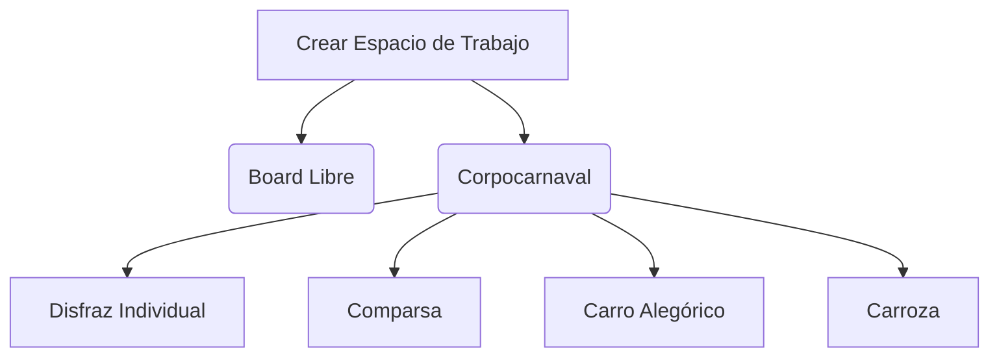
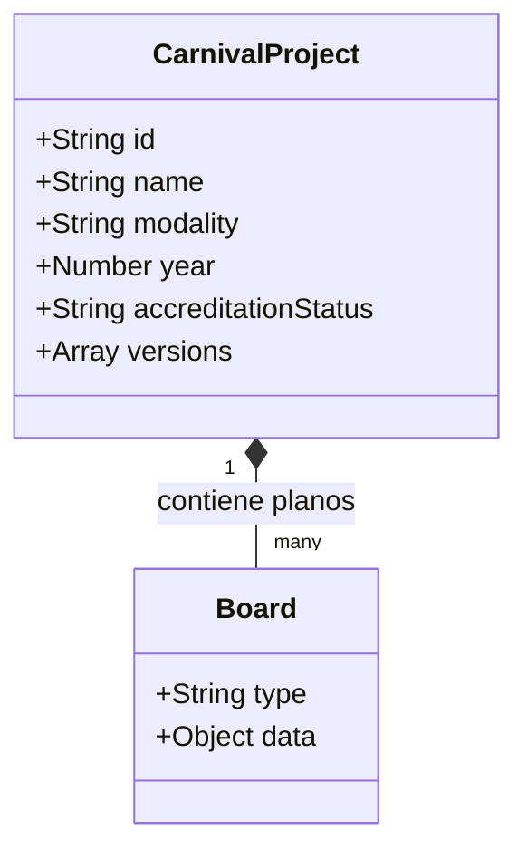
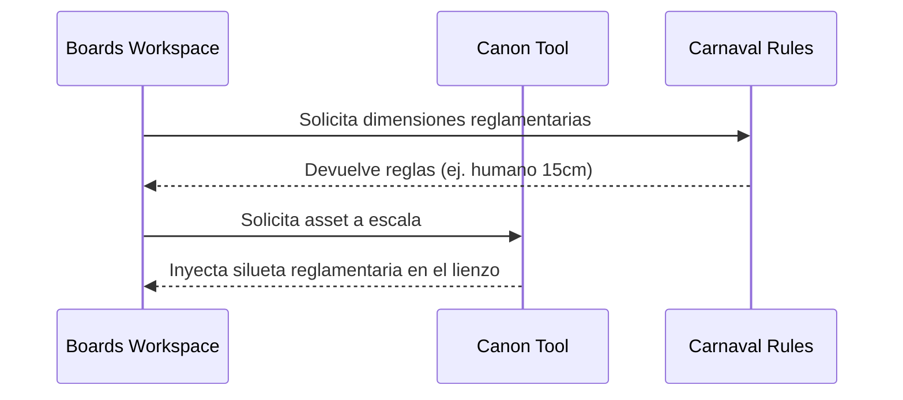
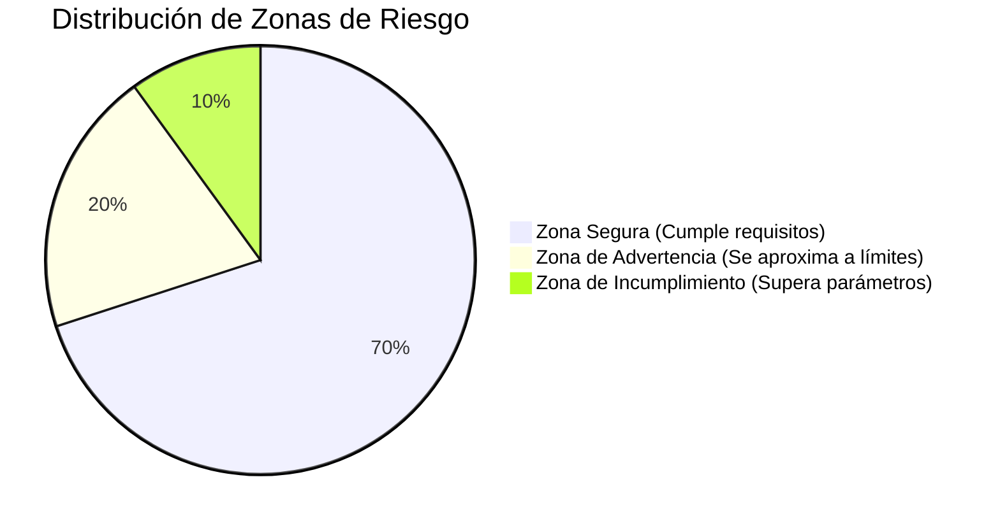
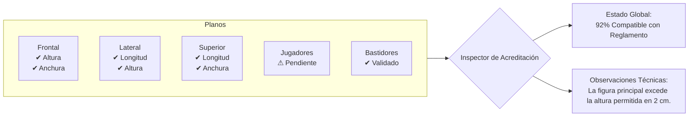
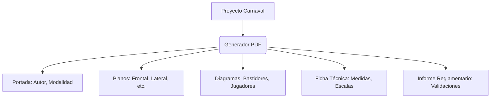

> ✅ **Implementado.** El Workspace Carnaval completo (modelos
> `CarnivalProject`/`CarnivalProjectVersion`, rutas `/dashboard/workspaces/[id]/*`)
> existe en código y está documentado como `status: stable` en
> `features/workspaces/carnaval.md`. Verificado y movido a
> `docs/historical/carnaval/` el 2026-08-13.

# Plan Técnico de Implementación: ArtSanctuary Carnaval Workspace

## Introducción

**ArtSanctuary** es un ecosistema creativo diseñado para que el artista encuentre en un solo lugar las herramientas, referencias y recursos necesarios para crear.

La implementación del módulo de acreditación para el Carnaval de Negros y Blancos no busca crear una herramienta independiente, sino **extender las capacidades existentes** de ArtSanctuary mediante un nuevo Workspace especializado que aprovecha la infraestructura actual del ecosistema.

Este Workspace permitirá a los artesanos diseñar, documentar y validar sus propuestas dentro del mismo entorno creativo que ya utilizan, eliminando procesos manuales repetitivos y reduciendo errores durante la acreditación.

---

## Principios de Diseño

### Reutilización del Ecosistema
La implementación debe aprovechar herramientas ya existentes:
- Boards
- Canon
- Reference Grid
- Sistema de Exportación
- Biblioteca de Recursos
- Archivo Documental

No se crearán herramientas paralelas que dupliquen funcionalidades.

### El Board como Espacio de Convergencia
Aunque todas las herramientas de ArtSanctuary pueden utilizarse de forma independiente, gran parte del proceso creativo termina materializándose dentro de **Boards**. Por esta razón, el Workspace Carnaval se integrará directamente en el flujo de creación de Boards.

### Mantener la Filosofía de ArtSanctuary
El objetivo no es restringir al artista, sino asistirlo. Los usuarios conservarán **libertad creativa total** mientras reciben apoyo técnico y validaciones reglamentarias.

---

## Fase 1 — Motor Reglamentario Corpocarnaval

### Objetivo
Centralizar todas las reglas oficiales en una única fuente de verdad.

### Implementación
Crear el archivo central de configuración:
```ts
src/shared/lib/carnavalRules.ts
```

Este módulo contendrá:
- Modalidades.
- Escalas oficiales.
- Alturas, anchuras y longitudes máximas y mínimas.
- Dimensiones de bases.
- Requisitos especiales, reglas para jugadores y restricciones estructurales.

### Beneficio
Permite actualizar futuras modificaciones reglamentarias sin afectar el resto del sistema.

---

## Fase 2 — Sistema de Workspaces para Boards

### Objetivo
Permitir que Boards adopte distintos contextos de trabajo.

### Nuevo Flujo
Al crear un nuevo Board, el usuario seleccionará su espacio de trabajo:



### Resultado
Al seleccionar una modalidad:
- Se cargan las reglas correspondientes.
- Se activa el inspector reglamentario.
- Se habilitan referencias especializadas.
- Se generan los planos requeridos.

Todo dentro del mismo entorno de Boards.

---

## Fase 3 — Sistema de Proyectos de Acreditación

### Objetivo
Evolucionar de Boards aislados a proyectos técnicos organizados.

### Nuevo Modelo (`CarnivalProject`)



### Planos del Proyecto
Dependiendo de la modalidad, un proyecto contendrá:
- Vista Frontal
- Vista Posterior
- Vista Lateral
- Vista Superior
- Plano de Bastidores
- Plano de Jugadores

*Cada plano será internamente un Board independiente.*

### Beneficio
Permite organizar correctamente toda la documentación exigida para acreditación.

---

## Fase 4 — Integración de Canon

### Objetivo
Convertir Canon en una fuente de referencias reglamentarias reutilizables.

### Implementación
Canon seguirá siendo una herramienta independiente dentro del ecosistema. Sin embargo, **Boards podrá consumir referencias provenientes de Canon**.



### Referencias Disponibles

#### Figura Humana Reglamentaria
Basada en los esquemas oficiales. Permite validar:
- Altura.
- Proporciones.
- Escalas.

#### Referencias Corporales
- Cabeza, Tórax, Abdomen, Pelvis, Extremidades.
Aprovechando el motor de proporciones ya existente.

### Beneficio
Evita duplicar lógica entre Canon y el Workspace Carnaval.

---

## Fase 5 — Planos Inteligentes

### Objetivo
Especializar cada plano según la información que representa.

| Plano | Valida | Muestra / Permite |
|-------|---------|-------------------|
| **Vista Frontal** | Altura, Anchura | Referencias humanas, líneas guía, límites reglamentarios |
| **Vista Lateral** | Altura, Longitud | Profundidades, bastidores, elementos sobresalientes |
| **Vista Superior** | Anchura, Longitud | Distribución espacial, organización de componentes |
| **Bastidores** | *N/A* | Soportes, estructuras, elementos mecánicos |
| **Jugadores** | *N/A* | Ubicación, circulación, áreas de acceso |

---

## Fase 6 — Sistema de Asistencia Visual

### Objetivo
Guiar al artesano sin limitar la creatividad.

### Lienzo Infinito
Boards conservará su comportamiento natural. No existirán límites físicos que impidan dibujar.

### Zonas Visuales


### Alertas Contextuales
Ejemplos de alertas no bloqueantes:
- ⚠️ *La altura máxima ha sido superada.*
- ⚠️ *La base obligatoria no coincide con la modalidad seleccionada.*
- ⚠️ *No se detecta delimitación para jugadores.*

---

## Fase 7 — Inspector de Acreditación

### Objetivo
Validar automáticamente el proyecto completo a través de un panel analítico.

### Análisis por Plano y Estado Global



---

## Fase 8 — Versionado de Proyectos

### Objetivo
Permitir la evolución controlada del diseño.

### Funcionalidades
- Crear versiones.
- Restaurar versiones anteriores.
- Comparar cambios.
- Marcar versión final.

### Comparador
Detectará cambios en medidas, distribución, bastidores y jugadores entre distintas versiones.

---

## Fase 9 — Generador de Expedientes

### Objetivo
Automatizar la preparación documental para Corpocarnaval.

### PDF Técnico
El sistema generará automáticamente un documento final:



---

## Fase 10 — Biblioteca Cultural y Recursos Oficiales

### Objetivo
Integrar la documentación oficial dentro del ecosistema.

### Recursos Disponibles
- Comunicados de Corpocarnaval.
- Guías de acreditación.
- Reglamentos históricos.
- Ejemplos de presentación y plantillas oficiales.

### Beneficio
El artesano ya no necesita buscar información en múltiples sitios externos. Todo permanece dentro de ArtSanctuary.

---

## Resultado Esperado

El **Workspace Carnaval** transformará ArtSanctuary en la primera plataforma especializada capaz de acompañar al artesano desde la conceptualización de una propuesta hasta la generación del expediente técnico final para acreditación.

La implementación aprovechará las herramientas existentes del ecosistema y reforzará la filosofía central de ArtSanctuary: **ofrecer en un solo lugar todo lo que un artista necesita para crear.**
