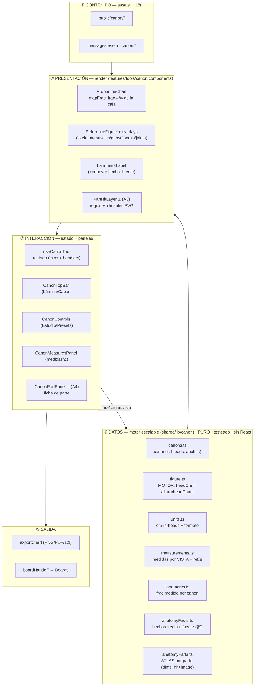
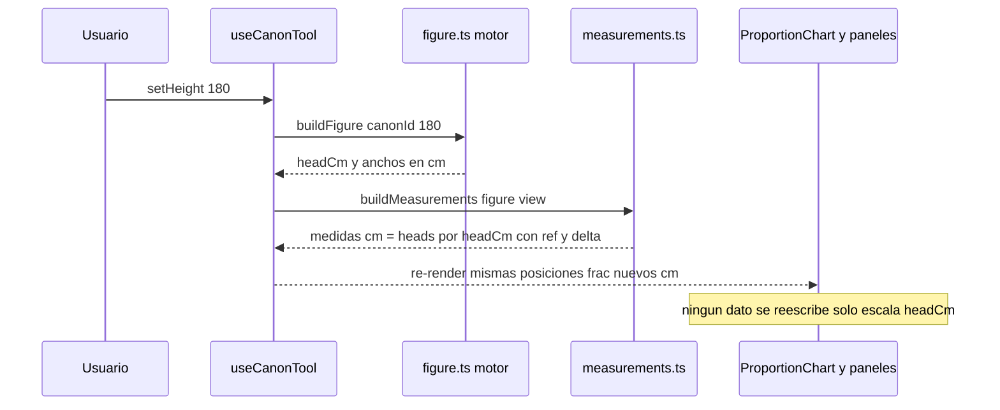

# Arquitectura — Plataforma Canon (atlas anatómico escalable)

**Fecha:** 2026-06-08 · **Tipo:** documento de arquitectura (espina del umbrella `importantes/canon`).
**Norte:** un **atlas anatómico** donde toda medida es un **ratio en unidades-cabeza** → cualquier altura/canon (y, a futuro, edad) recalcula TODO al instante. Ver `plan-canon-anatomy-deep.md` §0.

Este doc define las **capas**, sus **responsabilidades**, los **contratos/invariantes** y los **puntos de extensión**. Los planes hermanos (`plan-canon-*`) son el QUÉ/cuándo; esto es el CÓMO se organiza.

---

## 1. Capas (vista macro)

**Regla de dependencias (dura):** `shared/lib/canon` es **puro** (sin React, sin Next, sin DOM). Lo consumen la herramienta Canon **y** la silueta de Carnaval. Nada de `shared/` importa de `frontend/`. La presentación importa datos, nunca al revés.

---

## 2. ① Capa de datos — el motor escalable

Fuente única de verdad. Todo en **unidades-cabeza** (ratio), nunca cm fijos.

| Módulo | Responsabilidad | Invariante clave |
|---|---|---|
| `canons.ts` | Tabla de cánones (headCount, segmentos, anchos). | Σ segmentos = headCount (test). |
| `figure.ts` | **Motor:** `buildFigure({canonId,heightCm})` → `headCm = heightCm/headCount` + anchos en cm. | O(1), puro, memoizable. |
| `units.ts` | cm / in / heads + `formatValue`. | Conversión sin pérdida. |
| `measurements.ts` | `buildMeasurements(model, view)` → medidas con `ref`+`Δ`. Frontal/posterior = anchos (posterior +escápulas); lateral = profundidades. | `cm = heads·headCm`; toda no-unit lleva `ref`. |
| `landmarks.ts` | `frac` (0..1) medido por canon-vista + divisiones. | `frac` real medido, no derivado. |
| `anatomyFacts.ts` | Hechos por landmark + reglas cruzadas + nota de canon, con `source`. | Sin fuente, no entra. |
| `anatomyParts.ts` | **Atlas:** `BODY_PARTS` (parte→dims ratio, `image`, `children`). `dimHeads`/`dimCm` resuelven `relativeTo`. CANON-AGNÓSTICO. | Cada dim resuelve a heads>0; ratios anidados (P3). |
| `partHits.ts` | **Regiones clicables** por CANON-VISTA: `path` SVG normalizado (contorno, P9) + ancla. `getPartHits`/`hasPartHits`. | Path solo M/L/Z, coords 0..1; key ∈ raíces del atlas; sin trazado → vacío (degrada limpio). |

**Invariante de escalado (la columna vertebral):** cualquier dato visible = `ratio · headCm`. Cambiar altura/canon solo cambia `headCm`/`headCount`; **ningún dato se reescribe**. Por eso "cualquier tamaño es calculable".

---

## 3. ② Capa de presentación — render paramétrico

La figura es una **lámina PNG limpia**; la interfaz se **dibuja por código** alrededor, posicionada por `frac`.

- `ProportionChart` — orquesta. `mapFrac(frac)=frac·100%` ubica todo en la caja. Columnas de landmarks (izq/der) + centro (figura+overlays+líneas+joints) + `ChartAxis`.
- `ReferenceFigure` — el PNG base (next/image, por altura, aspecto de `figureMeta`).
- Overlays alineados coronilla→planta (`fill object-contain`): `FigureOverlays` (anchos/regla/calco), `GhostFigure` (superponer), `LoomisOverlay`, esqueleto/músculos (`overlays.ts`), joints (`joints.ts`).
- `LandmarkLabel` — etiqueta interactiva + popover (hecho+fuente, §9).
- `ZoomPanViewport` + `ChartCrossfade` — zoom/pan y transición al cambiar canon/vista.
- **`PartHitLayer` (A3 ✓):** SVG `viewBox 0 0 1 1` `preserveAspectRatio=none` (calza el bbox de la figura a cualquier zoom) con las regiones de `partHits.ts`. Hover = forma resaltada + chip HTML (el texto no va dentro del SVG estirado); clic = spotlight (scrim con máscara del path); Esc/Enter/Espacio + `role=button`. Vive DENTRO del viewport; se desactiva con la regla (`measure.active`). `hoverPart` es estado LOCAL del layer (no re-renderiza el chart).

**Contrato de registro de imagen:** todo overlay/parte se dibuja sobre la MISMA silueta y recorte que la lámina base de ese canon-vista (mismo bbox) → calza pixel a pixel.

---

## 4. ③ Capa de interacción — estado y paneles

- `useCanonTool` — **estado único + handlers** (canon, altura, vista, unidad, capas, calco, regla, superponer, presets, comparar, export, helpMode; futuro `hoverPart`/`activePart`). `figure`/`measurements` memoizados. Nada de estado en los componentes salvo UI local.
- Layout (post-rediseño): **`CanonTopBar`** (Lámina+Capas, 42px) → **`CanonControls`** panel izq (Estudio+Presets+acciones) → **stage** (ProportionChart) → **`CanonMeasuresPanel`** aside der (medidas/Δ por vista). `CanonLearnCard` flotante (modo explicado).
- **`CanonPartPanel` (A4 ✓):** al `activePart`, el aside der muestra la ficha (imagen `image[view]` o **fallback zoom CSS** a la región del path + alto físico escalado + blurb + fuentes + volver) y el árbol FILTRA a esa rama (deseleccionar restaura todo).

Primitivos compartidos de la suite de tools (`ToolWorkspace`/`ToolPanel`/`ToolButton`/`appBarStyles`) — coherencia con crop/grid/boards.

---

## 5. ④ Contenido y ⑤ salida

- **Assets:** `public/canon/<canon>/<view>.png` (+ `overlays/`, + `parts/<part>/<view>.png`). Arte **100% propio** (P2); degradación limpia si falta (capa no aparece / fallback zoom).
- **i18n:** todo texto en `messages/{es,en}.ts` bajo `canon.*` (`names`, `views`, `landmarks`, `measure`, `help`, futuro `part`). El `.ts` de datos guarda solo claves+ratios+fuente.
- **Salida:** `exportChart` (PNG/PDF/1:1 a escala real) y `boardHandoff` (enviar lámina a Boards). Re-verificar export tras tocar el render.

---

## 6. Flujo de datos (un cambio de altura)

---

## 7. Puntos de extensión (cómo crece sin romper)

| Quiero… | Toco SOLO | Resultado |
|---|---|---|
| Añadir un canon | `canons.ts` + `figureMeta.FIGURES` + `landmarks` + 3 PNG | aparece en selector/comparador/ghost |
| Añadir una medida | `measurements.ts` (key+ref) + i18n | sale en el panel der con Δ |
| Añadir un overlay | PNG + `overlays.ts OVERLAY_ASSETS` | toggle se prende solo para ese canon-vista |
| Añadir articulaciones | `joints.ts CANON_JOINTS` | capa joints se prende sola |
| Añadir una parte (atlas) | `anatomyParts.ts` (dims+source) + i18n; luego `image` | ficha de parte (fallback zoom hasta tener asset) |
| Hacer clicable un canon-vista | `partHits.ts` (trazar paths con el pipeline de píxeles) | hover/selección se prende solo para esa lámina |
| Eje EDAD (futuro, P1) | nueva tabla de ratios por edad + `figure.ts` | escala por edad (NO derivable del adulto) |

---

## 8. Invariantes / reglas (resumen)

0. **FIDELIDAD = norte (P10).** El propósito de la herramienta es **replicar exacto**: si el usuario pone 20 cm y lo construye (arcilla, etc.), las medidas físicas resultantes deben coincidir con las mostradas. Por tanto el VALOR mostrado = la **geometría real de la figura medida · escala**, NUNCA un ideal que no se replicará. **Una sola fuente de verdad, una sola medida** (la regla y el panel salen del MISMO modelo medido → no se contradicen; no se añaden métodos de medición que confundan al usuario). El ideal anatómico vive como **referencia/Δ** (capa de enseñanza), no como el número principal. Los tests se basan en esta fidelidad (valor == geometría·escala; escala-invariante exacta), no contra el ideal.
1. **Escalable:** todo dato = ratio en cabezas; cm solo se derivan (`·headCm`).
2. **Puro abajo:** `shared/lib/canon` sin React/DOM; reusable por Carnaval.
3. **Veracidad:** todo hecho/dim con `source`; rangos, no precisión falsa; ideal (canon) vs medido (antropometría) distinguidos.
4. **Texto en i18n:** datos guardan claves, no frases.
5. **Registro de imagen:** overlays/partes calzan el bbox de la base.
6. **Degradación limpia:** sin asset/data, la capa no aparece (nunca rota).
7. **Estado único:** `useCanonTool`; componentes casi sin estado.
8. **Arte propio + fuentes dominio público** (P2 copyright).
9. **Forma anatómica, NUNCA cajas** (P9). Las zonas clicables y el resaltado siguen el CONTORNO real de la parte, no un rectángulo (las cajas cuadradas de la V2 fueron un fallo de calidad). Ver §8.1.

### 8.1 Decisión P9 — Medios (raster vs vector) y forma de las regiones

**Conclusión:** *raster para tono, vector para línea/interacción/medida.* NO se vectoriza la figura.

| Capa | Medio | Motivo |
|---|---|---|
| Figura base (cuerpo sombreado) | **Raster** (WebP alta-res) | Render/foto no vectoriza bien (explosión de nodos, artefactos). Zoom se resuelve con resolución. |
| Interfaz (divisiones, landmarks, líneas, joints, cotas) | **Vector** (DOM/SVG por código) | Nítido a cualquier zoom, themeable, posicionado por `frac`. Ya es así. |
| **Zonas clicables + resaltado** (`PartHitLayer`) | **Vector SVG `path`** (contorno) | Hit-test nativo exacto; el mismo path = zona clic + forma del verde + recorte del spotlight. **Obligatorio, jamás cajas.** |
| Diagramas line-art (Loomis, écorché, cotas de parte) | **Vector SVG** si son línea pura | Línea = vector ideal. |
| (Opcional) glow pixel-perfect | **Máscara alpha PNG** por parte | Solo si se quiere brillo pegado al sombreado; pesa más. |

**Cómo se logra el resaltado anatómico (la mano se ilumina verde siguiendo su forma):**
1. NO se sacan láminas nuevas ni se vectoriza la figura.
2. Se **traza 1 `path` SVG por parte y por vista SOBRE la lámina existente** (igual que se miden los `frac`/joints, pero contorno en vez de punto) → `partHits.ts` por canon-vista (viewBox 0..1). Pipeline ya probado (A3): flood-fill de silueta → runs por fila → polígonos con cortes de landmarks → RDP → overlay de verificación.
3. Hover/foco → relleno verde de ese path (opacidad baja sobre la figura) = brillo con la forma de la parte. Clic → atenúa el resto (scrim con el path como recorte) = spotlight.
4. (Opcional/después) máscara PNG si se quiere glow pixel-perfect.

**Costo:** ~10 partes × 3 vistas ≈ 30 paths por canon. Empezar por **heroico frontal (10 paths)** → highlight ya funcional. El `path` es **por canon-vista** (cada lámina tiene su forma); las dims/medidas sí son canon-agnósticas.

**Las láminas dedicadas de parte (panel de detalle A4/A5) son OTRO entregable** — no bloquean el highlight; mientras tanto, fallback de zoom a la lámina.

---

## 9. Estado actual + roadmap consolidado (2026-06-09)

### Hecho ✓ (por plan)

| Plan | Estado |
|---|---|
| `plan-canon-redesign.md` | ✓ completo (TopBar + panel izq + aside, modo explicado, popovers) |
| `plan-canon-png-refactor.md` | F1+F2 ✓ (falta solo lo que depende de láminas nuevas + F3 pesado) |
| `plan-canon-png-features.md` | ✓ completo (zoom/pan, calco, regla, ghost, comparar, export, handoff) |
| `plan-canon-animations.md` | ✓ completo (AN3 motion polish) |
| `plan-canon-panel-jerarquico.md` | ✓ completo H0–H6 (fidelidad P10 + atlas `anatomyParts` con sub-partes + panel árbol) |
| `plan-canon-anatomy-deep.md` | A0–A4 ✓ (2026-06-09: `partHits.ts` + `PartHitLayer` + `CanonPartPanel` con filtro del árbol) · **A5–A7 pendientes** |

### Pendiente (orden recomendado)

| # | Qué | Tipo | Bloquea a | Plan |
|---|---|---|---|---|
| 1 | **Hover en todas las vistas + atlas ampliado a 17 partes** (trapecio/hombro/codo/muñeca/glúteo/rodilla/tobillo) | dato medido + datos con fuente | clic en todas las láminas; regiones que faltaban | **`plan-canon-hover-vistas-partes.md`** (N0–N7) |
| 3 | **Bloque A femeninas** — 9 láminas + `FIGURES`+`frac` propios | arte + medición | 3 cánones ♀ | laminas-faltantes §2 |
| 4 | **Bloque D partes** — láminas `parts/<part>/<view>.png` (mano/pie/cabeza primero) = A5 | arte + medición | ficha con imagen real | laminas-faltantes §4.5 |
| 5 | **A6 cotas dibujadas** sobre la imagen de parte | código | — | anatomy-deep |
| 6 | **Bloque C joints** — medir `CANON_JOINTS` (hoy vacío) | dato medido | capa articulaciones | laminas-faltantes §4 |
| 7 | **Bloque B overlays** — esqueleto/músculos (`OVERLAY_ASSETS` hoy vacío) | arte | capas estudio | laminas-faltantes §3 |
| 8 | **A7 verificación** de fuentes + pulido + export con parte activa | auditoría | cierre | anatomy-deep |
| — | Eje EDAD | extensión futura (tabla propia, P1) | — | anatomy-deep §6 |

**Modelo interactivo COMPLETO (A3+A4 ✓)** — hover/clic/ficha funcionan sin una sola imagen nueva. Todo lo pendiente es paralelizable (arte/datos por lámina); el sistema degrada limpio por cada asset/dato que falte (inv. 6). Decisiones ya tomadas: P1 scope adulto, P2 arte propio, P9 forma anatómica, P10 fidelidad.

---

Relacionado: `plan-canon-anatomy-deep.md`, `plan-canon-laminas-faltantes.md`, `plan-canon-redesign.md`, `plan-canon-png-refactor.md`, `src/shared/lib/canon/*`, `src/frontend/features/tools/canon/*`, memoria `canon-improvement-plan` · `canon-anatomy-deep-plan`.
