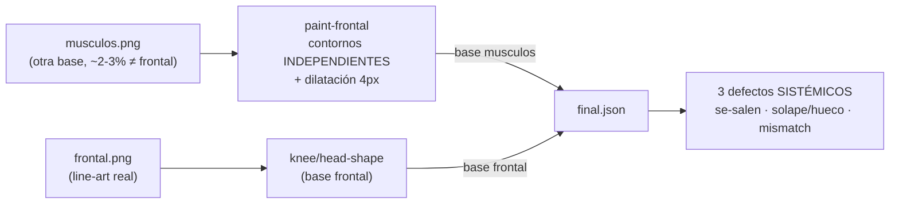
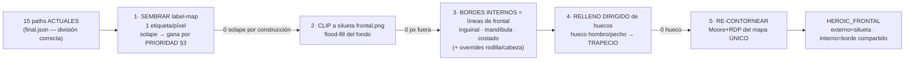
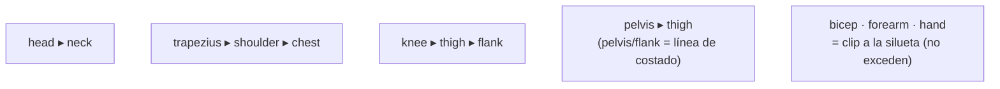
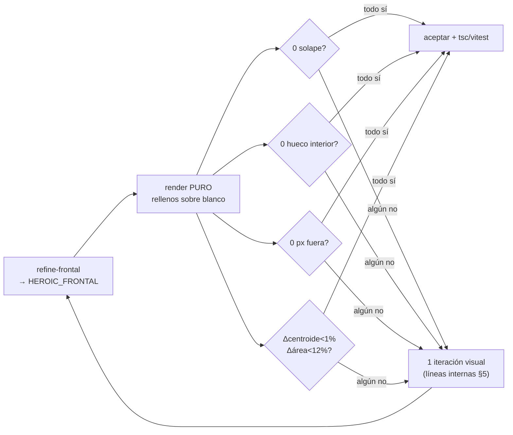
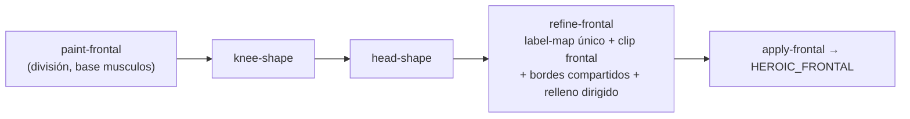
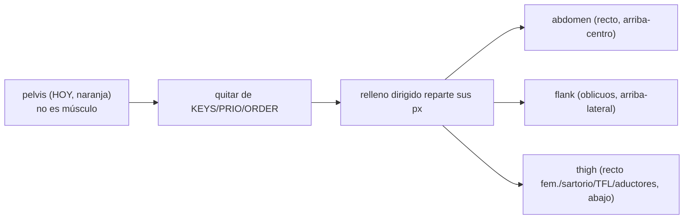
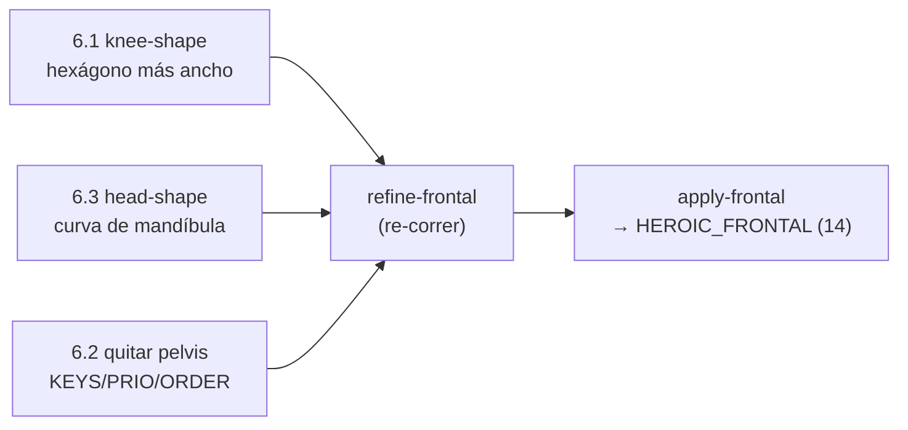

# Plan — Afinar los BORDES del mapa de músculos FRONTAL (partición limpia clipeada a `frontal.png`)

**Fecha:** 2026-06-18 · **Umbrella:** `importantes/canon` · **Estado:** `refine-frontal`
EJECUTADO ✓ (partición única clipeada a frontal: **0 solape / 0 hueco / 0 fuera**,
vitest+tsc verdes). Quedan **3 ajustes finos** sobre el resultado (§6).
**Alcance:** SOLO la vista FRONTAL de heroico. NO cambia qué-músculo-va-dónde (la
división ya está bien); solo pule los BORDES. Posterior/lateral no se tocan.

> Objetivo: que TODOS los músculos sigan la silueta **interior y exterior** de
> `public/canon/heroic/frontal.png`, **sin solaparse, sin huecos y sin cambios
> bruscos** de tamaño/posición. Ya solo es pulido.

**Contexto:** este es el **paso final** del mapeo frontal. Cómo se llegó a la
división actual y por qué fracasaron los enfoques previos → histórico
`docs/historical/2026-06-18-canon-frontal-muscle-mapping.md`. La arquitectura del
sub-sistema (los 3 generadores, el contrato de `partHits.ts`) →
`docs/architecture/canon-muscle-mapping.md`.

---

## 0. Cómo funciona HOY (2 técnicas) y por qué fallan los bordes

El mapa frontal se logró combinando dos técnicas (gen ③ de la arquitectura):

1. **Trazado por píxel** (`scripts/canon-parthits/paint-frontal.js`, de
   `musculos.png`): clasifica cada píxel por HUE+posición → key, dilata sobre las
   líneas negras (4 pasadas), contornea la máscara sólida de cada key (Moore+RDP),
   normaliza a la IMAGEN `musculos.png`. Da la DIVISIÓN correcta.
2. **Overrides de silueta** (`knee-shape.js`, `head-shape.js`, de `frontal.png`):
   formas hechas/medidas sobre el line-art, inyectadas en `heroic-frontal-final.json`.

Luego `apply-frontal.js` escribe `final.json` → `HEROIC_FRONTAL` en `partHits.ts`.



**Fallas estructurales (medidas, no a ojo):**

- **Base distinta (T1).** Las regiones se normalizan a `musculos.png`, que NO es
  idéntica a `frontal.png`. Diferencia de silueta medida ~2-3%:
  - cy0.65 (piernas): frontal `[0.266,0.724]` vs musculos `[0.242,0.758]`.
  - cy0.55 (manos/cadera) y cy0.93 (pies): musculos más ancho.
  → Las regiones **se salen** de la silueta de frontal en piernas/pies/manos.
- **Contornos independientes + dilatación (T1).** Cada músculo se contornea aparte y
  se dilata 4px sobre las líneas → vecinos **se solapan** en la línea y dejan
  **huecos** donde RDP/dilatación no coinciden. Causa la mayoría de solapes/huecos.
- **Dos bases (T1 vs T2).** Los overrides (rodilla, cabeza) viven en base `frontal`;
  sus vecinos (muslo, cuello) en base `musculos` → **mismatch en la frontera**
  (rodilla sobre muslo, cuello sobre cabeza).

**Sección transversal del defecto** (lo que se ve en un corte horizontal hoy):

```
        silueta frontal.png  │                          │
   músculo A (base musculos)─┤■■■■■■■■■■■■■■■░░          │   ░ = SE SALE (base más ancha)
   músculo B (base musculos)─┤        ▓▓▓██████         │   █ = SOLAPE (A∩B en la línea)
                             │            ╲___ hueco ___╱    espacio = HUECO (ningún músculo)
```

**Conclusión:** los defectos son SISTÉMICOS (base distinta + contornos independientes
+ 2 bases), no aleatorios. No se arreglan a empujones región-por-región (eso alargó
las sesiones). El arreglo es **una sola partición en base frontal**.

---

## 1. Defectos del usuario — validados + agregados

| Observación del usuario | Confirmado | Causa real |
|---|---|---|
| Pies: hueco + se salen | Sí | base musculos más ancha cy0.93 + contorno propio |
| Piernas casi bien, solo la rodilla | Sí | rodilla = override (base frontal) vs pierna (base musculos) |
| Muslo: solapa rodilla, recta arriba, esquinas en costado | Sí | top del muslo = recta del trazo (no comparte borde con pelvis); spill lateral |
| Pelvis debe subir y seguir el costado | Sí | borde pelvis/flank no compartido |
| Manos se salen mucho; antebrazo poco; bíceps casi nada | Sí | base musculos del brazo desfasada; se agrava distal |
| Hueco hombro/trapecio/pecho; crece el TRAPECIO (no el hombro) | Sí | hueco por contornos independientes |
| Cuello solapa cabeza | Sí | head override (frontal) vs cuello (musculos) |
| Cabeza termina en recta inclinada, debe ser la mandíbula | Sí | head-shape corta recto en cy0.135, no sigue la mandíbula |

**Agregados (medidos, el usuario no los nombró):** el solape y el hueco están por
TODO el cuerpo (dilatación + contornos independientes), no solo donde se notó. Y
hay líneas INTERNAS dibujadas en frontal (línea alba, pliegue inguinal, mandíbula,
línea del deltoides) que hoy ningún borde sigue.

---

## 2. Estrategia: una partición única clipeada a frontal (no nudging)

Una pasada nueva `scripts/canon-parthits/refine-frontal.js` que REHACE los bordes en
base frontal, **conservando la división actual**:



1. **Sembrar** un mapa de etiquetas (1 etiqueta por píxel) rasterizando los 15 paths
   ACTUALES (`final.json`, ya tienen la división correcta). Donde 2 se solapan, gana
   1 por **prioridad** (tabla §3) → **0 solape** por construcción.
2. **Clip a la silueta de `frontal.png`** (flood-fill del fondo desde el borde — la
   silueta validada en este análisis): todo px fuera de la figura → fondo → **nada
   se sale** (manos, pies, brazos, antebrazos).
3. **Bordes internos = líneas de frontal** donde existan: integrar al MISMO mapa las
   formas que ya siguen frontal (rodilla-hexágono, cabeza-contorno) y snapear las
   fronteras clave a la línea negra dibujada: muslo↑ = pliegue inguinal, pelvis↑ =
   línea de costado, cabeza↓ = mandíbula. Así "interior y exterior" siguen frontal.
4. **Rellenar huecos DIRIGIDO** (no "al vecino más cercano" a ciegas): el hueco
   hombro/pecho lo gana el **trapecio**; etc. → **0 hueco**.
5. **Re-contornear** cada etiqueta del mapa ÚNICO (Moore+RDP) → paths nuevos.
   Externos = silueta; internos = frontera compartida (una sola línea) → imposible
   solape/hueco. Escribir en `HEROIC_FRONTAL`.

**Sección transversal — después de `refine`** (mismo corte que §0):

```
        silueta frontal.png  │                          │
   músculo A (clipeado)──────┤■■■■■■■■■■■■■│             │   sin ░: clip a la silueta → no se sale
   músculo B (borde compart.)┤            │█████████████│   frontera = UNA línea (A.der == B.izq)
                             │            ↑ borde único, 0 solape / 0 hueco
```

**Por qué NO daña:** el mapa se siembra de las regiones actuales → posición/área de
cada músculo se conserva; solo los BORDES se pegan a la silueta o se comparten. El
re-contorneo no re-divide, solo limpia.

---

## 3. Prioridad al solapar (quién gana el píxel)

Cuando dos etiquetas caen en el mismo píxel al sembrar (§2.1), gana la de mayor prioridad:

```
head > neck
trapezius > shoulder > chest
knee > thigh > flank
pelvis > thigh   (frontera pelvis/flank = la línea de costado dibujada)
manos/antebrazo/bíceps = clip a la silueta (no exceden)
```



---

## 4. Criterio de aceptación (duro)

Render PURO (rellenos opacos sobre blanco, máscara de figura erosionada):
- **0 px de solape** (ningún px en ≥2 regiones).
- **0 huecos** dentro de la silueta.
- **0 px fuera** de la silueta.
- **Δcentroide < 1%** y **Δárea < 12%** por región respecto al estado actual
  (si algo cambia más → es brusco → se revisa, NO se acepta).
- `npx vitest run src/shared/lib/canon` + `tsc` verdes.



---

## 5. Riesgos / decisiones

- **Líneas internas** (mandíbula, inguinal, costado): detectarlas exacto entre muchas
  líneas es lo más frágil → 1 iteración visual ahí; lo demás sale del clip+label-map.
- **`musculos.png` se borra:** el refine NO lo usa (parte de los paths ya aplicados +
  la silueta de `frontal.png`). Confirmado seguro.
- **Pipeline:** se agrega `refine-frontal.js` al final; NO toca
  `paint/knee/head-shape` (quedan como semilla del label-map).



---

## 6. Pulido final — 3 ajustes medidos (screenshot 2026-06-18) ✅ EJECUTADO

Tras `refine`, el render PURO era 0/0/0, pero el overlay sobre `frontal.png` dejaba **3
defectos finos** (pocos, concretos). Eran lo ÚLTIMO que faltaba. **Los 3 hechos**
(overlay verificado, render PURO sigue 0/0/0, vitest 50/50 + tsc verdes, `HEROIC_FRONTAL`
= 14 regiones). Implementación final entre paréntesis en cada punto.

### 6.1 Rodilla — ensanchar el hexágono (mata la línea recta thigh↔leg)

**Defecto:** la rodilla es tan pequeña que `thigh` (arriba) y `leg` (abajo) **se tocan
directamente** a sus lados → una **línea recta horizontal** en la frontera (el peor
pecado, P9). El hexágono no abarca todo el ancho de la pierna a esa altura.

**Fix:** en `knee-shape.js`, **ensanchar** el hexágono en X (lo justo, NO exagerado)
para que la rodilla **ocupe TODO el ancho de la pierna** en su banda → `thigh` y `leg`
nunca se tocan directo → sin recta. Mantener la altura (lente vertical) y `knee>thigh`.

```
    HOY (knee angosto)              FIX (knee al ancho de la pierna)
   thigh ▆▆▆▆▆▆▆▆▆▆               thigh ▆▆▆▆▆▆▆▆▆▆
   ━━━━━━╱◆╲━━━━━━  ← recta       ╲___◆◆◆◆◆◆___╱   ← sin recta: knee separa
   leg   ▆▆▆▆▆▆▆▆▆▆               leg   ▆▆▆▆▆▆▆▆▆▆
```

Concreto: ancho actual ~`0.305..0.415` (Δ0.11). Subir a ~`0.285..0.435` (Δ0.15),
re-medir en overlay; el criterio es que NO quede ningún px donde thigh toque leg.

### 6.2 Pelvis — ELIMINAR la región (redistribuir a los músculos vecinos)

**Defecto / criterio del usuario:** la **pelvis NO es un grupo muscular**, es hueso
de origen/inserción. En un atlas miológico una región coloreada debe ser un músculo
identificable. La zona naranja "pelvis" pisa territorio de **oblicuos** (→ `flank`),
**recto femoral / sartorio / TFL / aductores** (→ `thigh`).

> **Regla nueva (dura):** si una región no se asocia a un músculo/grupo identificable,
> NO va en el mapa muscular.

**Fix:** quitar `pelvis` del set FRONTAL. En `refine-frontal.js`: borrar `pelvis` de
`KEYS` y de `PRIO`; sus píxeles quedan sin etiqueta y el **relleno dirigido (BFS
multi-fuente)** los reparte al vecino más cercano → la mitad superior la toman
`abdomen`/`flank`, la inferior `thigh` (exactamente los músculos que el usuario lista).
Quitar `pelvis` también del `ORDER` de `apply-frontal.js` (si no, falla por key
faltante). Posterior/lateral y `anatomyParts`/`regions` **no se tocan** (pelvis sigue
viva en otras vistas → degrada limpio).



### 6.3 Cabeza/cuello — seguir la MANDÍBULA, no una recta inclinada

**Defecto:** el borde inferior de `head` es hoy un **corte recto inclinado a la
izquierda** (en `head-shape.js`, línea plana en `Y_JAW=0.135`). Debe seguir la **forma
de la mandíbula**: mentón más bajo al centro, subiendo hacia los ángulos del maxilar.

**Fix:** en `head-shape.js`, cambiar el borde inferior recto por una **curva de
mandíbula** simétrica (medida/paramétrica, espejada en el eje): ángulos del maxilar
arriba (~cy0.115) → **mentón** abajo al centro (~cy0.145), como una U suave. Como
`head>neck` en el seed, el `neck` vuelve a calzar bajo esa curva automáticamente
(comparten el borde) → se arregla cabeza Y cuello de un golpe.

```
   HOY  ╲________  ← recta inclinada         FIX  ╲        ╱  ← ángulos maxilar arriba
        (mal)                                      ╲__◡__╱     mentón (centro) abajo
```

**Aceptación de los 3:** overlay sobre `frontal.png` sin recta en rodilla, sin región
pélvica, mandíbula curva; render PURO sigue 0/0/0; vitest+tsc verdes; pelvis ya no en
`HEROIC_FRONTAL` (14 regiones).



---

Relacionado: arquitectura `docs/architecture/canon-muscle-mapping.md`, histórico
`docs/historical/2026-06-18-canon-frontal-muscle-mapping.md`,
`plan-canon-musculos-frontal-atlas.md` (cómo se trazó el frontal),
`scripts/canon-parthits/{paint,knee-shape,head-shape,apply}-frontal.js`,
`src/shared/lib/canon/{partHits,muscleColors}.ts`, láminas
`public/canon/heroic/{frontal,musculos}.png`.
