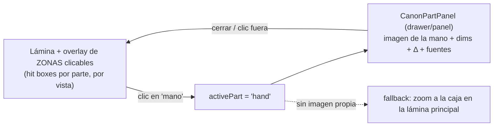
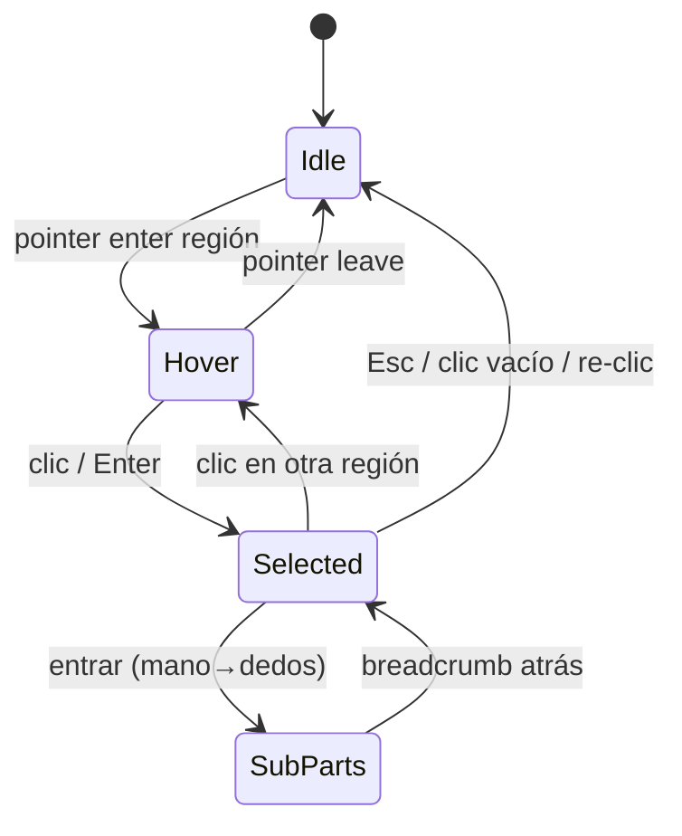
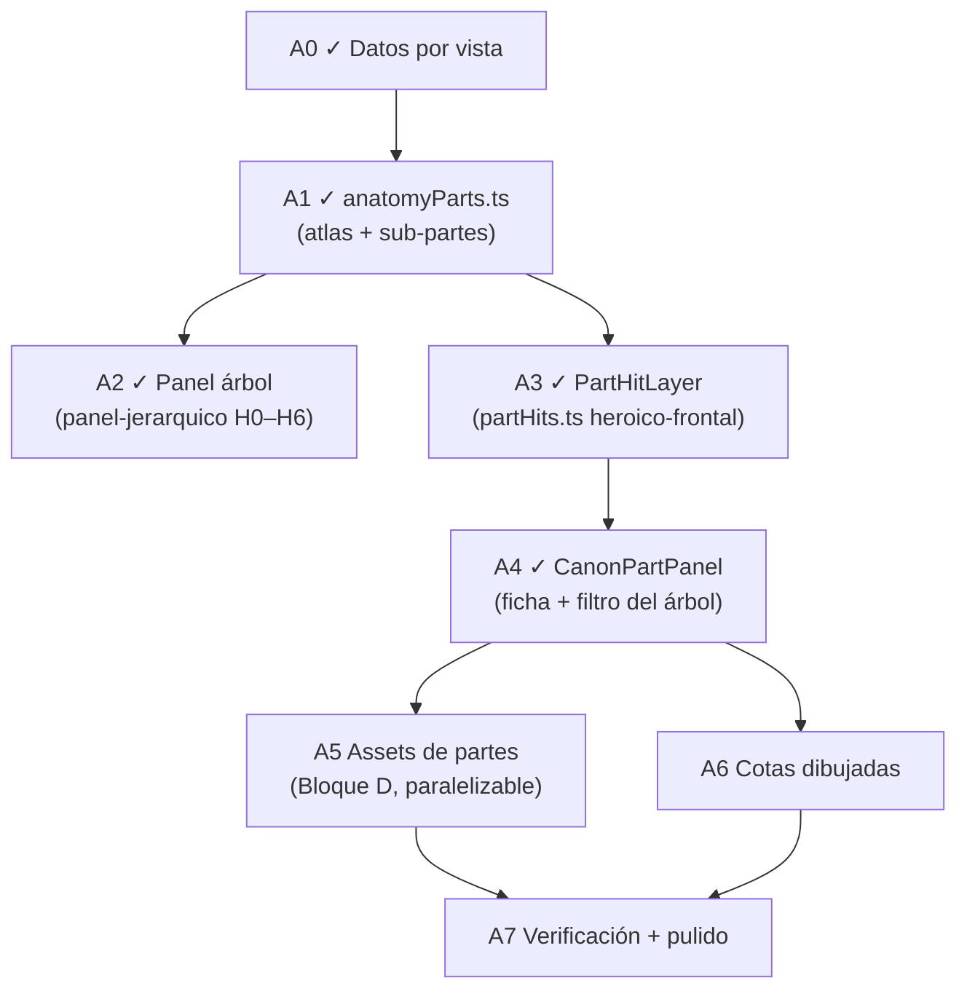

# Plan — Sistema profundo de medidas anatómicas + modelo interactivo (Canon)

**Fecha:** 2026-06-08 · **Rev:** 2026-06-09 (estado real + fases reorganizadas)
**Alcance:** la herramienta Canon (`src/frontend/features/tools/canon/`) + datos en `src/shared/lib/canon/`.
**Estado:** **A0–A4 COMPLETOS** — atlas `anatomyParts.ts` con sub-partes + panel árbol (P10) + **A3** (2026-06-09): `partHits.ts` (10 paths heroico-frontal por pipeline de píxeles) + `PartHitLayer` (hover/selección/spotlight/teclado, desactivado con regla) + **A4** (2026-06-09): `CanonPartPanel` — ficha de la parte en el aside (imagen dedicada o **fallback de zoom CSS a la región del path** + alto físico de la región escalado + blurb + fuentes + volver) y el árbol **FILTRA** a esa rama al seleccionar (deseleccionar restaura TODO). **Siguiente: A5/A6** (assets de partes / cotas) o trazar más láminas en `partHits.ts`. `public/canon/parts/` sigue sin assets (el fallback lo cubre).
**Decisión A3:** las regiones clicables NO viven en `anatomyParts.ts` (atlas canon-agnóstico) sino en **`shared/lib/canon/partHits.ts` por CANON-VISTA** (mismo patrón que `landmarks.ts`/`joints.ts`); `BodyPart.hit` se eliminó del schema.
**Estado base:** el panel derecho (`CanonMeasuresPanel`) ya muestra medidas por VISTA (frontal/posterior = anchos + escápulas; lateral = profundidades) con Δ vs `ANATOMY_REFERENCE`. Este plan lo lleva de *lista plana* a un **sistema jerárquico por parte del cuerpo** y prepara la **interactividad del modelo** (clic en una parte → ficha de esa parte con su imagen y todas sus dimensiones).

> Regla dura (heredada de §9): cada dato lleva **procedencia** (Vitruvio / Richer / Loomis / Bridgman / antropometría). Rangos, no precisión falsa. Sin fuente, no entra. Texto visible SOLO en i18n.

---

> **Arquitectura:** la espina (capas, invariantes, puntos de extensión) vive en `arquitectura.md` (misma carpeta). Este plan es el QUÉ/cuándo del eje profundo; aquél es el CÓMO se organiza todo Canon.

## 0. Norte (la meta)

Un **atlas anatómico detallado con medidas ESCALABLES**: cualquier tamaño de cuerpo es calculable al instante. Toda medida se guarda en **unidades-cabeza** (ratio), nunca en cm fijos. El motor ya existe (`figure.ts`: `headCm = altura / headCount`; cada medida = `heads · headCm`), así que cambiar altura o canon recalcula TODO el atlas sin tocar datos. El atlas es la capa de contenido (partes → dimensiones → referencias → láminas) montada sobre ese motor. Regla de oro: **si un dato no es un ratio escalable con fuente, no entra.**

## 1. Visión (lo que el usuario pidió)

El usuario entra a la herramienta, ve el modelo. Puede **entrar a una parte** — p. ej. da clic en las **manos** — y se abre el **panel de la mano**: su imagen en todas sus dimensiones, con las referencias anatómicas respectivas (largos de falanges, ancho de palma, proporción dedo/palma, etc.), cada una con su fuente.

**¿Es posible?** Sí. La figura ya es una lámina con landmarks/joints posicionados por dato (`landmarks.ts`, `joints.ts`) y overlays alineados coronilla→planta. Añadir **zonas clicables** por parte (mismo mecanismo que los joints: posición `x`,`frac` por canon-vista) y un **panel de detalle** que consume un registro de partes es una extensión natural, sin tocar la matemática del chart.

---

## 2. Modelo de datos (núcleo del sistema)

Nuevo `src/shared/lib/canon/anatomyParts.ts` — DATA pura, jerárquica. Reúne las medidas dispersas de `measurements.ts` bajo una **parte** y le añade caja clicable + imagen + dimensiones propias.

```ts
type Axis = 'width' | 'length' | 'depth' | 'girth'

interface PartDimension {
  key: string            // i18n canon.part.<part>.dim.<key>
  axis: Axis
  heads: number          // valor canónico en unidades-cabeza
  ref?: AnatomyRef       // rango anatómico (Δ)
  source: FactSource
}

interface BodyPart {
  key: string                    // 'hand' | 'foot' | 'head' | 'arm' | 'leg' | 'torso' | 'pelvis' ...
  region: 'head'|'trunk'|'arm'|'leg'
  // Región clicable sobre la lámina, por vista: path SVG normalizado (viewBox
  // 0..1) que sigue el contorno de la parte + ancla de etiqueta. Ver §3.1.
  hit: Partial<Record<View, { path: string; cx: number; cy: number }>>
  image?: Partial<Record<View, string>>   // public/canon/parts/<part>-<view>.png (opcional)
  dims: PartDimension[]
  blurb?: boolean                // hay nota i18n canon.part.<part>.blurb
}

export const BODY_PARTS: BodyPart[]
export function getPart(key: string): BodyPart | undefined
```

`measurements.ts` se mantiene (la lista plana del panel deriva de las partes o convive). Las dims de cada parte usan el mismo `AnatomyRef`/`withRef` y `withinRef` ya existentes → Δ coherente.

**Partes iniciales y dims confirmadas (ejemplos, todas con fuente):**

| Parte | Dimensiones (cabezas) | Fuente |
|---|---|---|
| Mano | largo total 0.9 (≈ cara) · palma ≈ ½ mano · dedo medio ≈ ½ mano · ancho palma ≈ 0.4 | Richer/Loomis |
| Pie | largo 1.0 · alto empeine ~0.3 · ancho ~0.35 | Richer |
| Cabeza | alto 1.0 · ancho 0.66 · profundidad 0.8 · tercios faciales iguales · ojos a media altura | Loomis |
| Brazo | brazo 1.4 · antebrazo 1.15 · mano 0.9 · total 3.45 | Loomis |
| Pierna | muslo 2.0 · pierna 1.7 · total 3.7 | Loomis |
| Tórax | ancho 1.5 · profundidad 0.95 · alto ~2 | antropometría |
| Pelvis | ancho 1.5–1.7 · profundidad 0.95 | antropometría |

---

## 3. Interactividad del modelo (cómo funcionaría)



### 3.1 Sistema de HOVER + SELECCIÓN (estilo anatomy4sculptors, 2D)

Referencia: anatomy4sculptors muestra el modelo y, al pasar el cursor, **resalta la región** bajo el puntero con su nombre; al hacer clic, **entra** a esa parte. Lo replicamos en 2D sobre las láminas.

> **Decisión P9 (ver `arquitectura.md` §8.1):** zonas y resaltado siguen la **forma anatómica**, NUNCA cajas (las cajas cuadradas de la V2 fueron un fallo de calidad). NO se sacan láminas nuevas ni se vectoriza la figura: se **traza 1 `path` SVG por parte/vista SOBRE la lámina existente** (como los `frac`/joints). El mismo path = zona clic + relleno verde con la forma de la parte + recorte del spotlight. Costo ~30 paths/canon; empezar heroico frontal (10). Glow pixel-perfect opcional = máscara alpha PNG.

**Formas de las zonas (no cajas, regiones reales).** Para que el resaltado siga el contorno de la mano/cabeza/etc. (no un rectángulo), cada parte define un **path SVG** por canon-vista, no un box. `hit` evoluciona a:

```ts
hit: Partial<Record<View, { path: string; cx: number; cy: number }>>
// path = polígono normalizado (viewBox 0..1, 0..1) del contorno de la parte
// cx,cy = ancla de la etiqueta (centro visual)
```

Las regiones viven en un `<svg>` overlay (`PartHitLayer`) alineado a la lámina (mismo `absolute inset-0` que joints/overlays), con `viewBox="0 0 1 1"` y `preserveAspectRatio` igual que la figura. Cada `<path>` es transparente con `pointer-events: fill`.

**Tres estados visuales** (tokens compartidos, sin pieles nuevas):

| Estado | Tratamiento |
|---|---|
| Idle | path invisible (solo captura puntero). |
| **Hover** | relleno `--color-primary`/10 + contorno `--color-primary`/60 (transición 150ms); **chip de nombre** flotante junto a `cx,cy` o siguiendo el cursor (`canon.part.<key>.name`). Cursor `pointer`. |
| **Selected** (clic) | contorno sólido + tinte mantenido; las demás regiones se atenúan (`opacity-40`) para enfocar; abre `CanonPartPanel`. |

**Estado** en `useCanonTool`: `hoverPart: string | null` (transitorio, no re-render del chart pesado — vive en el overlay) y `activePart: string | null` (selección, sí gobierna el panel). `hoverPart` se puede mantener local al `PartHitLayer` para no propagar renders.

**Interacción:**
- Hover entra/sale → resalta + chip. Mouse y touch (touch: primer tap = hover+selección directa).
- Clic → `activePart = key`, abre ficha. Clic en zona vacía o en la parte activa de nuevo → deselecciona.
- **Teclado/accesibilidad:** cada region es `role="button"` `tabIndex=0` con `aria-label` = nombre; foco = mismo resaltado que hover; Enter/Espacio selecciona; Esc cierra la ficha. Navegación por Tab recorre partes en orden anatómico.
- **Anidamiento (futuro):** una parte puede tener sub-partes (mano → dedos/palma). Al estar dentro de `activePart`, el `PartHitLayer` cambia a las sub-regiones de esa parte (breadcrumb "Cuerpo › Mano"). El path soporta jerarquía con el mismo modelo.

**Coexistencia con zoom/pan y regla:** las regiones viven dentro de `ZoomPanViewport`, así que escalan con el zoom. Cuando la **regla** está activa (`measureActive`), el `PartHitLayer` se desactiva (`pointer-events:none`) para no robar los clics de medición — igual que hoy el pan se desactiva.



**Producción de los paths:** se trazan una vez por lámina (herramienta de polígono sobre la imagen, o medición manual como los `frac`). Mientras una parte no tenga `path` para una vista, simplemente no es clicable en esa vista (degradación limpia). Empezar por frontal; lateral/posterior después.

- **Capa de zonas clicables (✓ A3):** componente `PartHitLayer` sobre `ProportionChart` (hermano de los joints). Regiones de `partHits.ts` (por canon-vista) con hover que resalta el contorno. Clic → `onSelectPart(key)`.
- **Selección:** estado `activePart` en `useCanonTool` (como `helpMode`). No rompe nada existente.
- **Panel de detalle `CanonPartPanel`:** reemplaza/expande el contenido del panel derecho cuando hay `activePart` (o un drawer que sobre-pone). Muestra:
  - **Imagen de la parte** (`image[view]` si existe; si no, recorte/zoom de la lámina principal a la caja `hit`).
  - **Diagrama de dimensiones:** líneas/cotas sobre la imagen (reusa el patrón de `FigureOverlays`/marcas de ancho) con su valor en la unidad activa.
  - **Tabla de dims** con Δ y **badges de fuente** (`SourceBadge`).
  - **Nota** de la parte (`canon.part.<part>.blurb`).
  - Botón "volver al cuerpo" → `activePart = null`.
- **Coherencia:** mismos primitivos (tokens, `ToolCluster`, `SourceBadge`), no-scroll donde aplique; el panel de parte sí puede scrollear (aside derecho, ya scrollea).

---

## 4. Fases (estado 2026-06-09)

### Hecho ✓

- **A0 ✓ — Datos por vista:** medidas frontal/posterior (anchos+escápulas) y lateral (profundidades) con Δ en `measurements.ts`.
- **A1 ✓ — `anatomyParts.ts`:** schema (`PartDimension` con `heads`/`relativeTo`, `hit`, `image`, `children`) + 10 partes con sub-partes (mano→dedos→falanges, cabeza→rasgos), todo con `source`+rango. Helpers `partTree`/`getPart`/`dimHeads`/`dimCm` + tests. i18n `canon.part.*`. *Pendiente dentro de A1: solo `hit` e `image` (se llenan en A3/A5).*
- **A2 ✓ — Panel árbol:** completado vía `plan-canon-panel-jerarquico.md` (H0–H6): `CanonMeasuresPanel` = acordeón región→parte→sub-parte con valor primario fiel (geometría medida · escala, P10), ideal como Δ/referencia, badges de fuente.

- **A3 ✓ — Hover + selección (§3.1), hecho 2026-06-09:** `partHits.ts` (10 paths heroico-frontal, trazados con pipeline de píxeles: flood-fill silueta → runs → polígonos con cortes de landmarks → RDP → verificación visual) + `PartHitLayer` (SVG viewBox 0..1 estirado al bbox de la figura; hover resalta forma + chip, clic = spotlight con scrim enmascarado, Esc/Enter/Espacio, `role=button`, desactivado con la regla) + `activePart` en `useCanonTool` (se limpia al cambiar canon/vista) + el panel expande y hace scroll a la rama. Pendiente de A3 a futuro: trazar lateral/posterior y otros cánones (mismo pipeline).

- **A4 ✓ — `CanonPartPanel`, hecho 2026-06-09:** ficha en el aside al seleccionar: imagen dedicada (`image[view]`) o **zoom CSS a la región** (bg-size/position derivados del bbox del primer subpath del hit) + alto físico de la región (`bbox.h · heightCm`, escala con la altura) + blurb i18n + badges de fuente + "volver al cuerpo". El árbol FILTRA a esa rama (las dims viven en el árbol, la ficha no las duplica); deseleccionar restaura TODO. H5 del plan jerárquico queda ACTIVADA.

### Pendiente (en orden de ejecución)
- **A5 — Imágenes de partes (assets, paralelizable):** láminas `public/canon/parts/<part>/<view>.png` (= Bloque D de `plan-canon-laminas-faltantes.md`); prompts en `docs/helps/`. Prioridad mano/pie/cabeza. Mientras no haya asset → fallback de zoom (A4 ya lo cubre).
- **A6 — Cotas dibujadas:** diagrama de dimensiones sobre la imagen de la parte (líneas + valor), reusando overlays.
- **A7 — Pulido + verificación:** validación anatómica de cada `source` con la fuente en mano; responsive; export incluye la parte activa si aplica.



> **Camino crítico:** ~~A3~~ ✓ → A4. Todo lo demás (A5 assets, Bloque A femeninas, B overlays, C joints) es paralelizable y NO bloquea el modelo interactivo. Roadmap consolidado del umbrella en `arquitectura.md` §9.

Cada fase: tsc + tests + i18n (es/en) + doctor 100 en archivos tocados antes de commitear.

---

## 5. Riesgos / cuidados

- **Mapeo de `hit` por canon-vista:** cada lámina tiene proporciones propias; las cajas se miden por dibujo (como los `frac` de landmarks). Empezar con cajas amplias y afinar.
- **Veracidad de las dims finas (mano/pie):** son las más fáciles de inventar. Solo Richer/Loomis confirmados; lo dudoso se descarta.
- **Assets:** producir láminas de partes es costoso → el fallback de **zoom a la lámina principal** permite enviar A4 sin imágenes nuevas.
- **No romper lo existente:** `activePart`/`helpMode` son estado local aditivo; `ProportionChart`/`buildMeasurements` intactos salvo extensión.
- **Densidad del panel:** el aside derecho ya scrollea (no es el `ToolPanel` no-scroll), así que la jerarquía por región cabe.

---

## 6. Auditoría (referencias web + problemas detectados)

Investigación 2026-06: anatomy4sculptors **Human Proportions Calculator** (HPC) ya hace casi exactamente esto — proporciones por **sexo + edad** y por parte (zoom a Full Body/Head/Foot/Hand), todo en **Head Units (HU)** y "Orthographic Proportions" (perspectiva apagada = nuestras láminas ortográficas). Valida el enfoque y marca los huecos:

### P1 — Falta el eje EDAD (crítico para "cualquier cuerpo")
HPC escala por edad: Newborn 4 HU · Infant 5 · Young Child 5.5 · Child 6 · Teen 7 · Young Adult 7.5 · Adult 8 · Elderly 7. Nuestro motor es **solo adulto** (canon = nº de cabezas, anchos por canon). **El head-unit NO transfiere entre edades:** el bebé tiene cabeza enorme respecto al cuerpo y proporciones de segmento distintas — no basta con cambiar `headCount`, cambian los ratios por segmento. Decisión: o (a) declarar el atlas **adulto** (scope honesto) o (b) añadir un eje `age` con TABLAS de ratio por edad (no derivables de la adulta). Recomendado: empezar adulto, dejar `age` como extensión con su propia tabla.

### P2 — Copyright: pasar un LIBRO atlas a web (crítico)
Los **datos/proporciones anatómicas NO son copyrightables** (un hecho, una sola anatomía correcta). Las **ilustraciones SÍ.** No se puede **calcar/redibujar** láminas de un atlas (Richer, Bridgman moderno reimpreso, anatomy4sculptors, atlas médicos) ni copiarlas con cambios de color: eso es obra derivada. Reglas duras: (1) usar solo los **ratios/hechos** (libres) citando la fuente del dato; (2) generar **arte propio** (nuestras láminas IA/dibujo), nunca trazar una imagen ajena; (3) Richer (1890) está en **dominio público** (texto/figuras), Vitruvio también — preferirlos como fuente de figura. Auditar cada lámina: que no derive de una imagen protegida.

### P3 — Head-unit único acumula error en partes finas
Medir falanges/rasgos en cabezas globales es grueso. Mejor **ratios anidados**: sub-parte relativa a su parte (dedo = fracción de la mano; mano = fracción del cuerpo). El schema debe permitir `relativeTo?: parentKey` además de `heads`. Mantiene escalable y reduce error de redondeo.

### P4 — Rango, no verdad única
HPC y la literatura insisten: el adulto real es **6–7.5 HU**, el 8 es ideal. El atlas debe presentar **rangos** y distinguir ideal (canon) vs medido (antropometría) — ya lo hacemos con `ref`+Δ; extender a TODAS las dims de parte. No mostrar un valor como si fuera exacto.

### P5 — Scope: atlas IDEAL, no biométrico individual
"Cualquier tamaño calculable" = escalar el **canon ideal** por altura/canon(/edad). NO es un ajustador de una persona real concreta (eso necesitaría más entradas: largo de fémur real, etc.). Dejar claro en UI/datos que es referencia proporcional, no medición personal.

### P6 — Producción de cientos de láminas (riesgo de ejecución)
El cuello de botella es el arte (Bloque D del plan de láminas). Mitigado por: **data-first** (el motor escalable funciona sin imágenes), **fallback de zoom**, y partes **canon-agnósticas** (un set sirve a todos los cánones). Generar por prioridad (mano/pie/cabeza primero).

### P7 — Diferenciación vs HPC (producto)
HPC ya existe y es gratis. Nuestro valor: **2D con láminas** integradas en la suite (boards/crop/grid/canon), **Δ vs referencia** explicado con fuente, **calco/regla/export 1:1**, y todo escalable en la misma herramienta. No competir en 3D; apostar por el flujo 2D del artista de lámina.

### P8 — Hit-regions: rendimiento y accesibilidad
SVG con decenas de `path` por vista: OK en perf. Cuidar **objetivos táctiles** (mín. ~44px en móvil → en móvil quizá lista en vez de mapa), y a11y (cada región `role=button`+`aria-label`, foco visible) — ya en §3.1.

### Decisiones tomadas (2026-06-08)
- **P1 → scope ADULTO.** El atlas escala por altura + canon (adulto). El eje `age` queda como extensión futura con su propia tabla de ratios (no se deriva del adulto). El schema deja sitio (`age?` opcional) pero no se implementa ahora.
- **P2 → arte 100% propio + fuentes de dominio público.** Cada lámina se genera/dibuja desde cero; nunca se calca una imagen ajena. Datos de Richer (1890, dominio público) y Vitruvio preferidos; antropometría como rango.
- **P3 → adoptado en el schema:** `relativeTo` para ratios anidados (sub-parte respecto a su parte).
- **P9 → forma anatómica, no cajas.** Híbrido raster (figura) + vector (interfaz/regiones). Zonas clic y resaltado = `path` SVG trazado sobre la lámina existente (no nuevas láminas, no vectorizar la figura). Detalle en `arquitectura.md` §8.1.
- **P10 → FIDELIDAD = norte.** El valor mostrado = geometría real medida de la figura · escala (lo que el usuario replicará en arcilla/etc. debe salir exacto). UNA sola fuente de verdad y una sola medida (regla y panel del mismo modelo medido; NO añadir métodos de medición → confunde y hace abandonar la herramienta). El ideal anatómico = referencia/Δ, no el número principal. Tests basados en fidelidad (valor == geometría·escala), no contra el ideal. La dualidad canon/anatomía se mantiene como capa de Δ. Detalle `arquitectura.md` §8 inv.0.

> **Veredicto:** plan sólido y validado por el mercado (HPC demuestra demanda y viabilidad del modelo HU). Los dos bloqueos reales a decidir ANTES de escalar: **P1 (edad: definir scope)** y **P2 (copyright: arte 100% propio + fuentes de dominio público)**. Lo demás es ejecución incremental ya prevista.

Fuentes: anatomy4sculptors HPC (`hpc.anatomy4sculptors.com`, `anatomy4sculptors.com/blog/about-human-proportions-calculator`), Wikipedia *Body proportions*, Grokipedia *Artistic canons of body proportions*, US Copyright Office Compendium cap. 900, PMC11908999 (uso de material existente).

---

Relacionado: `docs/pr/importantes/canon/plan-canon-redesign.md` (§9 ayuda anatómica), `docs/pr/importantes/canon/plan-canon-laminas-faltantes.md` (Bloque D), `src/shared/lib/canon/{measurements,anatomyFacts,landmarks,joints}.ts`, memoria `canon-improvement-plan` · `canon-anatomy-deep-plan`.
