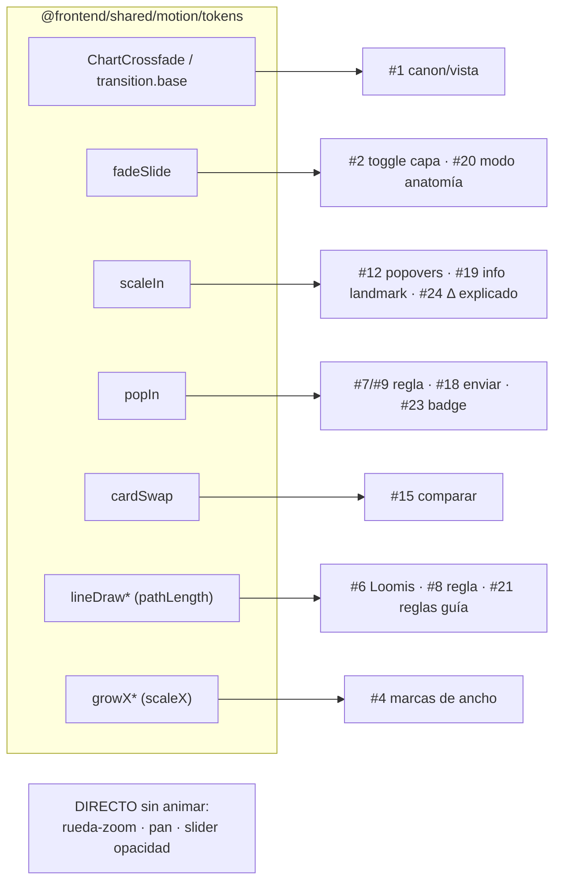

# Plan complementario — Animaciones (motion) de la pantalla Canon

**Fecha:** 2026-06-08
**Complementa:** `docs/pr/importantes/canon/plan-canon-redesign.md` (la creatividad de microinteracciones vive en su §3.1 CREATIVO; este doc la detalla).
**Regla dura:** toda animación usa `motion` (motion/react) + los **tokens compartidos** `@frontend/shared/motion/tokens` (NO duraciones/easings nuevos a ojo). Sensibilidad editorial ya fijada: movimientos ≤0.32s, desplazamientos ≤8px, sin rebotes. Ver `docs/frontend/animations.md`.
**Estado** Completado sin tener en cuenta `docs\pr\importantes\canon\plan-canon-anatomy-deep.md`
> Función e identidad visual CONGELADAS. Las animaciones solo dan continuidad y feedback; nunca bloquean ni retrasan una acción.

---

## 0. ACTUALIZACIÓN — diseño final (2026-06-08)

El diseño cambió respecto a cuando se escribió este plan. **Superficies reales actuales** (las del inventario §2 que ya no existen quedan obsoletas):

- **Sin navbar ni footer.** Todo en: **panel izquierdo** (clusters Lámina · Estudio · Presets + pie enviar/comparar) y **panel derecho** (`PanelSection`: Medidas reales · Referencia · Reglas cruzadas, siempre abiertas, sin scrollbar).
- **3 rails flotantes** sobre el lienzo (derecha), botones cuadrados `RailButton`: **Capas** (centro) · **Export** (arriba) · **Zoom** (abajo).
- **Eliminados:** "Anatomía explicada" (toggle + tarjeta flotante `CanonLearnCard`), footer de medidas plegable. Su contenido (ficha + reglas cruzadas) vive ahora **siempre visible** en el panel derecho.
- **Selects** unificados (`Select` compartido), `LandmarkLabel` con popover (CSS group-hover, ya animado).

**Inventario remapeado (lo que SÍ se anima ahora):**

| # | Superficie | Animación | Token |
|---|---|---|---|
| A | Cambiar canon/vista | Crossfade lienzo (existe) | `ChartCrossfade` ✓ |
| B | `RailButton` (capas/export/zoom) | `whileTap` scale 0.92; toggle activo pop | tap + `transition.fast` |
| C | Rails al montar | Entrada stagger de los botones | `fadeSlide` + stagger |
| D | Panel derecho `PanelSection` | Entrada stagger (fade/slide) de cada sección | `fadeSlide` + stagger |
| E | Toggle de capa | Fade-in/out de líneas+labels de ESA capa | opacity `transition.fast` |
| F | Marcas de ancho (capa anchos) | Trazo crece desde la línea media | `growX` (scaleX) |
| G | Loomis / plomada | Línea se dibuja | `lineDraw` (pathLength) |
| H | `SourceBadge` | Aparece sutil al revelar | `popIn` |
| I | Δ medidas dentro/fuera rango | Cross-fade del color del Δ | `transition.fast` |
| J | Comparar (1 ⟷ 2 paneles) | Crossfade | `transition.slow` |
| K | Regla: punto/segmento | `popIn` dot + `lineDraw` segmento | existe |
| L | Reduced motion | `<MotionConfig reducedMotion="user">` en la raíz | accesibilidad |

`lineDraw`/`growX` → se agregan a `tokens.ts` (reutilizables). Lo demás usa variants existentes.

**Fases (revisadas):**
- **AN1 (chrome, seguro):** L `MotionConfig` raíz · B `RailButton` motion · C rails stagger · D `PanelSection` stagger.
- **AN2 (lienzo):** E fade por capa · F `growX` anchos · G `lineDraw` Loomis/plomada/regla.
- **AN3 (detalle):** H badge popIn · I Δ color · J comparar · K regla.

Cada fase: tsc + tests + i18n + doctor; export no captura frames intermedios (estado final).

---

## 1. Tokens disponibles (reusar, no inventar)

- **Duración:** `DURATION.fast 0.15` · `base 0.22` · `slow 0.32`.
- **Easing:** `EASE.standard` (M3) · `emphasized` (entradas notorias).
- **`transition.{fast,base,slow}`** ya combinan duración+easing.
- **Variants:** `fadeSlide` (mensajes), `scaleIn` (popovers desde ancla), `popIn` (confirmación de campo), `cardSwap(dir)` (swap direccional), `shake` (error).
- **Ya en uso en Canon:** `ChartCrossfade` (AnimatePresence mode=wait + `transition.base`) al cambiar canon/vista.

Regla: si una animación nueva es reutilizable y no existe variant, se agrega a `tokens.ts` (no local). Si es muy específica de Canon, queda local pero usando `DURATION`/`EASE`.

---

## 2. Inventario de animaciones por interacción

| # | Interacción | Animación | Token/variant | Notas |
|---|---|---|---|---|
| 1 | Cambiar canon / vista | Crossfade del lienzo | `ChartCrossfade` (existe) `transition.base` | Ya hecho; mantener al mover el stage al scaffold. |
| 2 | Toggle de capa (canon/anatomía/anchos/Loomis/…) | Fade-in/out de líneas+labels de esa capa | opacidad con `transition.fast` | Por capa, no recolocar el resto. Evitar parpadeo al alternar rápido. |
| 3 | Líneas de división / landmarks al aparecer | Stagger sutil de arriba→abajo | `transition.base` + `staggerChildren` (~0.03) | Solo en la primera aparición de la capa, no en cada render. |
| 4 | Marcas de ancho (capa anchos) | Trazo horizontal que crece desde la línea media | `scaleX 0→1`, origen centro, `transition.base` | Refuerza la lectura "ancho". |
| 5 | Superponer (ghost) entra/sale | Fade + grayscale-in | `fadeSlide` adaptado (solo opacity) `transition.base` | Sin desplazamiento; el ghost calza en sitio. |
| 6 | Loomis aparece | Fade-in del SVG; opcional draw de la plomada | opacity `transition.base`; plomada `pathLength 0→1` `transition.slow` | `pathLength` = variant nueva `lineDraw` candidata a tokens. |
| 7 | Regla: colocar punto | `popIn` del dot | `popIn` (existe) | Confirmación de click. |
| 8 | Regla: conectar 2 puntos | El segmento se dibuja | `pathLength 0→1` `transition.fast` | Misma `lineDraw`. |
| 9 | Regla: etiqueta de distancia | `popIn` al aparecer | `popIn` | Aparece al 2.º punto. |
| 10 | Calco: cargar imagen | Fade-in de la referencia | opacity `transition.base` | Respetar la opacidad elegida como destino. |
| 11 | Calco: slider de opacidad | Sin animación (control directo) | — | El valor es la opacidad; animar molestaría. |
| 12 | Panel: popovers de cluster (si los hay) | Surge desde el ancla | `scaleIn` (existe) | `transformOrigin` en el ancla. |
| 13 | Footer de medidas: abrir/cerrar | Alto+opacidad | `transition.base` (`emphasized` si es notorio) | Si el footer es plegable. |
| 14 | Medidas: cambio de Δ (dentro/fuera de rango) | Tinte del punto Δ con cross-fade de color | `transition.fast` | Sutil; sin saltos. |
| 15 | Entrar/salir modo Comparar | Transición entre stage único y 2-paneles | `cardSwap`/crossfade `transition.slow` | Direccional o fade; un solo gesto. |
| 16 | Zoom por botón (+/−/reset) | Interpolar `scale` | `transition.fast` en el transform | Solo botones; el zoom por rueda y el pan por arrastre son **directos** (sin transición) para no sentir lag. |
| 17 | Hover de landmark (label↔línea) | Resalte recíproco | opacity/weight `transition.fast` | Ayuda a leer qué línea es cuál. |
| 18 | Enviar a tablero | Feedback de "enviado" | `popIn` en un toast/icono | El handoff navega; un pulso confirma. |
| **19** | **Info por landmark (ayuda anatómica)** | Popover surge desde la etiqueta | `scaleIn` (existe) | Nombre + cabezas + frase confirmada + fuente. `transformOrigin` en el landmark. |
| **20** | **Modo "anatomía explicada" entra** | Anotaciones de reglas cruzadas aparecen escalonadas | `fadeSlide` + `staggerChildren` ~0.04 | Codo=cintura, muñeca=trocánter, etc. Una vez, no por render. |
| **21** | **Regla cruzada de envergadura/líneas guía** | Se dibuja la línea (envergadura≈estatura, pubis=mitad) | `lineDraw` (`pathLength 0→1`) `transition.slow` | Mismo `lineDraw` de Loomis/regla. |
| **22** | **Panel/drawer de aprendizaje (ficha del canon)** | Abre con alto+opacidad | `transition.base` (`emphasized` si notorio) | Ficha del canon activo con fuente. |
| **23** | **Badge de fuente** (Richer/Loomis/…) | Aparece sutil al revelar el dato | `popIn` u opacity `transition.fast` | Discreto; no debe distraer de la lámina. |
| **24** | **Δ explicado** (por qué el canon difiere del real) | Tooltip surge del valor Δ | `scaleIn` | Engancha con `MeasurementsPanel` (#14). |

---

### 2.1 Mapa interacción → token

\* `lineDraw`/`growX` = candidatos a agregar a `tokens.ts` (sección 4).

## 2.2 Animación y la AYUDA ANATÓMICA (eje del rediseño)

La ayuda anatómica (§9 del plan de rediseño) es contenido, pero su **revelado** es donde la animación aporta pedagogía: una regla cruzada que se **dibuja** (envergadura≈estatura) enseña mejor que una línea que aparece de golpe. Aun así, **sutil**: la lámina manda, la ayuda acompaña. Nada de animaciones largas o llamativas que compitan con el estudio.

## 3. Principios

- **Directo lo que es manipulación:** rueda-zoom, pan-arrastre y slider de opacidad NO se animan (se sentiría lag). Se animan transiciones de ESTADO (aparecer/desaparecer/cambiar), no el arrastre continuo.
- **Por elemento, no por pantalla:** alternar una capa anima solo esa capa; nunca re-animar todo el chart.
- **Una sola vez:** entradas con stagger solo en la primera aparición, no en cada re-render (usar `key`/`AnimatePresence` con criterio).
- **`prefers-reduced-motion`:** envolver el árbol de Canon en `<MotionConfig reducedMotion="user">` para que todo degrade a fundidos mínimos / nada. Requisito de accesibilidad.
- **No bloquear:** ninguna animación retrasa el resultado (export, medida, toggle aplican de inmediato; la animación acompaña).
- **Dónde animar:** las superficies son **panel / stage / footer** (no hay navbar densa que animar, §3.2 del rediseño). El protagonismo del movimiento está en el STAGE (lámina + ayuda anatómica); panel y footer, mínimos (popovers `scaleIn`, apariciones `fadeSlide`).

---

## 4. Adiciones candidatas a `tokens.ts`

Solo si se confirman reutilizables:
- **`lineDraw`** (`pathLength 0→1`) — usado por plomada (Loomis) y segmento de regla (#6/#8). Reutilizable en cualquier overlay SVG → va a tokens.
- **`growX`** (`scaleX 0→1`, origin center) — marcas de ancho (#4). Posible token si otras tools lo usan; si no, local en Canon.

El resto se cubre con variants existentes.

---

## 5. Fases (se enganchan a las del rediseño)

- **A1 (con R2/R3 del rediseño):** toggles de capas (#2/#3), marcas de ancho (#4), popovers de panel (#12). Agregar `lineDraw`/`growX` a tokens si aplica.
- **A2 (con R5):** regla (#7/#8/#9), ghost (#5), Loomis draw (#6), calco fade (#10), hover landmark (#17).
- **A3 (con R5 pulido):** comparar (#15), footer medidas (#13/#14), zoom por botón (#16), feedback enviar (#18), `MotionConfig reducedMotion`.
- **A4 (con §9 Ayuda anatómica):** info por landmark (#19), modo anatomía explicada (#20), reglas guía dibujadas (#21), panel de aprendizaje (#22), badges de fuente (#23), Δ explicado (#24). Reusa `scaleIn`/`fadeSlide`/`lineDraw`/`popIn` — sin tokens nuevos salvo `lineDraw`.

Cada fase: tsc + tests + i18n + doctor 100. Verificar que el export (canvas) NO captura estados intermedios de animación (exporta el estado final).

---

## 6. Riesgos
- **Export vs animación:** `exportChart` redibuja en canvas; debe usar el estado final, no frames intermedios. Validar.
- **Rendimiento:** muchas líneas/landmarks animando a la vez → preferir opacity/transform (compositables), no layout. Stagger acotado.
- **Sobre-animar:** la herramienta es de estudio; el movimiento debe ser casi imperceptible (editorial). Si dudas, menos.

Relacionado: `docs/pr/importantes/canon/plan-canon-redesign.md`, `docs/frontend/animations.md`, memoria `canon-improvement-plan`.
