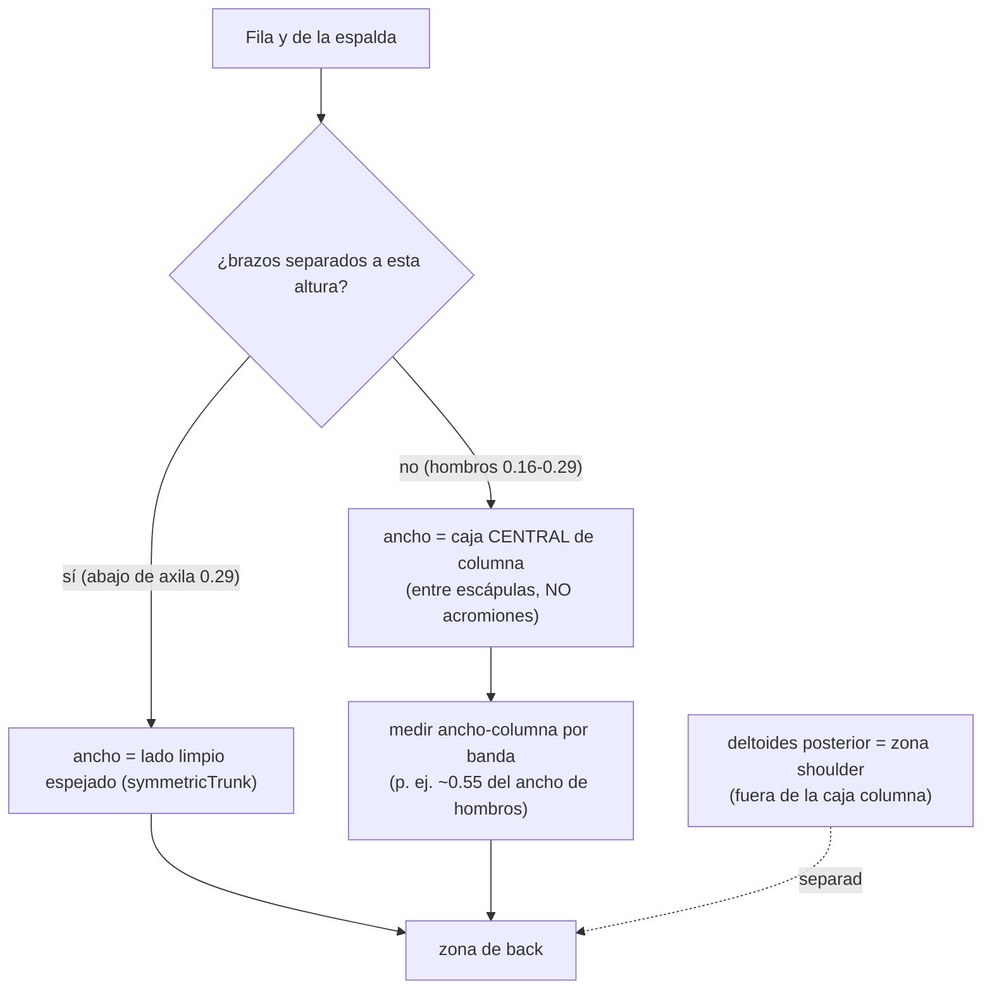
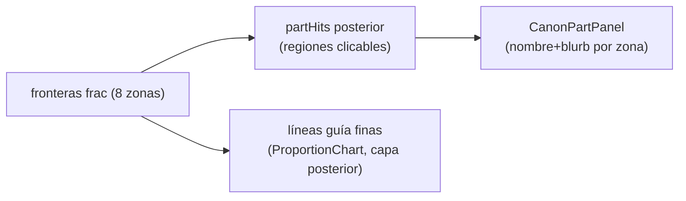
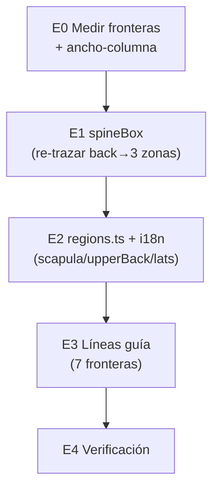

# Plan — Espalda posterior en 8 zonas anatómicas + fix bleed de brazos

**Fecha:** 2026-06-13 · **Umbrella:** `importantes/canon` · **Extiende:** `plan-canon-hover-vistas-partes.md` (region-set por vista, N4-bis).
**Estado:** E0–E4 ✅ (2026-06-13). **COMPLETO.** Nota: tras E2 el usuario pidió NO sobre-fragmentar → consolidado de 8 zonas a **5 masas funcionales** (anatomía artística): cuello · trapecio · escápulas/espalda alta · hombros post. · dorsales · lumbar · glúteos. E3 = líneas guía en las fronteras (capa `zones`, toggle en el rail, solo posterior).

**E1+E2 hechos:** pipeline ganó modos `spineBox` (caja central de columna, clampa a `frac` del medio-ancho limpio → excluye deltoides), `deltoidPost` (lóbulos fuera de la columna = `shoulder`), `centerFull` (nuca/cuello), y `skipParts` (descarta `torso`/`neck` hardcoded reemplazados por bandas). `partHits.ts` `HEROIC_POSTERIOR` ahora tiene las **8 zonas** (nape·neck·trapezius·scapula·shoulder·upperBack·lats·lumbar·gluteus) — el bloque único `back` se eliminó. `scapula`/`upperBack`/`lats` en `regions.ts` + i18n es/en (nombres+blurbs). Verificado overlay: columnas centrales NO agarran los brazos (deltoides separados en `shoulder`). 134 tests.

> **Pedido del usuario:** reemplazar la división actual de la espalda (hoy `back` = un
> bloque + `lumbar` + `gluteus`) por **8 zonas horizontales** anatómicas, delimitadas con
> líneas guía finas/discretas integradas al diseño. Además: **la espalda agarra parte de
> AMBOS brazos** (mal) — separar los deltoides/brazos del bloque central.

---

## 0. Problema actual (por qué la espalda agarra los brazos)

`symmetricTrunk` hizo el `back` simétrico, pero a la altura de hombros el run central
abarca **ambos deltoides** (los brazos van pegados arriba) → el `back` se extiende a
ancho-hombros completo, comiéndose la parte alta de los dos brazos.

**Causa:** el clamp simétrico usa el medio-ancho del lado limpio, pero arriba (0.16–0.29)
NO hay lado limpio: ambos brazos están pegados. Ahí el "tronco" real es solo la columna
central (escápulas), no el ancho de los deltoides.

**Fix raíz:** las zonas de espalda se clampean a la **caja central de la columna**
(ancho ≈ entre escápulas, NO entre acromiones). Los deltoides posteriores son su propia
zona (`shoulder`), separada del back. Medir el ancho central real por banda.

---

## 1. Las 8 zonas (arriba→abajo)

| # | Zona | key propuesta | Músculos / referencia | Banda `frac` (E0 MEDIDO) |
|---|---|---|---|---|
| 1 | Cabeza y nuca | `head` + `nape` | occipucio, inserción trapecio, C7 | 0–0.12 / 0.12–0.14 |
| 2 | Cuello | `neck` (post.) | columna cervical, esplenio | 0.14–0.158 |
| 3 | Trapecios | `trapezius` | trapecio superior (pendiente) | 0.158–0.205 |
| 4 | Escápulas y hombros post. | `scapula` (+ `shoulder`) | escápulas, deltoides posterior, redondos | 0.205–0.255 |
| 5 | Espalda alta | `upperBack` | romboides, infraespinoso | 0.255–0.292 |
| 6 | Dorsales | `lats` | dorsal ancho | 0.292–0.341 |
| 7 | Lumbar y cintura | `lumbar` | erectores, cresta ilíaca | 0.341–0.43 |
| 8 | Región glútea | `gluteus` | glúteo mayor | 0.43–0.544 |

> **E0 (medido sobre `posterior.png`, h=1471):** perfil de ancho confirma fronteras
> naturales: cuello estrecho (w≈95-115) hasta 0.14; trapecio flarea 0.14–0.20; hombros/
> escápulas anchos con doble joroba (pico 0.226, valle 0.251, pico-acromion **0.288 w426**);
> **caída en 0.292** (426→340 = se separa el brazo derecho) = frontera natural espalda
> alta↔dorsales; cintura 0.341; pliegue glúteo 0.544.
>
> **Ancho-columna (spineBox):** medio-ancho de hombro = 213px (acromion). Deltoides
> posteriores ≈ 20% exterior cada lado → caja central de espalda ≈ **60% del ancho del
> run** en la franja de hombros (0.158–0.292). Las zonas 3–6 se clampean a ese 60% central
> → los deltoides quedan fuera (zona `shoulder`). Afinar el % con el verify-overlay en E1.

**Claves NUEVAS:** `scapula`, `upperBack`, `lats` (zonas 4–6, hoy un solo `back`).
Las demás ya existen. `scapula`/`upperBack`/`lats` son **regiones-zona** (sin dim
lineal limpia con fuente) → van a `regions.ts` con nombre+blurb (no inventar medidas).

---

## 2. Separación columna vs deltoides (el fix clave)

**Implementación pipeline:** nuevo modo de clamp `spineBox` para las zonas de espalda
en la franja de hombros: en vez del run central completo, usar una fracción central
(medida) del ancho. Los deltoides quedan fuera → `shoulder` los toma. Así NINGUNA zona
de espalda agarra brazo.

---

## 3. Líneas guía (entregable visual)

Además de las regiones clicables, dibujar **líneas guía horizontales finas** en las 7
fronteras entre zonas, integradas al estilo (tokens existentes, como las divisiones de
canon en `ProportionChart`):

- Estilo: `border-t` punteado/fino, color `--color-outline-variant` a baja opacidad
  (mismo lenguaje que las líneas de división por cabeza). NO competir con la lámina.
- Solo visibles en vista posterior, capa propia (toggle o atadas a la capa anatomía).
- Posicionadas por las fronteras `frac` medidas → escalan con la figura.

---

## 4. Fases

- **E0 — Medir fronteras:** las 7 fronteras + ancho-columna por banda sobre `posterior.png`
  (script diag, como cintura/pliegue). Define los `frac` reales.
- **E1 — Modo `spineBox` en el pipeline:** clamp central de columna para las zonas de
  espalda en la franja de hombros (excluye deltoides). Re-trazar `back`→`scapula`/
  `upperBack`/`lats` + `shoulder` posterior. Verify-overlay (ninguna zona toca brazo).
- **E2 — Datos + i18n:** `scapula`/`upperBack`/`lats` en `regions.ts` (región trunk +
  fuente Richer/Bridgman) + nombres/blurbs es/en. `partHits.ts` `HEROIC_POSTERIOR` pasa
  de `back` único a las 3 zonas + shoulder.
- **E3 — Líneas guía:** capa de 7 líneas en `ProportionChart` (vista posterior),
  posicionadas por las fronteras. Toggle.
- **E4 — Verificación:** overlay (8 zonas limpias, sin brazos), tsc + tests + doctor.

---

## 5. Riesgos

- **Veracidad:** scapula/upperBack/lats sin dim → solo blurb con fuente (regla dura).
  No inventar anchos de músculo.
- **Ancho-columna por banda:** medir bien; si se pasa, vuelve a agarrar deltoide. El
  verify-overlay decide.
- **Densidad visual:** 7 líneas + regiones puede saturar → líneas muy sutiles, toggle.
- **Solo posterior:** frontal/lateral mantienen su region-set; estas 8 zonas son del
  region-set posterior (cada vista su propia división, principio ya establecido).

---

Relacionado: `plan-canon-hover-vistas-partes.md` (region-set por vista, §"Regiones por
vista"), `scripts/canon-parthits/` (pipeline + modos mirror/symmetricTrunk/centerSplit),
`src/shared/lib/canon/{partHits,regions}.ts`, `ProportionChart.tsx`, memoria
`canon-anatomy-deep-plan`.
