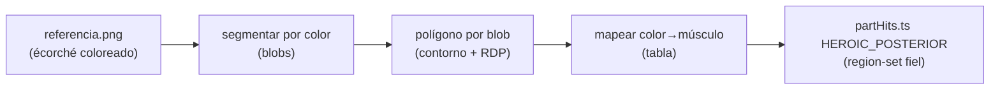
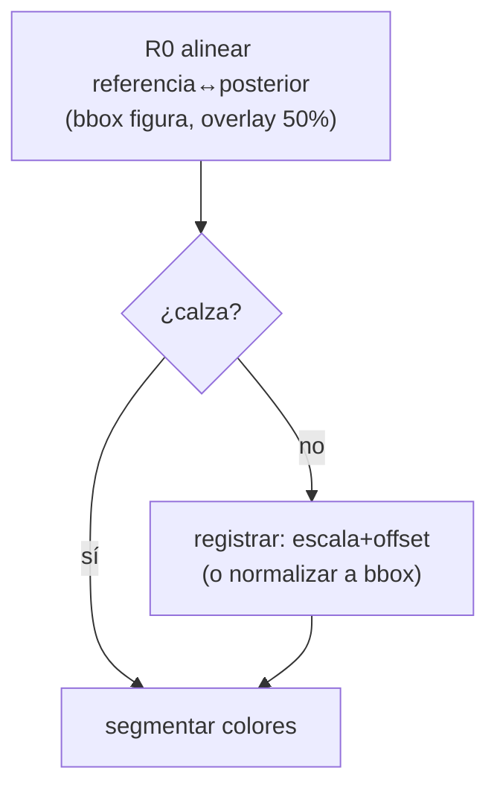
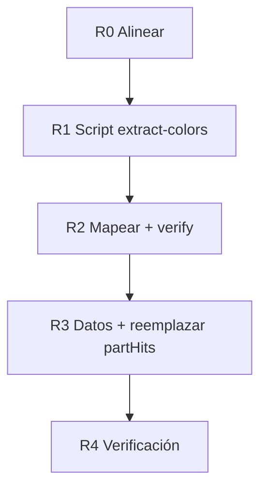

# Plan — Divisiones de espalda posterior desde MAPA DE REFERENCIA a color

**Fecha:** 2026-06-13 · **Umbrella:** `importantes/canon` · **Reemplaza:** las formas
hand-authored de la espalda en `plan-canon-espalda-8-zonas.md` (trazadas a ojo) por
**trazado desde un mapa miológico a color** (la división correcta ya viene pintada).
**Estado:** R0-R4 COMPLETOS (2026-06-16). Solo R5 (referencia frontal/lateral) futuro.

> **Insumo:** `public/canon/heroic/referencia.png` — écorché posterior coloreado por grupo
> muscular (misma figura/pose/encuadre que `heroic/posterior.png`). Cada color = un grupo
> → el contorno del color ES la región clicable. Elimina el adivinar formas a mano.

---

## 0. Por qué este enfoque gana

Hasta ahora la espalda se trazó por silueta (flood-fill) o a mano. Arriba de la axila
los brazos pegados impiden sacar contornos reales → cajas/aproximaciones. La referencia
**ya tiene cada músculo delimitado por color** → se segmenta por color y cada blob da el
polígono exacto. Cero adivinación; fidelidad anatómica real.

---

## 1. Grupos visibles en la referencia (posterior, arriba→abajo)

| Color (aprox) | Grupo muscular | key propuesta | tipo |
|---|---|---|---|
| verde | cabeza + cuello | `head` / `neck` | atlas |
| **morado** | **trapecio** (kite grande, domina la espalda alta) | `trapezius` | atlas (dim) |
| naranja/amarillo | **deltoides posterior** (caps de hombro) | `shoulder` | atlas (dim) |
| **azul** | **infraespinoso + redondos** (triángulos escapulares bajo el deltoide) | `infraspinatus` ⭐ | zona |
| salmón/rosa | **dorsal ancho** (V baja, de espalda media a cintura) | `lats` | zona |
| central angosto | **erectores / fascia toracolumbar** | `lumbar` | zona |
| **rojo** | **glúteo mayor** (masa grande) | `gluteus` | atlas (dim) |
| verde/azul brazo | **tríceps** (cara posterior del brazo) | `arm` | atlas (dim) |
| — antebrazo | extensores | `forearm` | atlas (dim) |
| naranja muslo | **isquiotibiales** (bíceps femoral + semitendinoso) | `hamstring` | zona |
| verde pierna | **gemelos** (gastrocnemio) | `calf` | zona |
| — | sóleo / Aquiles + talón | `ankle` / `foot` | atlas |

**Nuevo vs lo actual:** aparece **`infraspinatus`** (los triángulos azules escapulares),
que hoy no existe (lo absorbía el trapecio/escápula). El trapecio se reduce a su forma
real (morado), el dorsal baja a su posición real (salmón). Confirmar cada color con la
imagen al ampliar.

---

## 2. Alineación referencia ↔ lámina (crítico)

La referencia debe calzar **pixel a pixel** con `posterior.png` (misma silueta, mismo
recorte) para que los polígonos extraídos sirvan sobre la lámina limpia.

- **R0 — verificar alineación:** superponer `referencia.png` sobre `posterior.png`
  (overlay 50%); medir si coronilla/planta/hombros coinciden. Si hay offset/escala,
  registrar (escalar/desplazar los polígonos) — igual que el contrato de registro de
  overlays (`arquitectura.md` §3, inv.5).
- Si las dimensiones difieren (la referencia puede traer fondo/margen distinto), normalizar
  ambos a su bbox de figura antes de extraer.

---

## 3. Pipeline de extracción por color (nuevo modo)

Nuevo script `scripts/canon-parthits/extract-colors.ps1` (hermano de `extract-runs`):

1. LockBits sobre `referencia.png`.
2. Cuantizar colores (agrupar por tono dominante; la referencia tiene ~10-12 colores
   planos) → lista de clusters.
3. Por cada color objetivo (de la tabla §1), máscara de píxeles de ese color →
   componente(s) conexo(s) → contorno (marching squares o traza de borde) → simplificar
   (RDP) → polígono normalizado 0..1.
4. Salida `colors.json`: `{ <muscle>: { path, cx, cy } }` (subpaths M…Z para pares L/R).
5. `draw-verify` superpone sobre `posterior.png` → revisión visual.

**Cuidado:** colores casi iguales (dos azules) → ajustar umbral de cluster; grupos
pareados (deltoides L/R, isquios L/R) → 2 componentes conexos = 2 subpaths.

---

## 4. Datos + i18n

- `infraspinatus` nuevo en `regions.ts` (zona, fuente Richer/Bridgman) + i18n es/en
  (nombre "Infraespinoso/redondos" · "Infraspinatus/teres" + blurb).
- `partHits.ts` `HEROIC_POSTERIOR` se REEMPLAZA por los polígonos extraídos (trapezius/
  shoulder/infraspinatus/lats/lumbar/gluteus + arm/forearm/hand/hamstring/popliteal/calf/
  ankle/foot donde la referencia los delimite).
- Los hand-authored actuales (diamante/V/alas) se descartan a favor de los trazados reales.
- `BACK_ZONE_LINES`: recalcular las fronteras desde los nuevos blobs (o retirar si las
  formas ya se distinguen solas).

---

## 5. Fases

- **R0 ✅ Alineación:** aspectos figura casan (ref 0.316 vs post 0.308) → registro por
  normalización a bbox de figura (ref tiene fondo negro + márgenes x=210..732 y=9..1664).
- **R1 ✅ Script color-extract:** `extract-colors.js` (sharp → bucket de MATIZ HSV, no RGB
  exacto, porque el écorché está sombreado suave → componentes conexos → contorno Moore →
  RDP → normaliza a bbox) → `heroic-posterior-colors.json` (28 blobs limpios).
- **R2 ✅ Mapear:** `assign-posterior.js` (bucket+banda-y+banda-x → 13 músculos, pares L/R
  en 2-subpaths); `verify-posterior.js` overlay sobre `posterior.png` → registra bien.
- **R3 ✅ Datos:** `infraspinatus` NUEVO en `regions.ts` + i18n es/en; `HEROIC_POSTERIOR`
  reemplazado (trapezius/shoulder/lats/infraspinatus/arm/forearm/lumbar/gluteus/hamstring/
  popliteal/calf) descartando hand-authored; tests actualizados.
- **R4 ✅ Verificación:** overlay OK, tsc limpio, 49/49 tests canon verdes.
- **R5 (futuro):** ¿hay referencia FRONTAL/LATERAL a color? → mismo pipeline para esas
  vistas y para otros cánones (academic/comic).

---

## 6. Riesgos

- **Desalineación referencia↔lámina:** si no calzan, los polígonos quedan corridos → R0
  es bloqueante. Mitigar con normalización a bbox + overlay de verificación.
- **Colores ambiguos:** dos grupos con tono parecido → umbral fino o asignación manual
  del cluster al músculo.
- **Veracidad:** los músculos sin medida lineal limpia entran como zona (nombre+blurb),
  igual que ahora; el polígono da la forma, no una dimensión inventada.
- **Solo aplica a la(s) vista(s) con referencia a color.** Frontal/lateral siguen su
  region-set hasta tener su propio mapa.

---

Relacionado: `plan-canon-espalda-8-zonas.md` (lo reemplaza en la espalda), `plan-canon-
hover-vistas-partes.md` (region-set por vista), `scripts/canon-parthits/`,
`src/shared/lib/canon/{partHits,regions}.ts`, `public/canon/heroic/referencia.png`,
memoria `canon-anatomy-deep-plan`.
