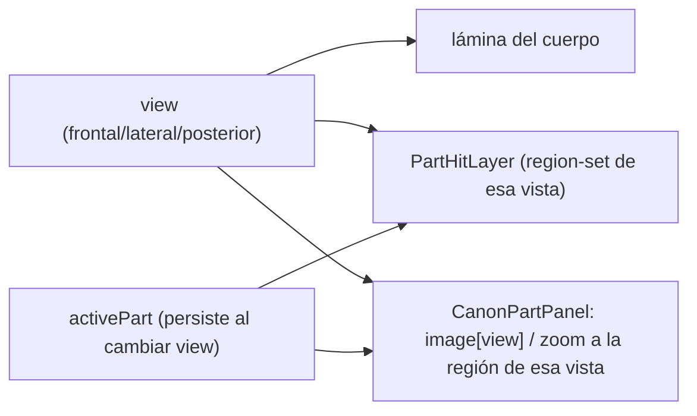
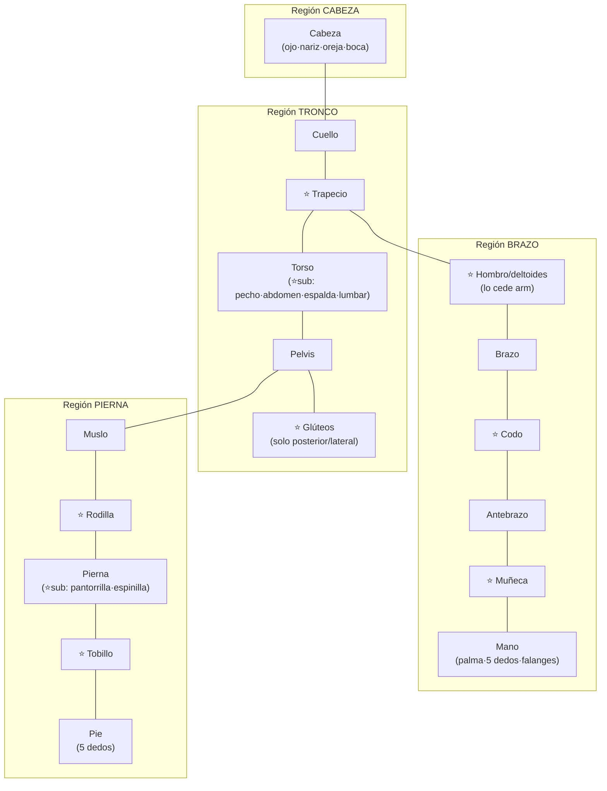
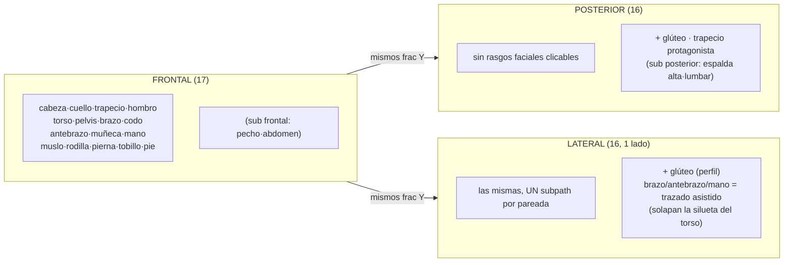
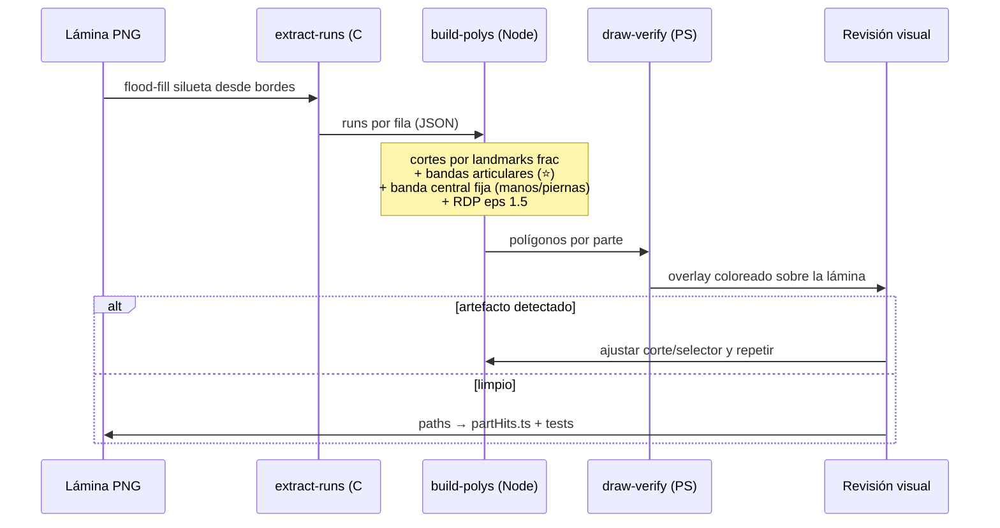
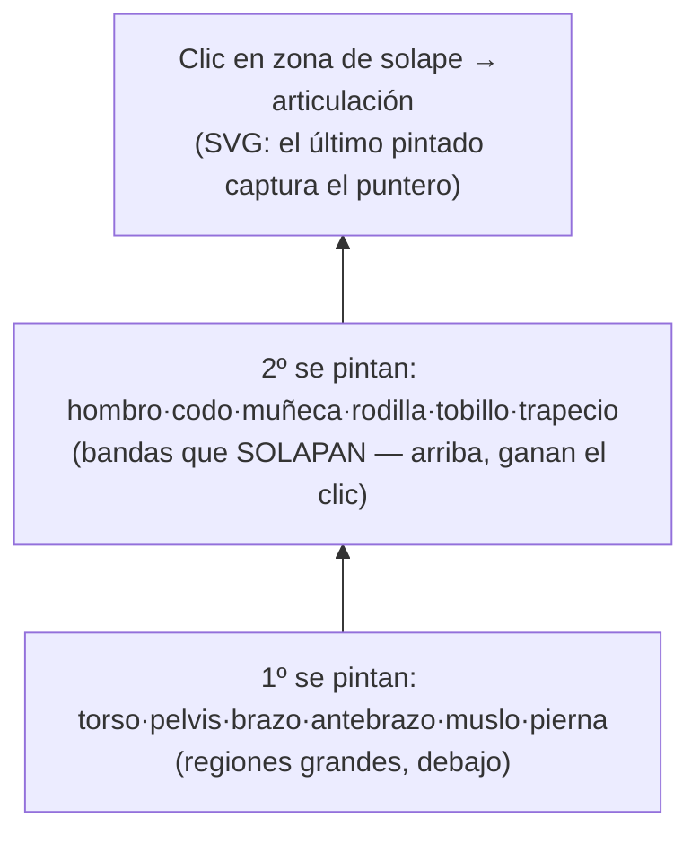
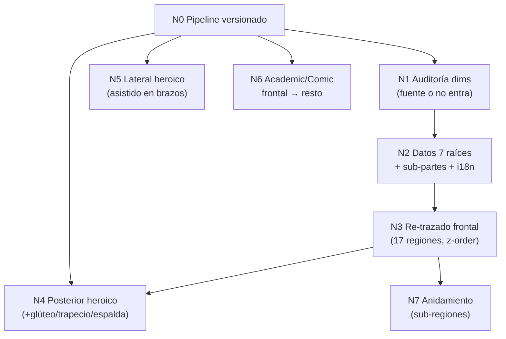

# Plan — Hover COMPLETO (lateral/posterior/otros cánones) + atlas de partes AMPLIADO

**Fecha:** 2026-06-09 · **Umbrella:** `importantes/canon` · **Parte de:** eje A3-extra del roadmap (`arquitectura.md` §9) + ampliación del atlas (`anatomyParts.ts`).
**Base:** A3+A4 COMPLETOS — `partHits.ts` (heroico-frontal, 10 partes) + `PartHitLayer` + `CanonPartPanel`. Pipeline de trazado probado (scripts en `C:\tmp\parthits`, AÚN no versionados).
**Estado:** N0–N3 ✅ (frontal: 16 regiones, articulaciones ancladas a landmarks). N4 revertido y **REHECHO en N4-bis**. **N4-bis** (2026-06-10): ✅ sync de vista · ✅ regiones-zona sin dim (`regions.ts`+panel+i18n) · ✅ anclaje a landmarks · ✅ **POSTERIOR trazado** (16 regiones, region-set propio nape/back/lumbar/glutes/hamstring/popliteal/calf…, vía mirror+centerSplit+bandas ancladas). **SIGUIENTE: N5 lateral** (region-set `flank`/`hip`). Sub-partes torso/pierna DIFERIDAS.

> **Problema doble (lo pidió el usuario):**
> 1. El hover/clic solo existe en **heroico frontal** — faltan lateral, posterior y los otros cánones.
> 2. La división actual del cuerpo (10 partes) se queda corta frente a los atlas de anatomía artística: **trapecio, hombro/deltoides, codo, muñeca, rodilla, tobillo, glúteos, pecho/abdomen/espalda** no existen como regiones.

---

## 0. Auditoría — qué dividen los atlas vs qué tenemos

Referencias: Richer *Anatomie artistique* (1890, dominio público — divide por regiones: cou, épaule, coude, poignet, fesse, genou, cou-de-pied…), Bridgman (capítulos dedicados a muñeca/codo/rodilla como "mecanismos"), anatomy4sculptors HPC (regiones: shoulder, elbow, wrist, hips, knee, ankle como zonas propias).

| Región (consenso atlas) | Hoy | Veredicto |
|---|---|---|
| Cabeza | `head` ✓ (+ ojo/nariz/oreja/boca) | OK |
| Cuello | `neck` ✓ | OK |
| **Trapecio** (pendiente nuca→acromion) | ✗ (zona muerta entre neck/torso/arm) | **FALTA — raíz nueva** |
| **Hombro / deltoides** | ✗ (absorbido en `arm`) | **FALTA — raíz nueva** |
| Tórax/pecho · Abdomen · Espalda alta · Lumbar | ✗ (todo es `torso`) | torso se queda como raíz; entran como **sub-partes** (anidamiento §5) |
| Brazo (húmero) | `arm` ✓ | OK (cede el deltoides al hombro) |
| **Codo** | ✗ | **FALTA — raíz nueva (articulación)** |
| Antebrazo | `forearm` ✓ | OK |
| **Muñeca** | ✗ | **FALTA — raíz nueva (articulación)** |
| Mano | `hand` ✓ (+ palma/dedos/falanges) | OK |
| Pelvis/caderas | `pelvis` ✓ | OK (vista frontal) |
| **Glúteos** | ✗ | **FALTA — raíz nueva (solo posterior/lateral)** |
| Muslo | `thigh` ✓ | OK |
| **Rodilla** | ✗ | **FALTA — raíz nueva (articulación)** |
| Pierna (tibia) | `leg` ✓ | OK; `calf`/`shin` como sub-partes (datos) |
| **Tobillo** | ✗ | **FALTA — raíz nueva (articulación)** |
| Pie | `foot` ✓ (+ dedos) | OK |

**Resultado: 7 raíces nuevas** (trapecio, hombro, codo, muñeca, glúteo, rodilla, tobillo) → 17 raíces clicables. Pecho/abdomen/espalda/lumbar y pantorrilla/espinilla = sub-partes (árbol + anidamiento futuro), no raíces.

### ⚠️ REGIONES POR VISTA — descubrimiento N4 (replanteo)

**El error de N4:** reusé las claves frontales (torso/pelvis/knee) en posterior. **Mal.**
La superficie posterior tiene **regiones y NOMBRES propios** — como hace cualquier
atlas (anatomy4sculptors muestra pecho/abdomen de frente, trapecio/dorsal/lumbares de
espalda). La clave anatómica de hueso/segmento puede ser la misma, pero la **región de
superficie clicable y su etiqueta cambian con la vista.**

**Estado:** las 3 vistas heroico trazadas con region-set propio — frontal (16 regiones),
posterior (masas de espalda, hand-authored arriba), lateral (bandas de perfil). Pendiente
paralelizable: otros cánones (academic/comic) + femeninas (mismo pipeline/configs).

**Principio (lo que fallé en N4):** cada **vista del cuerpo = region-set y nombres
PROPIOS + su lámina propia**. NO se reusan claves entre vistas. (Frontal salió bien
porque lo definimos así; el error fue no replicarlo a posterior/lateral.)

| Frontal (anterior) | **Lateral (perfil)** | **Posterior** |
|---|---|---|
| cabeza (rostro) | cabeza (perfil) | cabeza (occipucio) |
| cuello | cuello (perfil, ECM) | **nuca** |
| trapecio (pendiente) | trapecio (perfil) | **trapecio** (protagonista) |
| **pecho** · **abdomen** (torso ant.) | **costado / flanco** (costillas+oblicuo+dorsal ancho) | **espalda alta/dorsal** · **lumbar** (≠ "torso") |
| pelvis (vientre bajo) | **cadera (trocánter mayor)** | **glúteos** (≠ "pelvis"; los dos juntos) |
| hombro/deltoides | deltoide (perfil) | deltoide posterior |
| brazo · codo · antebrazo · muñeca · mano | brazo · codo · antebrazo · muñeca · mano (perfil) | brazo post. · **codo (olécranon)** · antebrazo · muñeca · mano |
| muslo | muslo (perfil) | **muslo post. (isquiotibiales)** |
| rodilla (rótula) | rodilla (perfil) | **corva / hueco poplíteo** (≠ "rodilla") |
| pierna (espinilla) | pierna (perfil: tibia+gemelo) | **pantorrilla (gemelos)** |
| tobillo | tobillo (ambos maléolos) | tobillo (tendón de Aquiles) |
| pie | pie (arco lateral) | **talón** / pie post. |

**Region-set por vista (claves propuestas, opción A):**
- **frontal:** `head, neck, trapezius, chest, abdomen, pelvis, shoulder, arm, elbow, forearm, wrist, hand, thigh, knee, leg, ankle, foot` (hoy: 16, falta separar chest/abdomen del `torso`).
- **lateral:** `head, neck, trapezius, flank, hip, shoulder, arm, elbow, forearm, wrist, hand, thigh, knee, leg, ankle, foot` (`flank`=costado, `hip`=cadera).
- **posterior:** `head, nape, trapezius, back, lumbar, glutes, shoulder, arm, elbow, forearm, wrist, hand, hamstring, popliteal, calf, ankle, heel` (`nape`=nuca, `back`/`lumbar`, `glutes`, `hamstring`=muslo post., `popliteal`=corva, `calf`=pantorrilla, `heel`=talón).

**Implicación de diseño (decidir en N4-bis):** el `region-set` es **por canon-vista**. Dos
opciones:
- **(A) keys propias por vista** en `partHits.ts` (p. ej. `back`, `glutes`, `popliteal`,
  `calf`, `nape`) con sus i18n `canon.part.names.*`. La ficha (`CanonPartPanel`) y el
  árbol mapean por la key real. Más honesto anatómicamente; el atlas de dims gana
  esas entradas (espalda/lumbar/pantorrilla con su fuente).
- **(B) misma key anatómica, etiqueta por vista** (`canon.part.names.<key>.<view>`).
  Menos entradas, pero fuerza un nombre por vista sobre la misma parte. Pierde que
  "glúteos" y "pelvis" son regiones DISTINTAS, no la misma con dos nombres.

→ **Recomendado (A)**: añadir las raíces posteriores que faltan (`back`/`upperBack`,
`lumbar`, `glutes`, `calf`, `popliteal`, `nape`, `hamstring`) y trazar el region-set
posterior propio.

**Decisión que evita inventar dims (clave):** las **regiones clicables ⊇ partes-con-dim**.
Muchas regiones de superficie (lumbar, costado, corva, nuca…) son ZONAS sin una medida
lineal limpia con fuente — forzarles un `heads` sería inventar (rompe la regla dura).
Por eso se separan dos cosas:
- **Parte de atlas** (`anatomyParts.ts`): tiene `dims` con fuente (cabeza, mano, rodilla→
  bicondilar, glúteo→1.0/1.5…). La ficha muestra dims+Δ.
- **Región clicable** (`partHits.ts`): puede existir SIN parte de atlas; lleva solo
  **nombre + blurb (con fuente del hecho)**. La ficha muestra nombre+blurb (sin dims
  inventadas). `CanonPartPanel` ya degrada a header+blurb cuando no hay `getPart(key)`.
- Una región puede ser ambas (glúteo: dim + clicable). Otras solo clicables (lumbar,
  costado). Así el atlas de superficie estilo anatomy4sculptors entra **sin inventar
  medidas**: se enseña la zona y su nota, y se mide solo lo medible.

Implementación: `CanonPartPanel` debe renderizar nombre+blurb aunque `getPart(key)` sea
`undefined` (hoy hace `return null`); los blurbs i18n cubren las regiones-zona.

### Interacción — la VISTA DE LA PARTE sigue la VISTA DEL CUERPO

Spec (confirmado por usuario): con una parte abierta (`activePart`), cambiar la vista
del cuerpo **mantiene la parte seleccionada** y conmuta su lámina a esa vista. Entrar a
la mano desde frontal y pasar a lateral = aparece la **mano lateral**; esa MISMA ficha
se abre clicando la mano estando ya en la vista lateral del cuerpo. La vista es una sola
fuente: `view` gobierna a la vez la lámina del cuerpo, las regiones clicables y la
imagen de la parte.

**Cambio de implementación (hoy hay un bug):** `useCanonTool` HOY borra `activePart`
al cambiar `view` → con el spec nuevo debe **conservarlo** (solo el cambio de CANON, o
que la parte no exista en la nueva vista, lo limpia). Casos:
- **Parte que existe en todas las vistas** (mano, brazo, rodilla, pie…): se mantiene y
  conmuta de lámina. ✔
- **Región exclusiva de una vista** (pecho solo frontal, espalda solo posterior, corva
  solo posterior): al cambiar a una vista donde NO existe → la ficha indica "no visible
  en esta vista" y ofrece su análoga si la hay (pecho↔espalda como cara opuesta del
  torso), o se cierra. Decidir el mapeo análogo en N4-bis.
- El `PartHitLayer` de la nueva vista usa SU region-set; si la parte activa sí está,
  queda resaltada; si no, sin resaltado pero la ficha persiste con el aviso.

### Mapa del atlas ampliado (17 raíces; ⭐ = nueva)

### Reglas que NO se negocian (heredadas)
- **Veracidad (regla dura):** cada parte nueva entra SOLO con ≥1 dim ratio + `source` (el test `dims.length > 0` lo fuerza). Los hechos POSICIONALES (codo = cintura, muñeca = entrepierna) NO son dims → van a `CROSS_RULES`/`anatomyFacts` si no están ya.
- **Forma anatómica, nunca cajas (P9)** — también para articulaciones (la rodilla es la zona de la rótula siguiendo el contorno, no un rectángulo).
- **Una parte sin path en una vista simplemente no es clicable ahí** (degrada limpio) — esto resuelve gratis las partes view-dependent: glúteo solo tendrá paths posterior/lateral; pecho solo frontal. El modelo de datos NO necesita eje "vista".

### Dims auditadas (N1 — 2026-06-09) ✅

**Método:** anchos óseos/articulares de **ANSUR II** (muestra masculina n=4082, mm) y
literatura ósea, convertidos a **unidades-cabeza** dividiendo por la **altura de
cabeza masculina ≈ 232 mm** (mentón→coronilla, ANSUR). El baseline 232 mm se VALIDA
contra un dato que el modelo ya tenía correcto: ancho de cabeza 155 mm / 232 = **0.668
≈ el 0.66 de `anatomyParts`** → la conversión es coherente. (Recordatorio: en el
modelo `heads` = fracción de la altura de cabeza, escala con `headCm` de cada canon.)

| Parte | Dim | mm (ANSUR II ♂) | **heads** | Rango | Fuente | Confianza |
|---|---|---|---|---|---|---|
| **Codo** | ancho (elbow breadth / biepicondilar) | ~76 | **0.33** | 0.30–0.38 | antropometría (ANSUR) | **alta** |
| **Muñeca** | ancho (wrist breadth / biestiloideo) | ~58 | **0.25** | 0.22–0.28 | antropometría (ANSUR) | **alta** |
| **Rodilla** | ancho (knee breadth / bicondilar) | ~96 (hueso 79 + tej.) | **0.41** | 0.38–0.46 | antropometría (ANSUR; bicondilar óseo confirmado 79±3) | **alta** |
| **Tobillo** | ancho (bimaleolar) | ~72 | **0.31** | 0.29–0.35 | antropometría (ANSUR) | **alta** |
| **Hombro/deltoides** | alto deltoides (acromion→inserción) | — | **0.6** | 0.5–0.7 | Bridgman (cubre 1/3 sup. del brazo, brazo=1.4) | media |
| **Hombro/deltoides** | ancho de la tapa deltoidea | ~0.5 cab | **0.5** | 0.45–0.6 | Bridgman/antropometría | media |
| **Trapecio** | largo nuca→T12 (vértice inf.) | — | **1.5** | 1.3–1.7 | Richer | media |
| **Glúteo** | alto cresta ilíaca→pliegue glúteo | — | **1.0** | 0.9–1.05 | Richer | media |
| **Glúteo** | ancho (≈ ancho de pelvis) | — | **1.5** | 1.4–1.7 | Richer/antropometría | media |

**Hechos POSICIONALES (no son dims — van a `CROSS_RULES`/`anatomyFacts`, no a `dims`):**
codo a la altura de cintura/ombligo · muñeca en la entrepierna (ya implícito en
landmarks) · rótula a `frac` 0.64 (ya es landmark `rodillas`) · **maléolo interno más
alto y más adelantado que el externo** (Richer — rasgo de dibujo, no medida) · trapecio
desciende en pendiente recta nuca→acromion.

**Descartado por ahora (sin fuente limpia → NO entra):** ancho biacromial como dim del
hombro (ya vive como `widthsCm.shoulders` del motor; no duplicar) · grosores/circunfe-
rencias de articulación (el atlas es de proporción lineal, no volumétrico).

**Regla dura respetada:** cada raíz nueva entra con **≥1 dim de confianza alta o media
CON fuente**; lo posicional no infla `dims`. El test `dims.length>0` se cumple.

Fuentes: [ANSUR II / OPEN Design Lab](https://www.openlab.psu.edu/ansur2/) · [Definiciones de dimensiones ANSUR (UMTRI)](https://mreed.umtri.umich.edu/mreed/downloads/anthro/ansur/ADAS-Dimension_Definitions.pdf) · [Bicondilar de fémur, estudio antropométrico](https://www.rjpbcs.com/pdf/2015_6(4)/%5B261%5D.pdf) · Richer *Anatomie artistique* (1890, dominio público) · Bridgman *Constructive Anatomy*.

---

## 1. Bloque V — hover en más vistas/cánones (trazado)

El pipeline (flood-fill silueta → runs → polígonos por cortes de landmarks → RDP → overlay de verificación visual) se reusa; lo que cambia por vista:

- **V-posterior (heroico):** GRATIS técnicamente — misma topología que frontal (simétrico, brazos a los lados, mismos landmarks Y). Re-correr pipeline sobre `posterior.png` (454×1471, cortes propios medidos). Partes posteriores nuevas visibles: trapecio, glúteo, espalda (sub). `pelvis` en posterior = zona sobre el sacro; el glúteo toma su parte baja.
- **V-lateral (heroico):** el DIFÍCIL — el brazo se SOLAPA con el torso en la silueta (el flood-fill no los separa). Estrategia: pipeline para las partes axiales (cabeza/cuello/torso/pelvis/pierna/pie por bandas de runs) + **trazado asistido visual** para brazo/antebrazo/mano (dibujo el polígono siguiendo el contorno INTERIOR del line-art, itero con el overlay de verificación — mismo loop draw→render→mirar→ajustar que ya usé para depurar frontal). Partes pareadas en lateral = UN solo subpath (se ve un lado).
- **V-otros cánones (academic/comic frontal → resto):** pipeline directo con SUS cortes (academic/comic comparten `MEASURED_ADULT`; axila/manos se detectan solos). ~30 min por lámina.
- **Z-order de articulaciones:** codo/muñeca/rodilla/tobillo se SOLAPAN con brazo/antebrazo/muslo/pierna. En `PartHitLayer` el orden del render decide el hit (SVG: último pinta encima) → **articulaciones SIEMPRE después de las partes grandes** en el mapa. Convención: `partHits.ts` define orden de inserción = orden de pintado.

### Cobertura por vista (qué parte es clicable dónde)

Regla: **sin path en esa vista = no clicable ahí** (degrada limpio, cero schema nuevo).

### Pipeline por lámina (loop de verificación visual)

### Z-order del hit-test (articulaciones encima)

**Versionar el pipeline (deuda):** mover los scripts de `C:\tmp\parthits` a `scripts/canon-parthits/` del repo (extract-runs.ps1, build-polys.js, draw-verify.ps1) con README corto. Sin esto, cada vista nueva re-inventa.

---

## 2. Bloque P — partes nuevas (datos + trazado)

1. **Datos:** 7 raíces nuevas en `anatomyParts.ts` (dims confirmadas §0 + `region` correcta: trapecio/glúteo→trunk, hombro/codo/muñeca→arm, rodilla/tobillo→leg) + sub-partes de torso (chest/abdomen/upperBack/lumbar) y pierna (calf/shin) SOLO como datos del árbol. i18n `canon.part.names.*` + blurbs es/en.
2. **Trazado frontal (heroico):** las articulaciones son **bandas del contorno** alrededor de su landmark (rodilla = silueta entre frac 0.61–0.67; el pipeline ya corta por bandas — mismo mecanismo). Hombro = el polígono que A3 le quitó al torso (deltoide, frontera interpolada ya calculada); trapecio = banda 0.14–0.165 entre cuello y acromion. `arm` se recorta (cede el deltoide).
3. **Re-trazar afecta a `arm`/`torso`/`neck` existentes** — el verify-overlay decide; los paths actuales son reemplazables sin tocar código (solo data).
4. **Tests:** mismos de `partHits.test.ts` (se amplían las listas de pareadas/centrales); + test de que toda raíz nueva tiene dim con fuente.

---

## 3. Fases (orden de ejecución)

- **N0 ✅ Pipeline versionado:** `scripts/canon-parthits/` (extract-runs.ps1 + build-polys.js parametrizado por `configs/<canon>-<view>.json` + draw-verify.ps1 + README). Smoke: reproduce los paths de heroico-frontal **byte-idéntico** a A3.
- **N1 ✅ Auditoría de dims:** tabla §0 cerrada — 4 anchos articulares de **confianza alta** (ANSUR II, convertido a heads con baseline cabeza 232 mm validado contra el 0.66 ya correcto) + 5 de confianza media (Richer/Bridgman); posicionales a `CROSS_RULES` (varios ya existen: `elbowWaist`/`wristCrotch`). `FactSource` ya cubre las fuentes.
- **N2 ✅ Datos:** 7 raíces en `anatomyParts.ts` (trapecio/glúteo→trunk, hombro/codo/muñeca→arm, rodilla/tobillo→leg) con dims+fuente+blurb; i18n es/en (nombres + 7 blurbs); tests (17 raíces, partHits subconjunto). **Sub-partes torso/pierna DIFERIDAS**: `chest/abdomen/upperBack/lumbar` y `calf` no tienen dim con fuente limpia sin inventar (regla dura > completitud); `shin` ya es dim de `leg`. Posicionales reusan `CROSS_RULES` existentes. Ya salen en el árbol con Δ (aún no clicables).
- **N3 ✅ Re-trazado heroico-frontal:** **16 regiones** (10 base + trapecio + 5 articulares; solo el glúteo es exclusivo posterior/lateral). Las nuevas son `bands` data-driven en `configs/heroic-frontal.json` (modos `trapSlope`/`armPegado`/`sideLimb`/`legs`); SOLAPAN las partes grandes y se insertan DESPUÉS en `partHits.ts` → ganan el hit-test (z-order). NO se recortó `arm`/`torso` (overlay + z-order basta).

  > **⚠️ CALIBRACIÓN — método del usuario (pendiente de implementar, NO seguir tuneando a mano):** afinar las ventanas `frac` a ojo es frágil (frontal quedó descuadrado 2 veces: codo bajo/largo, muñeca baja, rodilla alta/corta, trapecio sin cubrir el cuello). **Solución sistemática a adoptar:** anclar cada banda articular a un **landmark YA medido** en `landmarks.ts` (codo→`ombligo`, muñeca→`entrepierna`, rodilla→`rodillas`, tobillo→`pies`) ± medio alto de articulación, en vez de números tecleados. Como los landmarks son por canon-vista, las bandas **se auto-corrigen en TODAS las láminas a la vez** — esa es la "manera fácil". El trapecio debe extenderse hacia ARRIBA contra el cuello (cubrirlo completo), no solo la pendiente baja. **Hasta implementarlo, el frontal queda como está (codo aún algo bajo, rodilla algo corta) — se corrige cuando se aplique el anclaje, no antes.**

- **N4 ❌ REVERTIDO — Posterior heroico:** intento fallido. Errores reportados por el usuario (2026-06-10): pelvis debía ser **glúteos** (los dos juntos), muslos no salían, pierna/rodilla mal ubicadas, codo y trapecio no aparecían, **torso fusionado con el brazo izquierdo**, y sobre todo **nombres equivocados** (torso→espalda, rodilla→corva). Causa raíz: reusé el region-set frontal. Revertido el wiring (`partHits.ts` vuelve a solo `HEROIC_FRONTAL`). Lección → §"Regiones por vista".
- **N4-bis — Region-set por vista + sync de vista (EN CURSO):**
  - (3) **sync de vista ✅ (2026-06-10):** `useCanonTool` ya NO borra `activePart` al cambiar `view` (solo al cambiar `canonId`) → la ficha conmuta de lámina; `CanonPartPanel` muestra aviso `notInView` cuando la parte no se ve desde esa vista. La spec §"Interacción" funciona para las partes que existan en ambas vistas.
  - (1) ✅ **regiones-zona sin dim (2026-06-10):** nuevo `shared/lib/canon/regions.ts` (`SURFACE_REGIONS`: nape/back/lumbar/chest/abdomen/flank/hip/hamstring/popliteal/calf/heel, cada una con región+fuente, disjuntas del atlas) + `getRegion`. `CanonPartPanel` ya renderiza nombre+blurb+fuente cuando `getPart(key)` es `undefined`. i18n es/en (nombres + 11 blurbs). Tests (regions.test.ts: claves únicas, disjuntas del atlas, getRegion). Así `lumbar`/`flank`/`popliteal`/`nape`… son fichas válidas **sin inventar medidas**.
  - (2) modelo de region-set por vista: la estructura de `partHits.ts` YA es por-vista (keys libres) y las claves+i18n+descriptores ya existen → **falta solo TRAZAR** los paths posterior/lateral con esas claves (trazado asistido, abajo).
  - (4a) ✅ **anclaje a landmarks (2026-06-10):** el pipeline soporta bandas ancladas (`anchor` + `offset` + `half` sobre `config.landmarks`) en vez de `frac` a mano. Frontal RE-TRAZADO con anclaje (codo→ombligo, muñeca→entrepierna, rodilla→rodillas, tobillo→pies) → codo/muñeca/rodilla corregidos (el feedback del usuario), verificado con overlay. Como los landmarks son por canon-vista, las bandas se auto-ubican en cada lámina → fin del tuneo a mano.
  - (4b) ✅ **trazado asistido POSTERIOR (2026-06-10):** 16 regiones con region-set PROPIO (`nape`/`back`/`lumbar`/`gluteus`/`arm`/`forearm`/`hand`/`elbow`/`wrist`/`trapezius`/`hamstring`/`popliteal`/`calf`/`ankle`/`foot`/`head`). Resuelto sin trazar a mano: `mirror:auto` (refleja el brazo separado al pegado, figura simétrica), `centerSplit` (glúteo en dos lóbulos por la banda central, inmune a las manos), hamstring por banda anclada bajo las manos, articulaciones ancladas a landmarks. Wireado en `partHits.ts` `HEROIC_POSTERIOR` + tests (region-set propio, zonas en `regions.ts`). Verificado overlay.
  - (4c) **PENDIENTE — N5 lateral:** mismo enfoque con region-set lateral (`flank`/`hip`).
- **N5 ✅ Lateral heroico (2026-06-13):** region-set lateral PROPIO con bandas de perfil (modo `profileBand`): head·neck·**flank**(costado)·**hip**(cadera)·thigh·knee·leg·ankle·foot. El perfil es UN solo run → el brazo va FUNDIDO con el torso (inseparable) → arm/forearm/hand se OMITEN (degrada limpio). `flank`/`hip` son zonas (`regions.ts`). Wireado `HEROIC_LATERAL` + test. Las 3 vistas (frontal/posterior/lateral) ya tienen su region-set propio.
- **N-láminas (paralelo) — cada PARTE tiene sus propias vistas:** las láminas dedicadas de parte (`public/canon/parts/<part>/<view>.png`, A5) también son **una por vista con anatomía distinta** (mano dorsal≠palmar≠lateral; rodilla frontal≠perfil≠corva). Prompts en `docs/helps/canon-image-prompts-parts.md` (ampliados con las regiones de superficie por vista).
- **N6 — Frontales academic/comic:** pipeline re-run (cortes propios). Después lateral/posterior de cada uno.
- **N7 — Anidamiento (futuro, cierra §3.1 del plan profundo):** dentro de `activePart`, el layer cambia a sub-regiones (torso→pecho/abdomen; mano→dedos) con breadcrumb. Requiere paths de sub-parte (mismo pipeline a otra escala).

Cada fase: tsc + tests + i18n es/en + doctor en tocados + verify-overlay visual antes de commitear paths.

---

## 4. Riesgos

- **Inventar dims de articulaciones** — el riesgo nº1. Mitigación: tabla §0 es CANDIDATA, nada entra sin confirmar; posicionales a `CROSS_RULES`.
- **Lateral:** la separación brazo/torso no sale del alpha → asistido visual (más lento, ~1-2 h esa vista). Aceptado.
- **Regiones pequeñas (muñeca/tobillo) en móvil:** objetivo táctil < 44px con zoom bajo. Mitigación: el usuario puede hacer zoom (las regiones escalan); si molesta, padding de hit invisible alrededor del path (stroke ancho transparente).
- **Árbol más denso (17 raíces):** el aside scrollea y las regiones agrupan; si satura, colapsar articulaciones bajo su limbo en el árbol (codo dentro de Brazo) manteniendo la raíz clicable en la lámina — decidir en N2.
- **Re-trazar rompe lo trazado:** no — los paths son data pura; verify-overlay valida antes de reemplazar.

---

Relacionado: `arquitectura.md` (§8.1 pipeline, §9 roadmap), `plan-canon-anatomy-deep.md` (§3.1 anidamiento), `src/shared/lib/canon/{anatomyParts,partHits}.ts`, `src/frontend/features/tools/canon/components/PartHitLayer.tsx`, memoria `canon-anatomy-deep-plan`.
