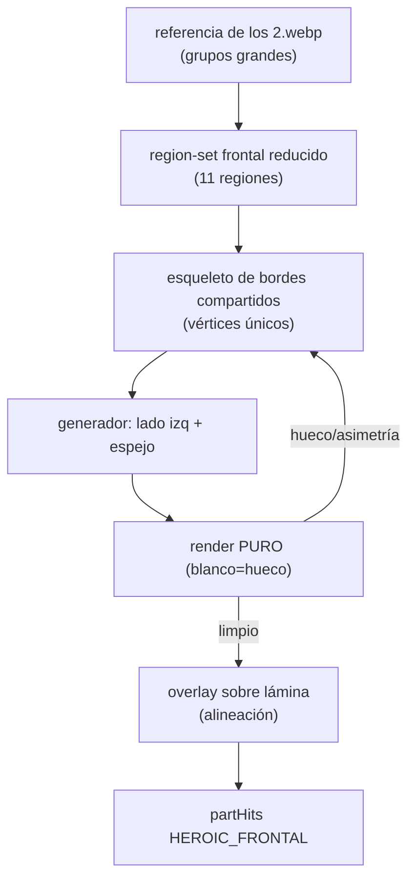

# Plan — Mapa de músculos FRONTAL fino, suave y anatómico (estilo atlas)

**Fecha:** 2026-06-17 · **Umbrella:** `importantes/canon` · **Estado:** ✅ EJECUTADO.
**Resultado final (F9): la lámina sigue siendo `frontal.png`** (innegociable) y la
capa Músculos se TRAZA del dibujo del usuario `musculos.png` (re-exportado por el
usuario ALINEADO con frontal.png → siluetas casi idénticas, sin warp). Pipeline:
`paint-frontal.js` (clasifica CADA PÍXEL por HUE+posición → dilata líneas → contornea
máscaras sólidas) → `apply-frontal.js`. 14 regiones del dibujo (trapecio propio, sin
mano), interactivas (hover), colores por vista. Se ELIMINARON los experimentos que no
convergían (build-frontal F1-F7, warp, trace-por-blob, lámina musculosblanco). tests
+ tsc verdes.
**Alcance:** SOLO vista **frontal** del mapa de músculos (capa "Músculos").
Posterior queda como está (solo pulido menor, NO rehacer). **Lateral EXCLUIDA**
(demasiados errores; se retoma en otro plan).

> **Objetivo:** que el mapa frontal quede como un atlas real — regiones **finas,
> suaves, simétricas, sin huecos ni solapes**, con POCAS divisiones grandes (no
> sobre-fragmentar). Referencia rectora: `public/canon/heroic/referencia de los
> 2.webp` (diagrama "Muscular System": color plano, grupos grandes).

---

## 0. Lecciones de la sesión (por qué fallamos y qué cambia)

Pulir a ojo, región por región, falló muchas iteraciones (hueco trapecio derecho,
pelvis cortando recto, axila con blanco, asimetrías). Causas y reglas nuevas:

1. **Tilear a mano = huecos.** Dos polígonos vecinos trazados por separado casi
   nunca comparten el borde exacto → quedan slivers blancos o solapes.
   → **REGLA:** las regiones vecinas deben **compartir los MISMOS vértices**. Un
   borde compartido se define UNA vez y lo usan ambas regiones.
2. **Adivinar coords = asimetría + desalineación.**
   → **REGLA:** definir solo el lado IZQUIERDO y **espejar** (`x → 1-x`) para el
   derecho. Simetría por construcción (mata el "trapecio derecho").
   → **REGLA:** los bordes que tocan la silueta se **miden** del PNG (columna→
   primer píxel no-fondo), no se inventan.
3. **No se veían los huecos reales.** El dibujo de la lámina los tapaba.
   → **REGLA:** verificar con **render PURO** (solo rellenos sobre blanco): cualquier
   blanco dentro del cuerpo = hueco. Luego overlay sobre la lámina para alineación.
4. **Demasiadas divisiones = demasiadas costuras.** Pelvis/flanco/trapecio-frontal/
   articulaciones generaban uniones frágiles (la pelvis fue el peor corte).
   → **REGLA:** adoptar el grupo GRANDE de la referencia simple. Menos regiones,
   menos seams, más atlas.

Herramienta nueva (de esta sesión): generador con vértices compartidos + espejo
+ render puro/overlay (`scripts/canon-parthits/_gen.js`, a formalizar en F1).

---

## 1. Region-set frontal NUEVO (reducido pero anatómico)

Base: `referencia de los 2` (grupos grandes) PERO conservando las uniones
anatómicas que el usuario pidió mantener: **pelvis** (une abdomen+costados con
muslos), **flanco/costados** y **rodilla**. El trapecio frontal se **FUSIONA en
el cuello** (de frente el trapecio es mínimo; no va como región aparte).

| key | grupo | color | notas |
|---|---|---|---|
| `head` | cabeza | neutro | no es masa pintada |
| `neck` | cuello + trapecio (fusionados) | verde | base baja a clavícula; cubre la pendiente cuello-hombro |
| `shoulder` | deltoides | naranja | cap, comparte borde con neck+chest+arm |
| `chest` | pectorales | rojo/salmón | borde sup = clavícula (compartido) |
| `arm` | brazo (bíceps) | azul | comparte axila con chest+shoulder |
| `forearm` | antebrazo | tostado | comparte codo (línea) con arm |
| `abdomen` | abdomen (recto) | naranja | centro; lados → flanco |
| `flank` | costados (oblicuo/serrato) | tostado | entre chest/abdomen y pelvis |
| `pelvis` | pelvis/inguinal | mauve | **UNE abdomen+flanco con muslos** (no eliminar) |
| `thigh` | muslo (cuádriceps) | mauve | borde sup = pelvis; comparte rodilla con leg |
| `knee` | rodilla | ocre | **mantener**; lente entre thigh y leg |
| `leg` | pierna (gemelo/tibial) | verde | comparte rodilla con thigh |
| `hand` | mano | neutro | — |
| `foot` | pie | azul | — |

**SE ELIMINAN de frontal (fusiones aceptadas):** `trapezius` → fusionado en
`neck` (clave del problema cuello/trapecio); `elbow`, `wrist`, `ankle` → se
vuelven bordes compartidos (arm↔forearm, leg↔foot). Esto reduce ~18 → ~14
regiones. **SE CONSERVAN:** `pelvis`, `flank`, `knee` (uniones anatómicas).

> Nota clic: al fusionar trapecio y quitar codo/muñeca/tobillo se pierden como
> clicables EN FRONTAL (siguen en otras vistas). Se acepta (objetivo = mapa
> atlas). Reintroducir clic de esas luego como dato aparte, no como polígono.

---

## 2. Esqueleto de bordes COMPARTIDOS (el corazón del plan)

En vez de polígonos sueltos, se define un **grafo de bordes**; cada región se
arma encadenando bordes. Un borde compartido existe una sola vez → imposible que
haya hueco/solape entre vecinos.

Bordes clave (lado izq; el der es espejo):
- **SIL_hombro**: silueta superior del hombro (MEDIDA del PNG: x→y primer píxel).
- **CLAV**: línea de la clavícula (notch esternal centro → acromion). Borde
  inferior de `neck`/superior de `chest`/`shoulder` cerca del cuello.
- **B_chest_sh**: chest ↔ shoulder (del acromion a la axila).
- **AXILA**: punto único donde se juntan `chest`, `shoulder`, `arm`.
- **B_chest_abs**: chest ↔ abdomen/flanco (surco bajo el pectoral).
- **B_abs_flank**: abdomen ↔ flanco (lateral del recto).
- **B_flank_pelvis** / **B_abs_pelvis**: borde superior de la pelvis (recibe
  abdomen + flanco).
- **B_pelvis_thigh**: pliegue inguinal (pelvis ↔ muslo) — V suave, NO recto.
- **B_arm_fore**: codo (arm ↔ forearm), línea, no caja.
- **B_thigh_knee** / **B_knee_leg**: rodilla como LENTE entre thigh y leg.
- silueta exterior de brazo/antebrazo/muslo/pierna (medida del PNG).

Puntos de unión triples (deben ser UN vértice compartido por las regiones que
concurren): **ACR** (neck/shoulder/chest), **AXILA** (chest/shoulder/arm),
**pelvis-corners** (abdomen/flanco/pelvis), **INGLE** (pelvis/thigh), codo y
rodilla (líneas compartidas).

---

## 3. Herramienta: formalizar el generador

`scripts/canon-parthits/build-frontal.js` (de `_gen.js`):
1. Tabla de PUNTOS nombrados (lado izq), y medidos del PNG donde tocan silueta.
2. `mir(p)=[1-x,y]` y `poly(pts)`.
3. Cada región = lista de puntos (reusando los compartidos).
4. Modo `--pure` → rellenos opacos sobre blanco (detectar huecos).
5. Modo `--over` → semi-transp sobre `frontal.png` (alineación).
6. Imprime los `path` normalizados listos para `partHits.ts`.

Criterio de aceptación del render puro: **0 píxeles blancos dentro del bbox del
cuerpo** entre regiones adyacentes (salvo fondo exterior a la silueta).

---

## 4. Fases

- **F0 — Medir** la silueta frontal (hombros, brazo, antebrazo, muslo, pierna,
  inguinal) del PNG → tabla de puntos. (script sampler, ya probado en sesión).
- **F1 — Formalizar `build-frontal.js`** (vértices compartidos + espejo + `--pure`/
  `--over`). Reproduce el cinturón superior ya logrado (cuello/hombro/chest).
- **F2 — Completar el set**: arm, forearm, abdomen, flanco, pelvis, thigh, knee,
  leg con bordes compartidos (codo línea, rodilla lente, inguinal en V).
  Fusionar trapecio en cuello; quitar codo/muñeca/tobillo. CONSERVAR pelvis,
  flanco, rodilla.
- **F3 — Verificar PURO** (0 huecos, simétrico) → iterar el esqueleto, no a ojo.
- **F4 — Overlay** sobre lámina (alineación con la anatomía real).
- **F5 — Aplicar** a `HEROIC_FRONTAL` + ajustar tests (nuevo set), i18n si cambia,
  `muscleColors` cubre las keys. tsc + tests + doctor.
- **F6 — Pulido suave**: `strokeLinejoin=round` ya está; revisar que el contorno
  lea fino (no cajas). Opcional: redondear esquinas duras añadiendo 1-2 vértices.

- **F7 — Pulido ANATÓMICO (híbrido)** ✅ HECHO — *feedback del usuario: los bordes rectos
  parecen CAJAS y no siguen el músculo; posterior se ve mejor porque sus formas
  vienen del écorché a color (contorno orgánico). El problema: frontal se hizo
  100% con el generador (que NO ve las líneas del músculo). Debe ser HÍBRIDO.*
  - **Referencia de FORMA:** `referenciafrontal.png` (écorché a color) — copiar la
    CURVA de cada grupo (cap deltoideo redondeado, borde inferior del pectoral
    convexo, columna del recto, pliegue inguinal cóncavo, lente de rodilla, vientre
    del gemelo). La referencia simple solo dicta el AGRUPAMIENTO.
  - **Mecanismo:** mantener la TOPOLOGÍA de vértices compartidos (sin huecos +
    pegada a la silueta) PERO cambiar los bordes INTERNOS rectos por **curvas**
    (polilíneas densas tipo Bézier cuadrático, `curve(a,b,bow,n)`) moldeadas al
    écorché. Como partHits solo admite M/L/Z, la curva = muchos `L`. El generador
    recto se reserva a casos rebeldes (la pendiente del trapecio).
  - **Cabeza:** medir AMBOS lados reales (NO espejar) → casa con el dibujo
    asimétrico; el borde inferior sigue la mandíbula (curva), no un corte recto.
    Compartir las esquinas de la mandíbula con el top del cuello.
  - **Cuello/trapecio:** columna más fina; la pendiente del trapecio cóncava (el
    deltoides sube más) — no un triángulo que llena todo.
  - **Pies:** cubrir bien los dedos.
  - **Criterio:** overlay sobre `frontal.png` debe leerse como el écorché (mismos
    músculos, transiciones suaves), no como cajas. Render puro sigue sin huecos.

- **F8 — Adoptar el DIBUJO del usuario** ✅ HECHO (estrategia final, reemplaza el
  generado) — *el usuario entregó `musculos.png` (mapa coloreado EXACTO que quiere)
  y `musculosblanco.png` (la misma figura sin color). Generar a ojo no convergía;
  se traza el dibujo directo.*
  - `musculosblanco.png` y `musculos.png` = MISMA figura (≠ frontal.png, otra pose).
    Por eso la **lámina frontal de heroico pasa a `musculosblanco.png`** (override
    `src` en `figureMeta`) → el trazo calza pixel-perfect.
  - **Trazado por color** (pipeline de posterior): `trace-frontal.js` (componentes
    conexos por color; cada músculo va separado por línea negra) → `assign-frontal.js`
    (agrupa blobs → 14 regiones por color+ubicación, une subpaths) → `apply-frontal.js`
    (regenera `HEROIC_FRONTAL`). Normalizado a la IMAGEN completa (0..1).
  - Region-set del dibujo: head·neck·**trapezius (propio, capa morada)**·shoulder·
    chest·arm·forearm·abdomen·flank·pelvis·thigh·knee·leg·foot. SIN `hand` (sin
    colorear en el dibujo → degrada limpio). El trapecio YA NO se fusiona (el dibujo
    lo separa).
  - Colores por vista: `muscleColors.muscleColor(key, view)` con override FRONTAL
    (paleta del dibujo) sin tocar posterior/lateral.
  - Landmarks re-medidos sobre la nueva lámina como **override por vista**
    (`getLandmarks(canonId, view)`); las medidas en cm siguen con los del canon.
  - El generador `build-frontal.js` (F1-F7) queda como histórico; el frontal final
    es TRAZADO, no generado.

---

## 5. Posterior y lateral

- **Posterior:** NO rehacer (está bien). Solo pulido menor si aparece algún
  sliver, con la misma herramienta de vértices compartidos. Mismo criterio puro.
- **Lateral:** EXCLUIDA de este plan (demasiados errores). Plan aparte después,
  reusando `build-<view>.js`.

---

## 6. Riesgos

- **Perder clic de articulaciones en frontal** (codo/muñeca/rodilla/tobillo): se
  acepta para el objetivo atlas; reintroducir luego como dato de clic separado.
- **La pelvis** (su mal corte fue el peor de la sesión): NO se elimina pero se
  RE-FORMA — borde superior recibe abdomen+flanco (vértices compartidos), borde
  inferior = pliegue inguinal en V suave hacia los muslos. Nada de corte recto.
- **Silueta no simétrica del PNG:** medir ambos lados; si difiere <1%, usar el
  promedio y espejar (prioriza simetría visual sobre el píxel exacto).

---

Relacionado: `plan-canon-espalda-referencia.md` (posterior, hecho),
`scripts/canon-parthits/{extract-colors,assign,verify}.js`,
`src/shared/lib/canon/{partHits,muscleColors,regions}.ts`,
`src/frontend/features/tools/canon/components/MuscleMapLayer.tsx`,
referencias `public/canon/heroic/referencia*.{png,webp}`, memoria
`canon-anatomy-deep-plan`.
