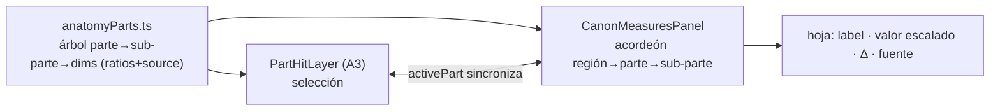
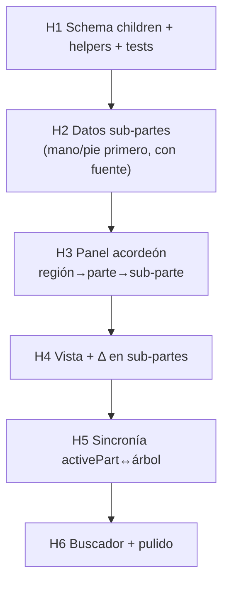

# Plan — Panel derecho JERÁRQUICO por parte (atlas amplio)

**Fecha:** 2026-06-08 · **Umbrella:** `importantes/canon` · **Expande:** la fase **A2** de `plan-canon-anatomy-deep.md` (que era "panel por región plegable") y el contenido de `anatomyParts.ts` (A1).
**Arquitectura:** `arquitectura.md` (capas, invariantes). Este plan toca ① datos (`anatomyParts.ts`) y ③ interacción (`CanonMeasuresPanel`).
**Estado** Completado · H5 (sincronía/filtro con el modelo) ACTIVADA el 2026-06-09 al cerrarse A3+A4: seleccionar en la lámina filtra el árbol a esa rama; deseleccionar restaura todo.

> **Problema (foto 2026-06-08):** el panel derecho hoy es una **lista plana** (Anchos / Largos) — info super reducida. **Objetivo:** convertirlo en un **árbol anatómico amplio**: región → **parte** → **sub-parte** → dimensiones, con valores escalables y fuente. Ej.: *Mano → 5 dedos + palma; cada dedo → falanges con su medida*. Así para cada parte del cuerpo.

---

## 0. Principio rector — FIDELIDAD (P10)

El valor que muestra cada hoja debe ser **el que el usuario obtendrá al replicar** (regla = panel = mismo modelo medido). Por tanto:
- **Valor PRIMARIO = geometría real medida de la figura · escala** (largos verticales de los `frac` de `landmarks.ts`; anchos de la silueta). Coincide con la regla → replicable exacto.
- **Ideal anatómico (atlas `anatomyParts`) = columna de referencia/Δ**, NO el número principal. Mantiene la dualidad canon/anatomía como enseñanza.
- **Sub-partes sin medición** (dedos/falanges hoy ideales): se marcan como *referencia* hasta tener su medición (trazado §3.1 / medición por lámina), para no prometer exactitud que no se cumple.
- **NO se añaden más métodos de medición** (confunde → abandono). Regla y panel = una sola verdad.

## 1. Qué cambia (de plano a árbol)

**Hoy:** `measurements.ts` → 2 secciones planas (anchos/largos) en `CanonMeasuresPanel`.
**Objetivo:** sigue dividiendo **por dimensión** (ancho/largo/profundidad) PERO **sobre todo por PARTE**, con sub-partes anidadas:

```
▾ TRONCO
  ▾ Tórax        ancho 1.5 · prof 0.95 · alto 2.0
  ▸ Pelvis
▾ BRAZO
  ▾ Mano                largo 0.9 · ancho 0.4
    ▾ Palma             ½ mano
    ▾ Pulgar            2 falanges …
    ▾ Índice            3 falanges (prox/medio/distal) …
    ▸ Medio · Anular · Meñique
  ▸ Antebrazo · Brazo
▾ PIERNA
  ▾ Pie                 largo 1.0 · alto 0.3 · ancho 0.35
    ▸ Dedos (5) · Talón · Empeine
  ▸ Muslo · Pierna
```

Cada hoja = `etiqueta · valor (en la unidad activa, escala con altura) · Δ vs referencia · badge de fuente`.

---

## 2. ① Datos — sub-partes en `anatomyParts.ts`

`BodyPart` gana **hijos** (sub-partes) recursivos. Reusa `PartDimension` (con `relativeTo` para anidar ratios → invariante de escalado intacto).

```ts
interface BodyPart {
  key; region; hit; image; blurb?;
  dims: PartDimension[];
  children?: BodyPart[];   // ← NUEVO: sub-partes (palma, dedos, falanges…)
}
```

**Ejemplo Mano (estructura; cifras a confirmar con fuente):**
```
hand  (largo 0.9 ≈ cara [Richer] · ancho 0.4)
 ├─ palm        (largo = 0.5·hand)
 ├─ thumb       (2 falanges)  ├─ proximal ├─ distal
 ├─ index       (3 falanges)  ├─ proximal ├─ middle ├─ distal
 ├─ middle      (3) … (dedo medio ≈ 0.5·hand)
 ├─ ring        (3) …
 └─ little      (3) …
```
Pie análogo (5 dedos, talón, empeine). Cabeza → rasgos (tercios faciales, ojo, nariz, oreja). Tronco → tórax/abdomen/pelvis.

**Escalado:** toda sub-dim es ratio — `heads` global o `relativeTo` a su parte (`dimHeads` ya recorre la cadena). Una falange = fracción del dedo = fracción de la mano = fracción del cuerpo. Cambiar altura recalcula TODO.

**Helpers nuevos:** `walkParts(part)` (recorrer árbol), `partTree()` (raíz por región). Tests: cada sub-dim resuelve a heads>0; cada hoja con `source`.

---

## 3. Veracidad (dura, esto multiplica el riesgo)

Las falanges/rasgos son **lo más fácil de inventar**. Reglas:
- Cada sub-dim con `source` (Richer 1890 / Bridgman / antropometría). Lo no confirmable **no entra** (mejor faltar).
- Ratios conocidos y verificables primero: palma ≈ ½ mano, dedo medio ≈ ½ mano (Richer); proporción de falanges (decreciente prox>medio>distal) — confirmar contra Bridgman antes de poner número.
- Rangos, no precisión falsa. Marcar variabilidad (los dedos varían mucho entre personas).
- Distinguir ideal (canon) vs medido (antropometría).
- Texto SOLO en i18n (`canon.part.<part>.dim.<key>`, `.children.<sub>`).

> **Auditoría previa obligatoria:** una pasada de validación con Richer/Bridgman en mano antes de publicar cada número de falange/rasgo. Sin esa pasada, una parte queda con sus dims gruesas (mano: largo/ancho/palma/dedo-medio) y SIN falanges hasta confirmarlas.

---

## 4. ③ UI — árbol plegable en `CanonMeasuresPanel`

- **Acordeón por región** (Cabeza/Tronco/Brazo/Pierna) → parte → sub-parte. Expandir/colapsar; recordar estado por sesión.
- **Doble lectura:** dentro de una parte, sus dims se etiquetan por eje (ancho/largo/prof) — sigue dividiendo por dimensión, pero anidado en la parte.
- **Vista gobierna:** lateral muestra profundidades; frontal/posterior anchos (ya implementado) — aplica también a sub-partes.
- Hoja: `label · valor · Δ` + `SourceBadge`. Densidad compacta (mucho contenido) — el aside ya scrollea (no es el panel no-scroll).
- **Sincronía con el modelo (futuro A3/A4):** seleccionar una parte en la lámina (`activePart`) **expande y enfoca** su rama en el árbol; y al revés, hover en el árbol resalta la región. El árbol y `PartHitLayer` comparten `anatomyParts`.
- Buscador/filtro opcional (muchas filas).



---

## 5. Fases

- **H0 — Fidelidad (P10):** el valor primario de cada hoja = geometría medida · escala (anclar largos a `frac` de landmarks; anchos a silueta); el ideal `anatomyParts` pasa a Δ/referencia; sub-partes sin medición marcadas "referencia". Tests de fidelidad (valor == geometría·escala, escala-invariante). Regla y panel = misma fuente.
- **H1 — Schema recursivo:** `children?` en `BodyPart` + helpers `walkParts`/`partTree` + tests. Sin UI.
- **H2 — Datos confirmados (parte por parte):** poblar sub-partes con fuente, empezando por **mano** y **pie** (las que el usuario pidió), luego cabeza/tórax. Auditoría Richer/Bridgman por parte.
- **H3 — Panel árbol:** `CanonMeasuresPanel` pasa de lista plana a acordeón región→parte→sub-parte (colapsable, compacto). i18n.
- **H4 — Vista + Δ en sub-partes:** profundidad/ancho por vista en sub-partes; Δ y badges en cada hoja. (Δ ya en H3; el filtro por vista quedó absorbido — el atlas muestra todas las dims.)
- **H5 — Sincronía con el modelo (MODELADO, no implementar aún):** `activePart` ↔ rama del árbol. **Comportamiento por defecto = mostrar TODO el árbol** (estado actual; nada se oculta). El **filtro a "solo la parte seleccionada"** solo se activa **cuando esté terminado** `plan-canon-anatomy-deep.md` (A3 hover/selección + A4 ficha): al seleccionar una parte en el modelo, el panel colapsa a esa rama; al deseleccionar (Esc / clic vacío), **vuelve a mostrar todo**. Hasta entonces el panel sigue completo. Regla: la selección **filtra**, nunca **borra** — sin selección, todo visible.
- **H6 — Pulido:** buscador/filtro, densidad, responsive, verificación final de fuentes.



Cada fase: tsc + tests + i18n (es/en) + doctor 100 en archivos tocados.

---

## 6. Riesgos

- **Veracidad a escala:** decenas de sub-dims nuevas = decenas de afirmaciones. El cuello de botella es la **auditoría con fuente**, no el código. Mitigar: publicar por parte, dims gruesas primero, falanges solo confirmadas.
- **Densidad del panel:** mucho contenido → acordeón colapsado por defecto + compacto. El aside scrollea (permitido).
- **No romper escalado:** toda sub-dim debe ser ratio (`heads`/`relativeTo`); nada de cm fijos (invariante §1 de `arquitectura.md`).
- **Coherencia con A3/A4:** el árbol y las regiones clicables consumen el MISMO `anatomyParts`; mantener una sola fuente de verdad.

---

Relacionado: `arquitectura.md` (§1 datos, §7 extensión), `plan-canon-anatomy-deep.md` (A2/A3/A4), `src/shared/lib/canon/anatomyParts.ts`, `src/frontend/features/tools/canon/components/CanonMeasuresPanel.tsx`, memoria `canon-anatomy-deep-plan`.
