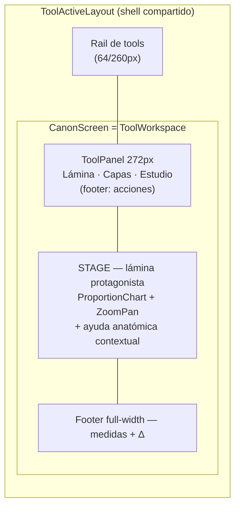
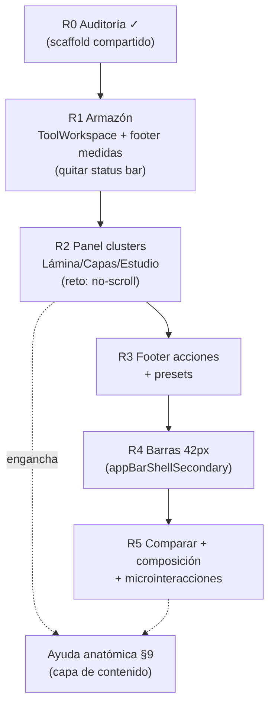
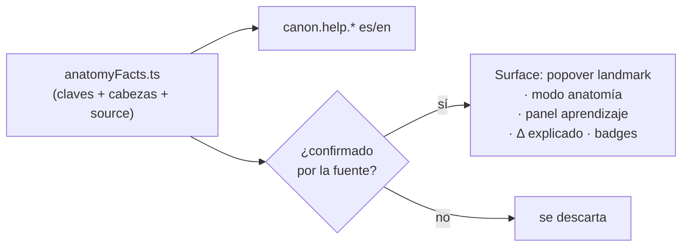

# Plan — Rediseño pantalla Canon (coherencia con el sistema de tools)

**Fecha:** 2026-06-08
**Alcance:** SOLO la pantalla Canon (`src/frontend/features/tools/canon/`). No toca el shell ni otras tools.
**Regla dura:** el **diseño de la plataforma NO se toca** — colores, tipografía, tokens, alturas de barra, estilos de botón están DEFINIDOS y son compartidos. El rediseño es **estructural**: hacer que Canon use los MISMOS componentes/patrones que las tools ya finalizadas (recorte, cuadrícula, tableros) para que sea coherente (mismo alto de navbar, mismo panel, mismo pie, mismos botones).
**Estado**completo

> Funcionalidad CONGELADA: no se agrega ni se quita nada. Todo lo actual (6 cánones, capas canon/anatomía/anchos/Loomis/esqueleto/músculos/articulaciones, unidades, presets, calco, regla, comparar, superponer, enviar a tablero, export PNG/PDF/1:1, zoom/pan, medidas con Δ) sigue accesible. Solo cambia DÓNDE viven los controles y QUÉ componentes los renderizan.

---

## 1. El sistema canónico (lo que usan crop/grid/boards y Canon NO)

Fuente compartida ya existente:

- **`shared/workspace/ToolWorkspace.tsx`** — layout de tool: **panel lateral izquierdo** + **lienzo** (stage) + **pie full-width** (footer) + modal. Lo usa `ReferenceGridScreen`.
- **`shared/workspace/ToolPanel.tsx`** — `ToolPanel` (aside 272px, `bg-surface-container`, **REQUISITO DURO: nunca scrollea ni desborda**) + helpers `ToolRow`, `ToolGrid(cols 2|3)`, `ToolPanelFooter` (pie pegado abajo para acciones de salida).
- **`shared/workspace/ToolButton.tsx`** — botón único de tool.
- **`shared/layouts/appbar/appBarStyles.ts`** — barras: `appBarShell` (principal, `--spacing-appbar-height` = 56px), **`appBarShellSecondary`** (`--spacing-appbar-secondary-height` = 42px), `appBarBg.{glass,solid}`, `appBarIconBtnIdle/Active`, `appBarTitle`, `appBarLabel`. (Ver `docs/pr/completos/plan-appbar-unify.md`.)

**Cómo lo usan las otras tools:** controles en el **panel izquierdo** (clusters en columna, sin wrap), lienzo al centro, **medidas en el pie** full-width, barras a 42px con los estilos compartidos.

## 2. Qué hace Canon distinto (la incoherencia a corregir)

| Canon hoy | Sistema canónico | Problema |
|---|---|---|
| `CanonToolbar` propia, `min-h-[--spacing-appbar-height]` (56px), `bg-surface-container` hand-rolled | barras a **42px** (`appBarShellSecondary`) | **navbar más alto** que crop/grid/boards → rompe coherencia (lo que notó el usuario). |
| **3 barras** apiladas (Toolbar + TraceBar + Presets) | **panel lateral** único | Canon mete controles arriba; las otras a un lado. |
| Panel de medidas en **aside derecho** | medidas en **footer** full-width | lado y forma distintos. |
| Status bar propia `h-8` | footer del scaffold | barra extra ad-hoc. |
| Botones export hand-rolled (`exportBtnCls`) | `ToolButton` / `appBarIconBtn*` | estilos duplicados, no compartidos. |
| No usa `ToolWorkspace`/`ToolPanel` | sí | toda la estructura diverge. |

## 3. Objetivo

Reescribir el armazón de `CanonScreen` para que use `ToolWorkspace` + `ToolPanel` + `appBarStyles` + `ToolButton`, igual que `ReferenceGridScreen`. Cero tokens nuevos: reusar los compartidos. Resultado: Canon es **coherente** con las otras tools (mismo alto de barra, mismos botones, mismo panel/pie) — PERO no idéntica ni sosa.

## 3.1 Qué es FIJO y qué es CREATIVO (el límite)

Usar primitivos compartidos NO quita creatividad: la fija solo en lo que debe ser igual en toda la plataforma, y la libera en la composición propia de Canon.

**FIJO (compartido, no se toca):**
- Tokens de color y tipografía (paleta, Manrope/JetBrains Mono).
- Alturas de barra (`appBarShell*`), estilos de botón (`ToolButton`/`appBarIconBtn*`), radios, gutters.
- Los contenedores estructurales: `ToolWorkspace` (panel izq + stage + footer), ancho de `ToolPanel` (272px), regla no-scroll.

**CREATIVO (latitud de Canon, dentro de lo fijo):**
- **Composición de la lámina (stage):** Canon es la ÚNICA tool centrada en una figura medida. El stage puede tener una puesta en escena propia — encuadre, respiración alrededor de la figura, cómo conviven las columnas de landmarks izq/der, el bracket de altura, las líneas. Es su sello, no tiene que parecerse al canvas de crop.
- **Organización del panel:** el AGRUPAMIENTO y jerarquía de clusters (Lámina / Capas / Estudio / Presets) es decisión de diseño; cómo se segmentan las 7 capas, cómo se presenta la dualidad canon/anatomía, etc.
- **Microinteracciones (motion ya disponible):** crossfade al cambiar canon/vista, feedback de la regla, transición del ghost, hover de landmarks. Distintivas de la herramienta.
- **Presentación de datos:** el footer de medidas con Δ puede tener una lectura propia (tabla, sparkline de desviación) usando tokens compartidos.
- **Estados:** vacío (sin calco), regla activa, comparación, superposición — todos con carácter.

Regla mental: **mismos ladrillos, edificio propio.** Coherente al tacto (alturas, botones, tipo), reconocible como Canon por cómo compone la lámina y sus controles.

---

## 3.2 Aprovechar el espacio (NO todo en una navbar)

Error a evitar: amontonar controles en una barra superior. El lienzo de la tool es **amplio** — hay que repartir, no apretar. Los controles viven donde corresponde a su función, y el espacio sobrante es para la lámina + la **ayuda anatómica** (sección 9).

- **Panel izquierdo** (`ToolPanel` 272px): controles de ajuste (Lámina, Capas, Estudio).
- **Stage central:** la lámina protagonista, con aire; sobre/junto a ella, anotaciones e info anatómica contextual.
- **Footer full-width:** medidas + Δ.
- **NADA forzado en una navbar densa.** Si queda barra superior, mínima (título/identidad). Las acciones poco frecuentes (exports) en el footer del panel.



## 4. Mapeo componente → destino

| Canon hoy | Va a |
|---|---|
| `CanonToolbar` (barra 56px) | **ELIMINAR**. Sus controles se reparten en `ToolPanel`: cluster *Lámina* (canon · vista · altura · unidad) con `ToolRow`/selects compartidos. |
| Toggles de capas (canon/anatomía/anchos/Loomis/esqueleto/músculos/articulaciones) | `ToolPanel` cluster *Capas* con `ToolGrid` (botones `ToolButton` segmentados). |
| `CanonTraceBar` (calco + regla) | `ToolPanel` cluster *Estudio* (calco: cargar/opacidad/quitar; regla on/off). |
| Superponer (ghost) | `ToolPanel` cluster *Estudio* (select). |
| `CanonPresets` | `ToolPanelFooter` o cluster *Presets* compacto (cargar/guardar/borrar). |
| `CanonActions` (enviar/comparar/PNG/PDF/1:1) | `ToolPanelFooter` (acciones de salida, patrón idéntico a crop/grid: enviar + exportar). |
| Zoom/pan controls | quedan flotando en el **stage** (esquina), como hoy (`ZoomPanViewport`); coherente con boards. |
| `MeasurementsPanel` (aside derecho) | **`footer`** de `ToolWorkspace` (medidas full-width con Δ), patrón de crop/grid. |
| Status bar `h-8` | ELIMINAR; la cifra base (1 cabeza = N cm) va al footer de medidas. |
| `ProportionChart` + `ZoomPanViewport` | **`stage`** de `ToolWorkspace`. |
| `CanonComparePanel` (modo comparar) | variante del **stage**: cuando `compare`, el stage muestra los 2 paneles (el panel lateral sigue controlando A; B con mini-controles como hoy). |

Lógica: `useCanonTool` NO cambia (salvo quizá un `panelOpen`/colapso si hiciera falta). Todo el estado/handlers se mantienen.

---

## 5. Reto principal: caben los controles sin scroll

`ToolPanel` **no puede scrollear ni desbordar** (requisito duro del sistema). Canon tiene MÁS controles que cualquier otra tool (canon, altura, vista, unidad, 7 capas, calco+opacidad, regla, superponer, presets + footer de acciones). Hay que **compactar**:

- Capas: `ToolGrid cols=3` de toggles-icono compactos (no botones con label largo).
- *Lámina*: selects compactos en 2 columnas (`ToolGrid`/`ToolRow`).
- *Estudio* y *Presets*: filas densas; opacidad como slider fino.
- Acciones poco frecuentes (exports 1:1/PDF/PNG, enviar) agrupadas en el `ToolPanelFooter` (posible menú "⋯" si no caben en fila).
- Si aún no cabe: permitir **un** acordeón/colapso por cluster (manteniendo el no-scroll), o mover exports a un popover del footer.

Medir el alto real contra 272px de ancho y la altura disponible es parte de R2.

---

## 6. Fases

- **R0 — Auditoría (HECHA en este análisis):** identificado el scaffold compartido (`ToolWorkspace`/`ToolPanel`/`appBarStyles`/`ToolButton`) y el mapeo. Sin código.
- **R1 — Armazón:** `CanonScreen` pasa a `ToolWorkspace` con `stage` = `ProportionChart`+`ZoomPanViewport`; `footer` = medidas; quitar status bar. Controles aún provisionales en el panel.
- **R2 — Panel de controles:** reconstruir clusters *Lámina/Capas/Estudio* con `ToolPanel`/`ToolRow`/`ToolGrid`/`ToolButton`; resolver el no-scroll. Borrar `CanonToolbar`/`CanonTraceBar`.
- **R3 — Footer de acciones + presets:** `ToolPanelFooter` con enviar/comparar/exports; presets compactos. Borrar `CanonActions`/`CanonPresets`.
- **R4 — Barras a 42px:** cualquier barra superior que quede (p.ej. título de la tool) usa `appBarShellSecondary` + estilos compartidos. Verificar que el alto calza EXACTO con crop/grid/boards.
- **R5 — Comparar + composición + pulido:** modo comparar como variante del stage; **puesta en escena propia de la lámina** y microinteracciones (sección 3.1 CREATIVO) — aquí entra la creatividad usando tokens compartidos; verificar export (PNG/PDF/1:1) y zoom/pan intactos; responsive (panel se oculta < lg, igual que las otras).

> Opcional R0+: usar el skill `frontend-design` para explorar la COMPOSICIÓN del stage/panel (no la piel) — variantes de cómo escenificar la lámina dentro de los primitivos fijos.

Cada fase: tsc + 18 tests + i18n (claves `canon.*` es/en) + doctor 100 antes de commitear.



---

## 7. Riesgos / cuidados

- **No-scroll del panel:** Canon es la tool con más controles → el reto es de densidad, no de estilo. Compactar con `ToolGrid`/iconos; medir.
- **No tocar la matemática del chart:** `ProportionChart`/`mapFrac`/`frac`/dims intactos; solo se MUEVE como `stage`. Re-verificar export tras mover.
- **Comparar en scaffold de un stage:** el modo 2-paneles debe convivir con el panel lateral único (el panel controla A; B con sus mini-controles).
- **Coherencia dura de alturas:** usar SIEMPRE las clases de `appBarStyles`/`ToolPanel`, nunca alturas hand-rolled. Así el alto de navbar queda idéntico por construcción.
- **i18n:** texto nuevo a claves; nombres de iconos material-symbols generan warnings aceptados.

## 8. Decisión abierta

1. **¿Mantener una barra superior de título en Canon** (como boards `TopBar`, a 42px) o ir directo panel+stage+footer sin barra (como grid)? (Recomendado: **igual que grid** — sin barra propia, todo en panel+footer; es la opción más coherente y la que el usuario validó como referencia.)

---

## 9. Ayuda anatómica (eje central del rediseño)

**Objetivo:** que la pantalla no sea solo una lámina con líneas, sino una **referencia anatómica que enseña**. Llenarla de ayuda/información anatómica **REAL y CONFIRMADA** (canon clásico + antropometría), con procedencia citada. El usuario debe poder, al pasar por un landmark o abrir el panel de aprendizaje, leer QUÉ es, A QUÉ ALTURA cae y POR QUÉ.

### 9.1 Regla de veracidad (dura)
- Cada dato lleva **procedencia**: Vitruvio, **Richer — *Anatomie artistique*** (1890), **Loomis — *Figure Drawing for All It's Worth***, **Bridgman**, o antropometría (p.ej. tablas NASA/DoD). Sin fuente, no entra.
- Distinguir **canon (ideal de enseñanza)** vs **antropometría (promedio medido real)** — ya existe el sistema DUAL (canon vs `ANATOMY_REFERENCE`); la ayuda lo explica, no lo confunde.
- Rangos, no falsa precisión: "el ombligo cae ~3 cabezas (canon 8)", no "exactamente 37.5%". Marcar variabilidad.
- Idioma vía i18n (`canon.help.*`), es/en.

### 9.2 Datos confirmados a incluir (contenido base)

**Divisiones del canon heroico de 8 cabezas (Loomis/Richer):**

| Línea (cabezas) | Landmark | Confirmado |
|---|---|---|
| 1 | mentón | base de la cabeza |
| 2 | pezones / línea del pecho | ~2 cabezas |
| 3 | ombligo (sobre la cintura) | ~3 cabezas |
| 4 | **pubis ≈ MITAD del cuerpo** | hito antropométrico clave en el adulto |
| 5 | mitad del muslo | |
| 6 | bajo la rodilla | |
| 7 | mitad de la pantorrilla | |
| 8 | planta | |

**Reglas cruzadas (verificables, "trucos" de atelier):**
- **Envergadura (brazos extendidos) ≈ estatura** (Vitruvio, "homo cuadratus").
- **Pubis ≈ punto medio** de la altura en el adulto (en el niño está más arriba → por eso el canon infantil).
- **Codo ≈ cresta ilíaca / cintura**; **muñeca ≈ trocánter mayor / entrepierna**; **punta de los dedos ≈ mitad del muslo**.
- **Pie ≈ 1 cabeza** de largo (aprox); **mano ≈ largo de la cara** (mentón→nacimiento del pelo).
- **Codo a codo (brazos en jarra) y hombros**: el ancho de hombros ≈ 2 cabezas (varón idealizado).

**Dimorfismo sexual (confirmado, base del eje femenino):**
- Mujer: **hombros más estrechos**, **pelvis más ancha** (cadera ≈ o > hombros), **cintura más alta y marcada**, mayor ángulo Q del fémur (rodillas más juntas), busto a la 2.ª cabeza.
- Varón: hombros ~2 cabezas, tórax más ancho que cadera, cintura más baja.

**Cabeza (construcción Loomis):** tercios faciales (nacimiento del pelo → ceja → base de la nariz → mentón) aproximadamente iguales; ojos a la mitad de la altura de la cabeza.

### 9.3 Cómo se SURFACEA en la UI (creativo, dentro de lo fijo)

- **Info por landmark:** al hover/tap sobre una línea/etiqueta → popover (`scaleIn`) con nombre + altura en cabezas + 1 frase confirmada + fuente. (`canon.help.<key>`.)
- **Capa/Modo "Anatomía explicada":** toggle que muestra anotaciones (reglas cruzadas: línea envergadura=estatura, marca codo=cintura, etc.) sobre la figura.
- **Panel de aprendizaje** (en el footer o un drawer): ficha del canon activo — qué es (academic/heroic/comic/female), su historia, sus proporciones, con fuente.
- **Δ explicado:** junto a la desviación anatómica del `MeasurementsPanel`, una nota de por qué el canon difiere del promedio real (p.ej. "el heroico estiliza la pierna +0.5 cabezas vs el adulto medido").
- **Badges de fuente:** cada dato muestra discretamente su procedencia (Richer/Loomis/Vitruvio/antropometría).

### 9.4 Estructura de datos propuesta

`src/shared/lib/canon/anatomyFacts.ts` (DATA pura, i18n por clave):
```
interface AnatomyFact { key; headsCanon?; rule?; source: 'vitruvio'|'richer'|'loomis'|'bridgman'|'anthropometry'; }
LANDMARK_FACTS: Record<landmarkKey, AnatomyFact>   // por landmark
CROSS_RULES: AnatomyFact[]                          // envergadura=estatura, codo=cintura…
CANON_NOTES: Record<canonId, { blurb; source }>    // ficha por canon
```
Texto visible SOLO en i18n (`canon.help.*`); el .ts guarda claves + cabezas + fuente. La capa de ayuda consume esto; el chart la pinta como anotaciones/popovers.

### 9.5 Verificación
Antes de publicar cada dato: contrastar contra la fuente citada. Lo que no se pueda confirmar **no se incluye** (mejor faltar que mentir). Revisión: una pasada de validación anatómica con las fuentes en mano (Richer/Loomis) marcando cada `source`.



---

Relacionado: `docs/pr/completos/plan-appbar-unify.md`, `docs/pr/importantes/canon/plan-canon-png-refactor.md`, `docs/pr/importantes/canon/plan-canon-animations.md`, `docs/pr/importantes/canon/plan-canon-laminas-faltantes.md`, memoria `canon-improvement-plan`.
