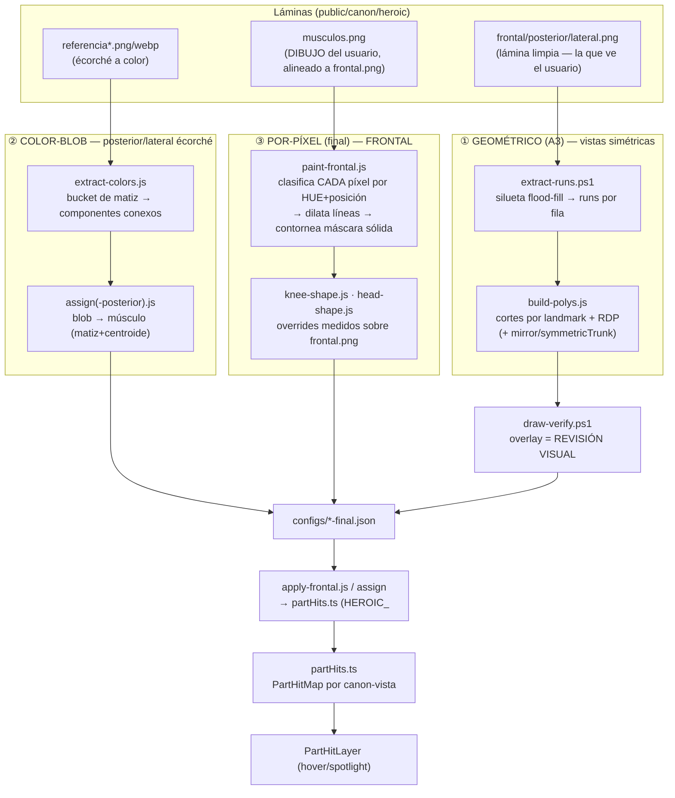
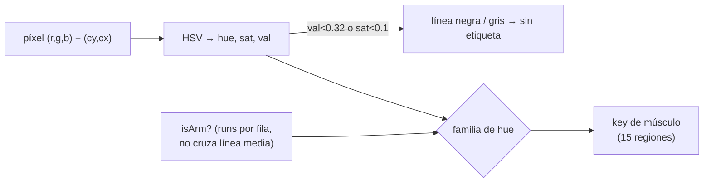
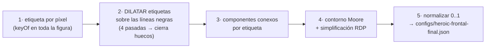
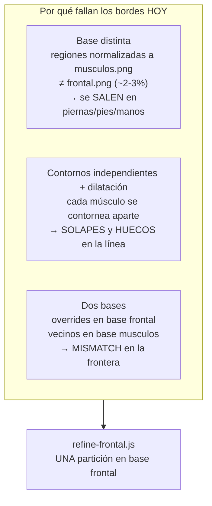
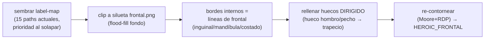

# Arquitectura — Mapeo de músculos clicables (Canon · `partHits.ts`)

**Fecha:** 2026-06-18 · **Tipo:** documento de arquitectura (sub-sistema del umbrella `importantes/canon`).
**Norte:** que cada músculo/zona de una lámina sea **clicable y resaltable siguiendo su CONTORNO anatómico real** (decisión P9 — nunca cajas), sin huecos ni solapes, simétrico, fiel al mapa que el usuario quiere.

Este documento describe **la solución final** al problema más grande de la herramienta Canon
(cómo se generan las regiones clicables) y los **tres generadores** que produce hoy
`partHits.ts`. El relato de cómo se llegó aquí (todas las propuestas que fracasaron) vive en
`docs/historical/2026-06-18-canon-frontal-muscle-mapping.md`. La espina general de Canon está en
`docs/pr/importantes/canon/arquitectura.md` (este doc expande su §8.1 / decisión P9).

---

## 1. El problema y el contrato

**Problema:** la figura base es una **lámina raster** (WebP/PNG sombreado, P9: el cuerpo no se
vectoriza). Para que el usuario pueda pasar el ratón sobre "el deltoides" y verlo iluminarse con
**su forma**, hace falta **un `path` SVG por músculo y por vista** que siga el contorno real —
no un rectángulo. Multiplicado por ~15 músculos × 3 vistas × N cánones, trazarlos a mano es
inviable y propenso a huecos/solapes/asimetría.

**Contrato de salida** (lo que consume el render, invariante en `partHits.ts`):

```ts
interface PartHit { path: string; cx: number; cy: number }
type PartHitMap = Record<string /* key de músculo/zona */, PartHit>
```

| Invariante | Regla |
|---|---|
| **Forma, no caja** | `path` sigue el contorno real (P9). Jamás un rectángulo. |
| **Solo `M`/`L`/`Z`** | El layer no interpreta curvas; una curva = muchos `L`. |
| **Normalizado 0..1** | Coords sobre el bbox de la lámina (`viewBox 0 0 1 1`, `preserveAspectRatio=none`) → calza a cualquier zoom. |
| **Por canon-vista** | Cada lámina tiene su dibujo; las dims/medidas sí son canon-agnósticas (`anatomyParts.ts`). |
| **Pareadas = 2 subpaths** | brazo/mano/pierna llevan `M…Z M…Z` en un mismo `path`; `cx,cy` = ancla del lado izquierdo. |
| **Degradación limpia** | Sin trazado, el canon-vista simplemente no es clicable (no rompe). |

Lo consume `PartHitLayer` (SVG estirado al bbox de la figura): hover = relleno del path (brillo
con forma de la parte); clic = spotlight (scrim con el path como recorte). Ninguna imagen nueva.

---

## 2. Visión macro — tres generadores, un contrato

`partHits.ts` no se escribe a mano: lo generan **scripts de píxeles** (`scripts/canon-parthits/`)
que leen una lámina, clasifican píxeles, sacan contornos y emiten los `path`. Han evolucionado en
**tres generaciones**, cada una resolviendo el fallo de la anterior. Hoy **coexisten**, una por
tipo de lámina:



| Gen | Script principal | Entrada | Para qué vista | Estado |
|---|---|---|---|---|
| ① Geométrico | `build-polys.js` (+ `extract-runs.ps1`) | lámina limpia | simétricas sin color (posterior/lateral V1) | base histórica, sigue válido |
| ② Color-blob | `extract-colors.js` → `assign*.js` | écorché a color | posterior, lateral | en uso (posterior/lateral) |
| ③ Por-píxel | `paint-frontal.js` (+ overrides) | dibujo del usuario | **frontal** | **solución final del problema grande** |

> **Por qué tres y no uno:** cada vista entrega un material distinto. Posterior llegó con un
> écorché a color limpio (blobs separados por línea negra → gen ②). Frontal no tenía écorché
> usable y el dibujo del usuario venía con músculos **sombreados** (un mismo músculo con varios
> tonos) → clasificar por bucket de color lo fragmentaba; hizo falta el clasificador **por
> píxel** (gen ③). El geométrico ① sirve cuando no hay color en absoluto.

---

## 3. El generador FRONTAL (③) — la solución al problema grande

Es la pieza clave: lo que destrabó el frontal tras muchas iteraciones fallidas (ver histórico).

### 3.1 Idea central — clasificar por **HUE + posición**, no por bucket de color

`paint-frontal.js` recorre la lámina `musculos.png` (el dibujo del usuario, **re-exportado
alineado a `frontal.png`** → siluetas casi idénticas, sin warp) y asigna **a cada píxel** una
etiqueta de músculo según `keyOf(r,g,b, cy, cx, isArm)`:

- **HUE (HSV):** rosa, azul, morado, verde-amarillo, verde, crema, piel/naranja → familias de músculo.
- **Posición (cy, cx):** desambigua un mismo hue en zonas distintas (p. ej. crema arriba = cabeza,
  crema bajo la clavícula = pecho; morado en columna de brazo = mano, morado en cintura = flanco).
- **`isArm(x,y)`:** ¿el píxel está en una **columna de brazo** (un *run* de figura que NO cruza la
  línea media, existiendo a la vez un run de torso que sí)? Separa el morado-de-brazo del
  morado-de-muslo **aunque la x se solape** en la cadera. Es lo que evita confundir antebrazo con muslo.



**Por qué no por bucket:** un músculo sombreado tiene varios tonos del mismo hue; agrupar por
"color exacto" lo parte en trozos. Clasificar por **familia de hue + dónde está** mantiene el
músculo entero.

### 3.2 Del campo de etiquetas al contorno



1. **Etiqueta por píxel** — `keyOf` clasifica toda la silueta (fondo por flood-fill desde el borde).
2. **Dilatar** — las líneas negras del dibujo quedan sin etiqueta; se rellenan por mayoría de vecinos
   (4 pasadas) → músculos vecinos se tocan **en el centro de la línea** (sin slivers blancos).
   Pocas pasadas: no se desborda al pelo ni se come el contorno.
3. **Componentes conexos** por etiqueta + filtro de área mínima (`MIN = fw·fh·0.0003`) → quita ruido.
4. **Contorno** (Moore-neighbour tracing) + **RDP** (`eps = max(fw,fh)·0.005`) → polígono simplificado.
5. **Normalizar** a 0..1 sobre la imagen → `configs/heroic-frontal-final.json`.

### 3.3 Overrides de silueta — `knee-shape.js`, `head-shape.js`

Dos zonas no salen bien del color del dibujo y se **miden sobre el line-art `frontal.png`**:

- **Cabeza** (`head-shape.js`): el color se rompe con ojos/pelo → en su lugar se **mide el borde
  izquierdo de la silueta** (corona→mandíbula) y se **espeja** sobre el eje de la cabeza → simétrico
  por construcción.
- **Rodilla** (`knee-shape.js`): hexágono de la rótula medido a ojo sobre frontal, lado izq + espejo.

Se inyectan en `heroic-frontal-final.json` **después** de `paint-frontal` y **antes** de `apply`.

### 3.4 Aplicar

`apply-frontal.js` regenera el bloque `HEROIC_FRONTAL` de `partHits.ts` desde el JSON, en un
**orden de pintado (z)** explícito (`ORDER`: grandes primero; trapecio sobre cuello/hombro; rodilla
al final). Falta una key en `ORDER` → falla ruidoso (no se pierde en silencio). Luego
`npx vitest run src/shared/lib/canon` + `tsc`.

### 3.5 Region-set frontal (15)

`head · neck · trapezius · shoulder · chest · bicep · forearm · hand · abdomen · flank · pelvis ·
thigh · knee · leg · foot`. El brazo se divide en **4** (shoulder·bicep·forearm·hand); `bicep` es
región propia añadida a `regions.ts` + i18n (en/es). Colores: `muscleColors.muscleColor(key,'frontal')`
(paleta del dibujo, sin tocar posterior/lateral).

---

## 4. La frontera pendiente — capa `refine-frontal` (bordes)

El generador ③ da la **división correcta** pero los **bordes** aún fallan de forma **sistémica**
(medido, no a ojo). Tres causas estructurales:



**Solución (plan `plan-canon-afinar-bordes-frontal.md`):** una pasada `refine-frontal.js` que NO
re-divide; siembra un **label-map único** de los 15 paths actuales, lo **clipa a la silueta de
`frontal.png`** (nada se sale), **comparte** las fronteras internas (una sola línea → imposible
solape/hueco), rellena huecos **dirigido** y **re-contornea**. Es **pulido final**, no rediseño.



**Criterio duro:** 0 px de solape · 0 huecos dentro de la silueta · 0 px fuera · Δcentroide < 1% y
Δárea < 12% por región (cambio mayor = brusco = se revisa). Verificación con **render PURO**
(rellenos opacos sobre blanco): cualquier blanco interior = hueco.

---

## 5. Pipeline geométrico (①) y color-blob (②) — referencia

Conviven para las otras vistas; mismo contrato de salida.

**① Geométrico** (`extract-runs.ps1` → `build-polys.js` → `draw-verify.ps1`): silueta por
flood-fill → *runs* `[x0,x1]` por fila → polígonos cortados por **fracciones de landmark**
(ancladas a `landmarks.ts`, auto-ubicadas por canon) + RDP. Para brazos pegados al torso
(posterior/lateral) usa `mirror:"auto"` (espeja el lado limpio) y `symmetricTrunk` (tronco
simétrico sin arrastrar el brazo fusionado). Verificación visual **obligatoria** con overlay.

**② Color-blob** (`extract-colors.js` → `assign*.js`): clasifica por **bucket de matiz** →
componentes conexos por bucket → filtra área → contorno+RDP → asigna blob→músculo por matiz+centroide.
Sirve cuando el écorché trae cada músculo **separado por línea negra** (posterior). Donde el músculo
viene sombreado (un hue en varios tonos) este enfoque fragmenta → por eso el frontal necesitó ③.

---

## 6. Reglas duras del sub-sistema (resumen)

1. **`partHits.ts` se GENERA**, no se teclea. Editar = correr el script y `apply`.
2. **P9 — contorno, nunca caja.** Vale para hit-test, resaltado y spotlight.
3. **Una lámina por trabajo.** El frontal traza el **dibujo del usuario alineado**, no warpea otra pose.
4. **Verificación visual obligatoria** (overlay) + **render PURO** para huecos. No se acepta "a ojo".
5. **Simetría por construcción** donde se pueda: medir un lado y espejar (`x→1-x`) mata las asimetrías.
6. **Bordes compartidos, una sola vez** (objetivo de `refine`): dos contornos independientes ≈ huecos/solapes garantizados.
7. **Degradación limpia:** canon-vista sin trazar = no clicable, nunca roto.
8. **`KEYS`/`ORDER` exhaustivos:** falta una key → el script falla ruidoso (no se pierde en silencio).

---

Relacionado: `docs/pr/importantes/canon/arquitectura.md` (§8.1 / P9), planes
`plan-canon-musculos-frontal-atlas.md` · `plan-canon-afinar-bordes-frontal.md` ·
`plan-canon-anatomy-deep.md`, histórico
`docs/historical/2026-06-18-canon-frontal-muscle-mapping.md`,
`scripts/canon-parthits/{paint,knee-shape,head-shape,apply}-frontal.js · build-polys.js · extract-colors.js`,
`src/shared/lib/canon/{partHits,muscleColors,regions}.ts`,
`src/frontend/features/tools/canon/components/{PartHitLayer,MuscleMapLayer}.tsx`.
