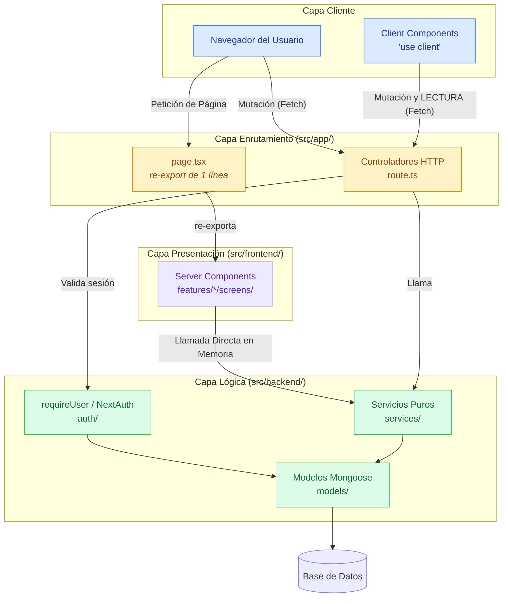

# Arquitectura Macro (Capas del Sistema)

Una vista a alto nivel (10,000 pies de altura) que ilustra la arquitectura de Clean Architecture (Patrón Controlador-Servicio) aplicada en ArtSanctuary.

## Explicación del Diagrama

El sistema está fraccionado en 4 áreas:

1. **Capa Cliente (Navegador):** Componentes con `'use client'`. Disparan
   `fetch` HTTP hacia la API — para **mutar y también para leer** (boards,
   explore, notifications y búsqueda leen así).
2. **Capa Enrutamiento (`src/app/`):** la frontera externa del servidor.
   - Los `page.tsx` son **re-exports de una línea**, no contienen lógica.
   - Los **controladores** (`route.ts`) validan sesión con `requireUser()` y
     delegan en los servicios.
3. **Capa Presentación (`src/frontend/features/*/screens/`):** aquí viven los
   **Server Components reales**, los que invocan servicios en memoria y evitan
   el salto HTTP interno. Ver
   [`../estructura-optimizada.md`](../estructura-optimizada.md#️-el-malentendido-más-caro-dónde-vive-el-server-component).
4. **Capa Lógica (`src/backend/`):** los servicios orquestan y hablan con los
   modelos. **No conocen HTTP ni auth**: es al revés — `requireUser()` se llama
   desde el controlador, antes de invocar al servicio.

## Diagrama (Mermaid)

