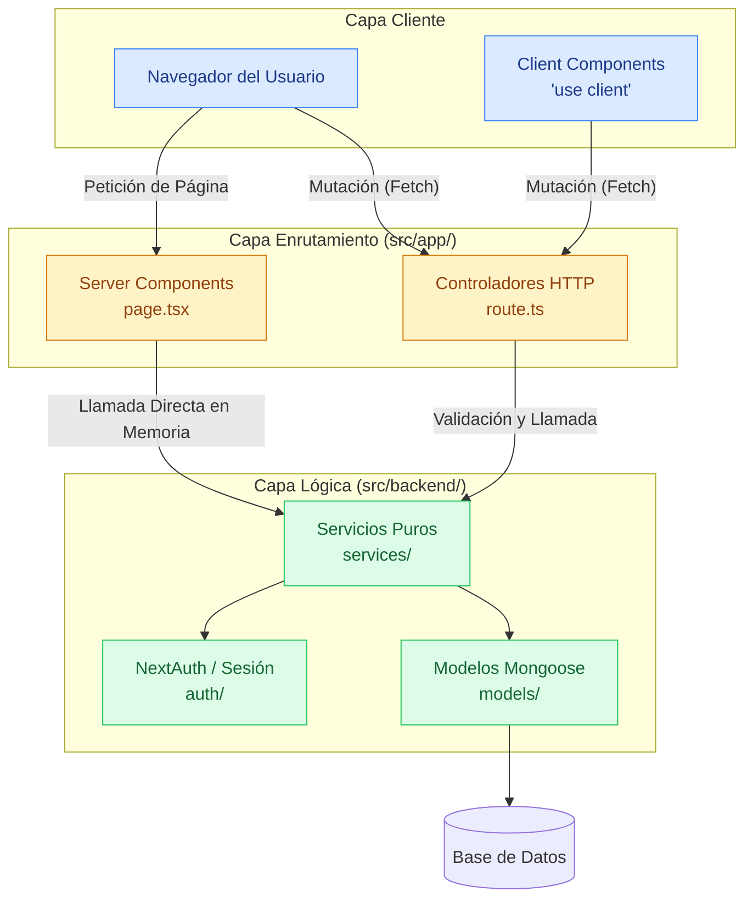

# Arquitectura Macro (Capas del Sistema)

Una vista a alto nivel (10,000 pies de altura) que ilustra la arquitectura de Clean Architecture (Patrón Controlador-Servicio) aplicada en ArtSanctuary.

## Explicación del Diagrama

El sistema está fraccionado en 3 grandes áreas físicas y conceptuales:

1. **Capa Cliente (Navegador):** Componentes marcados con `'use client'`. Estos componentes son los únicos que disparan mutaciones de datos mediante peticiones `fetch` HTTP a través de la red hacia la API.
2. **Capa Enrutamiento (`src/app/`):** Es la frontera externa del servidor. 
   - Los **Server Components** (`page.tsx`) generan HTML inicial. Para leer datos, invocan a los servicios puramente en memoria, siendo sumamente rápidos.
   - Los **Controladores HTTP** (`route.ts`) interceptan tráfico del cliente, extraen credenciales, y delegan en los servicios.
3. **Capa Lógica (`src/backend/`):** El corazón de la aplicación.
   - Los **Servicios** se encargan de orquestar operaciones complejas, validaciones y comunicarse con los Modelos de base de datos (`Mongoose`) o servicios de Autenticación (`NextAuth`). Nunca ven nada de HTTP, asegurando un diseño puro y testeable.

## Diagrama (Mermaid)

