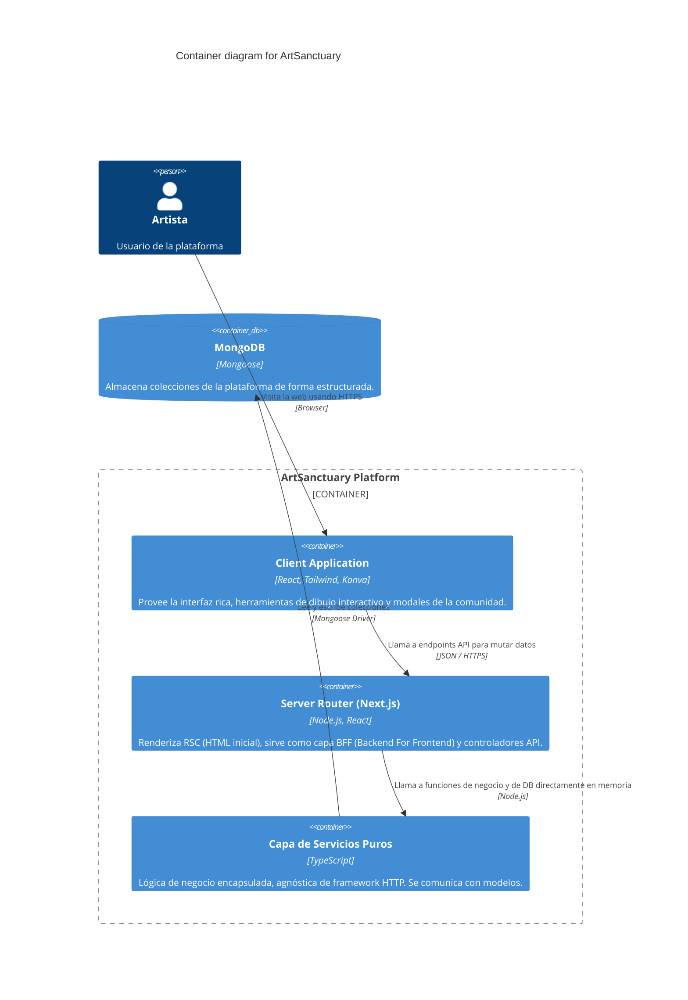

# Modelo C4 - Nivel 2: Contenedores

Este diagrama amplía el sistema `ArtSanctuary` para revelar los contenedores principales (aplicaciones web, APIs, capas lógicas y bases de datos) que componen la plataforma.

## Explicación del Diagrama
1. **Single Page Application (Client Components):** Todo el código React interactivo que corre en el navegador del usuario (incluyendo Konva.js para los tableros).
2. **Server App (Next.js App Router):** El entorno de Node.js donde viven los Server Components y los controladores de la API. Aquí ocurre el renderizado HTML inicial y la protección de rutas.
3. **Capa de Servicios Puros:** El núcleo de Clean Architecture. Una biblioteca interna donde reside toda la lógica de negocio (TypeScript puro), totalmente aislada de HTTP y de React.

## Diagrama (Mermaid C4)

