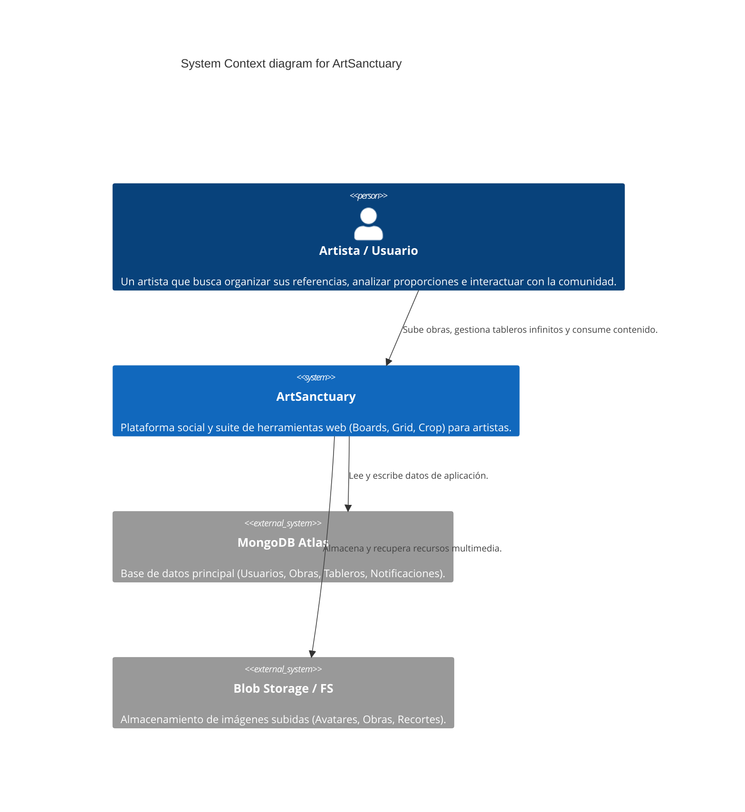

# Modelo C4 - Nivel 1: Contexto del Sistema

El diagrama de Contexto del Sistema muestra a ArtSanctuary desde la vista más lejana posible. Se enfoca en los usuarios que interactúan con la plataforma y los sistemas externos de los que ArtSanctuary depende para funcionar.

## Explicación del Diagrama
- **Artista/Usuario:** Es el actor principal que utiliza las herramientas visuales y las funciones sociales.
- **ArtSanctuary:** El sistema central.
- **Sistemas Externos:** MongoDB (para datos estructurados) y Vercel Blob / FileSystem (para almacenar imágenes, avatares y recortes).

## Diagrama (Mermaid C4)

