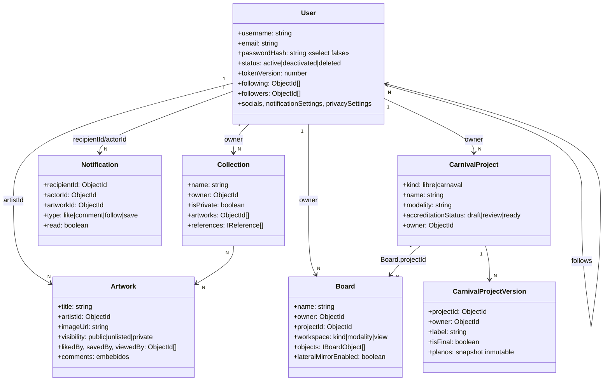
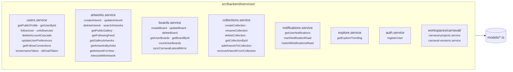

# Modelos de Dominio y Módulos de Servicio

Reconstruido desde cero el 2026-08-14. La versión anterior dibujaba clases
`UserService`/`BoardService`/`ArtworkService` con métodos que **no existen**:
los servicios son módulos de funciones sueltas, no clases. También le faltaban
4 de los 7 modelos.

## Modelos (Mongoose)

Los 7 documentos reales y sus relaciones. Campos completos y verificados en
[`../data-model.md`](../data-model.md).

> **`CarnivalProject` sirve a los dos workspaces.** Pese al nombre, su campo
> `kind` es `'libre' | 'carnaval'`. La colección se llama `carnivalprojects`
> por compatibilidad histórica.

> **La relación proyecto↔planos va al revés de lo intuitivo:** es `Board` quien
> apunta al proyecto con `projectId`. El proyecto no guarda un array de planos.

## Servicios: módulos, no clases

No hay `new UserService()`. Son módulos con funciones exportadas que se
importan directamente (`@backend/services/users.service`). No hay barrel.

Firmas exactas y comportamiento no obvio (efectos secundarios, orden de la
cascada, qué está cacheado) en [`../services.md`](../services.md).

## Límites de plan free

Constantes exportadas por los propios servicios:

| Recurso | Límite | Dónde |
|---|---|---|
| Boards | 5 | `MAX_FREE_BOARDS` |
| Colecciones | 3 | `MAX_FREE_COLLECTIONS` |
| Proyectos | 3 | `MAX_FREE_PROJECTS` |

## Advertencia

Varios de estos servicios tienen defectos conocidos sin resolver — incluido uno
crítico en `getPublicProfile`. Leer
[`../../ops/known-issues.md`](../../ops/known-issues.md) antes de construir
encima.
