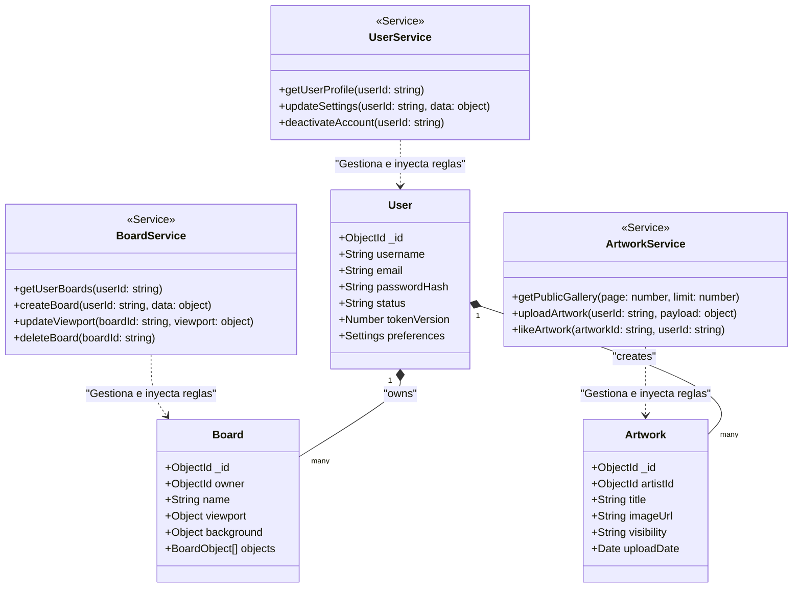

# Diagrama de Clases (Dominio y Servicios)

Este diagrama UML muestra la estructura interna de las clases, interfaces y servicios principales del backend, reforzando la separación entre la capa de datos (Modelos) y la capa lógica (Servicios).

## Explicación del Diagrama
- Se ilustran las propiedades clave de las entidades de la base de datos (`User`, `Artwork`, `Board`).
- Se definen los Servicios que inyectan comportamiento a estos datos (`UserService`, `BoardService`, `ArtworkService`), asegurando que la lógica no reside en los controladores de Next.js, sino aquí.
- Las líneas de relación explican las cardinalidades lógicas: un Usuario administra y es dueño de muchos Tableros y Obras.

## Diagrama (Mermaid Class)

