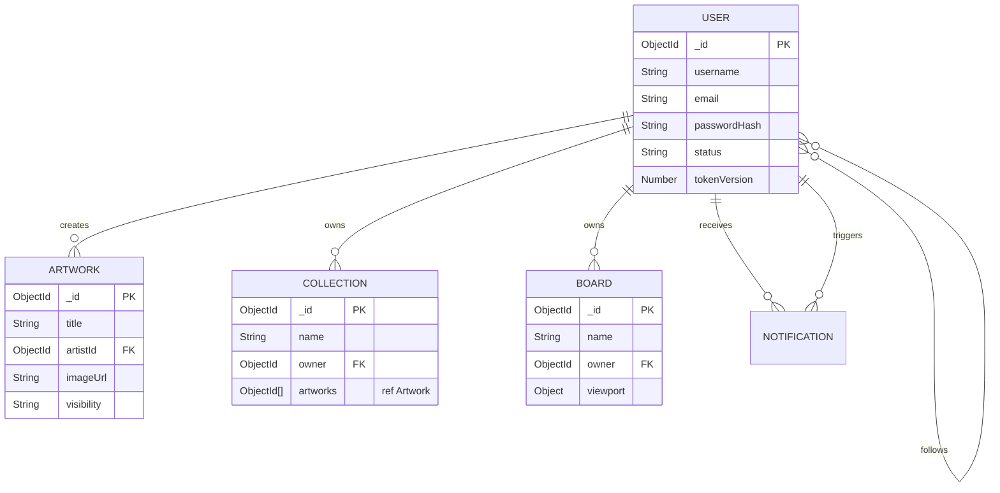

# Modelo de Entidad-Relación (Base de Datos)

Este diagrama representa la estructura de las colecciones de MongoDB manejadas a través de Mongoose. Muestra cómo las distintas entidades del sistema se relacionan entre sí.

## Explicación del Diagrama

- **USER (Usuario):** Es la entidad central. Un usuario puede crear múltiples obras de arte (`ARTWORK`), ser dueño de colecciones (`COLLECTION`) y tableros de edición (`BOARD`). También gestiona seguidores a través de una relación consigo mismo.
- **ARTWORK (Obra):** Representa las obras subidas a la plataforma. Mantiene una clave foránea (`artistId`) apuntando a su creador.
- **COLLECTION y BOARD:** Son entidades agrupadora y de trabajo, respectivamente. Ambas referencian al `owner` (dueño). Las colecciones contienen referencias a las obras (`ObjectId[] artworks`).
- **NOTIFICATION (Notificación):** Actúa como registro de actividad. Relaciona a un usuario que dispara la acción (`actorId` interno, no graficado para limpieza) y un usuario que la recibe (`recipientId` mapeado implícitamente).

## Diagrama (Mermaid)

