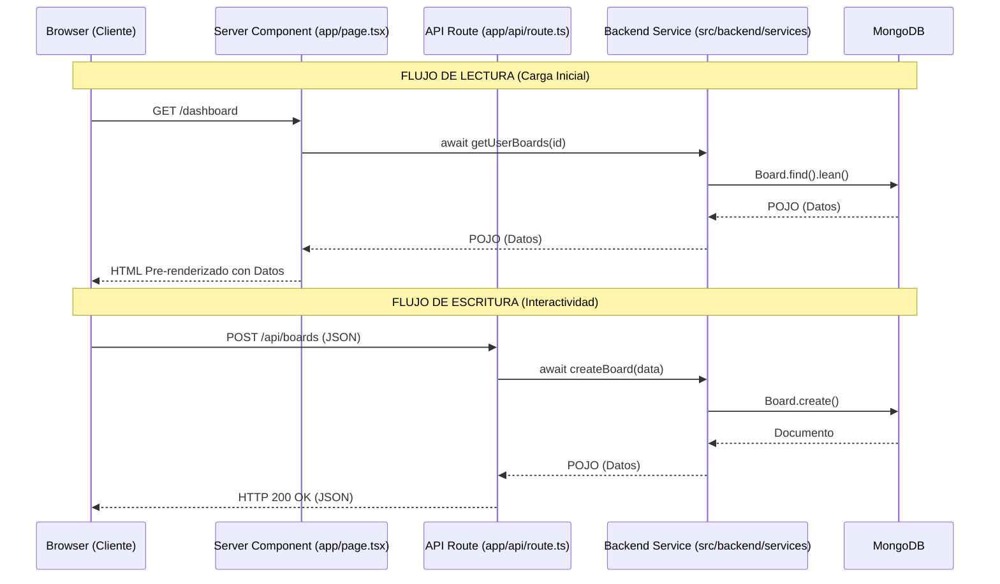

# Flujo de Datos: RSC vs. Mutaciones del Cliente

> ⚠️ **Parcialmente incorrecto** (verificado 2026-08-14):
> - El participante `Server Component (app/page.tsx)` está mal ubicado: vive
>   en `src/frontend/features/*/screens/`. Ver
>   [`../estructura-optimizada.md`](../estructura-optimizada.md#️-el-malentendido-más-caro-dónde-vive-el-server-component).
> - **El ejemplo concreto es falso**: `GET /dashboard` → `getUserBoards()` no
>   ocurre. `dashboard/tools/boards/page.tsx` es `'use client'` y los boards se
>   cargan con `fetch('/api/boards/:id')` desde el cliente. `getUserBoards`
>   solo se invoca desde `src/app/api/boards/route.ts`.
> - Falta el flujo de **lectura vía cliente**, que es el que usan boards,
>   notifications, explore y search.
> - No aparece el caché (`unstable_cache` + tag `artworks`).

Este diagrama ilustra la diferencia fundamental en cómo se obtienen y envían los datos en la arquitectura actual. Está diseñado para aprovechar los React Server Components (RSC) y reducir la carga sobre el cliente.

## Explicación del Diagrama

1. **Flujo de Lectura (Carga Inicial):**
   Cuando un usuario navega a una página (ej. `/dashboard`), la solicitud no realiza saltos HTTP adicionales en el servidor. El componente de servidor (`page.tsx`) llama **directamente en memoria** a las funciones de `src/backend/services`. Estos servicios se comunican con MongoDB, obtienen los datos puros (POJOs) y se los pasan al componente para que renderice el HTML. Esto garantiza el tiempo de respuesta (TTFB) más rápido posible.

2. **Flujo de Escritura (Interactividad):**
   Cuando el usuario realiza una acción en el navegador (como crear un tablero o dar "Me gusta"), un *Client Component* (`'use client'`) envía una petición HTTP `fetch` a la API (`src/app/api/<dominio>/route.ts`). El controlador de la API valida la autenticación, extrae los parámetros y delega la ejecución de negocio al mismo servicio (`src/backend/services`).

## Diagrama (Mermaid)

