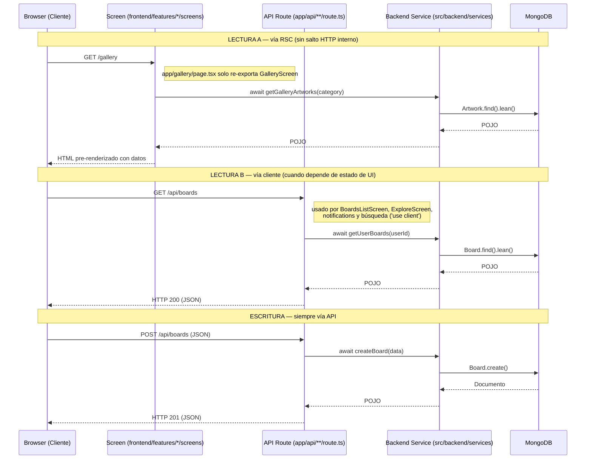

# Flujo de Datos: RSC vs. Mutaciones del Cliente

> **Hay dos caminos de lectura, no uno.** El RSC (A) evita el salto HTTP y es
> el preferido; el cliente (B) se usa cuando la lectura depende de estado de UI
> (búsqueda, filtros, polling). Confundirlos es el error más común aquí.
>
> `getPublicGallery` y `getExploreTrending` van además envueltos en
> `unstable_cache` (`revalidate: 60`, tag `artworks`), no mostrado abajo para
> no cargar el diagrama.

Este diagrama ilustra la diferencia fundamental en cómo se obtienen y envían los datos en la arquitectura actual. Está diseñado para aprovechar los React Server Components (RSC) y reducir la carga sobre el cliente.

## Explicación del Diagrama

1. **Flujo de Lectura (Carga Inicial):**
   Cuando un usuario navega a una página (ej. `/dashboard`), la solicitud no realiza saltos HTTP adicionales en el servidor. El componente de servidor (`page.tsx`) llama **directamente en memoria** a las funciones de `src/backend/services`. Estos servicios se comunican con MongoDB, obtienen los datos puros (POJOs) y se los pasan al componente para que renderice el HTML. Esto garantiza el tiempo de respuesta (TTFB) más rápido posible.

2. **Flujo de Escritura (Interactividad):**
   Cuando el usuario realiza una acción en el navegador (como crear un tablero o dar "Me gusta"), un *Client Component* (`'use client'`) envía una petición HTTP `fetch` a la API (`src/app/api/<dominio>/route.ts`). El controlador de la API valida la autenticación, extrae los parámetros y delega la ejecución de negocio al mismo servicio (`src/backend/services`).

## Diagrama (Mermaid)

