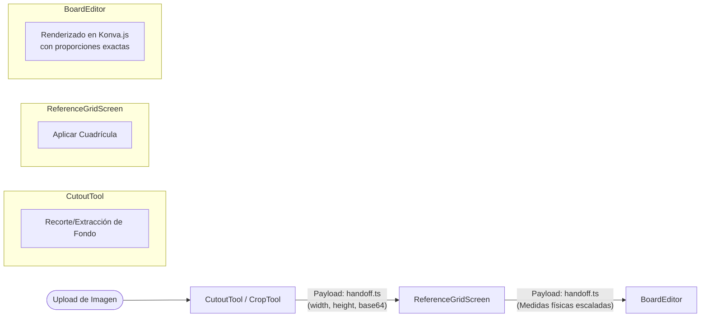

# Flujo de Handoff entre Herramientas de Estudio

Este diagrama describe cómo una imagen transita a través del ecosistema de herramientas para artistas (`CropTool`, `ReferenceGridScreen`, `BoardEditor`).

## Explicación del Diagrama

El **Handoff** es el mecanismo que permite enviar una imagen de una herramienta a otra sin perder contexto, calidad ni escala de medida. 

1. **Subida y Recorte (`CropTool / CutoutTool`):** La imagen original entra al sistema. Aquí el artista extrae el fondo o recorta la parte que le interesa.
2. **Payload de Transición (`handoff.ts`):** Al pasar a la siguiente etapa, se envía un objeto que contiene el Base64 de la imagen recortada, junto con su ancho y alto original.
3. **Cuadriculado (`ReferenceGridScreen`):** La herramienta recibe la imagen, permite aplicar guías visuales y configurar la escala física en centímetros.
4. **Lienzo Final (`BoardEditor`):** Al integrarse al tablero infinito de Konva, la imagen aterriza con sus proporciones físicas exactas previamente calculadas (`Medidas físicas escaladas`), garantizando que la referencia sea métricamente precisa.

## Diagrama (Mermaid)

