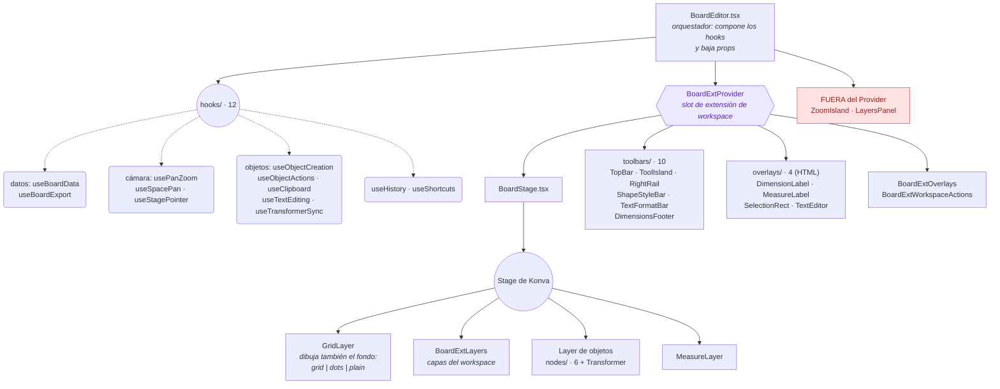

# Jerarquía y Estado de BoardEditor

> **El anidamiento respecto al `BoardExtProvider` es load-bearing.** Lo que
> está dentro comparte el contexto de la extensión de workspace; `ZoomIsland` y
> el panel de capas quedan fuera. Mover un componente entre esas dos zonas
> rompe el contexto en silencio — ver
> [`../workspaces-plugins.md`](../workspaces-plugins.md).
>
> Ojo a la distinción Konva vs HTML: `layers/` y `nodes/` viven **dentro** del
> `<Stage>`; `overlays/` y `toolbars/` son HTML **encima**. No son
> intercambiables.
>
> Detalle por subcarpeta e invariantes:
> [`../../features/tools/boards.md`](../../features/tools/boards.md).

Este diagrama documenta la compleja estructura del Tablero Infinito interactivo, separando las responsabilidades de estado (Hooks) de la presentación visual (Konva y React).

## Explicación del Diagrama

El componente `BoardEditor` es un orquestador que centraliza el estado y lo distribuye a los componentes de presentación. Está dividido en 3 grandes bloques:

1. **Hooks de Lógica (`hooks/`):** Almacenan el estado y la lógica de negocio del lado del cliente.
   - `useBoardData`: Carga y autoguardado de los datos del tablero hacia la API.
   - `useHistory`: Gestiona la pila de deshacer/rehacer (snapshots).
   - `usePanZoom`: Cálculos matemáticos para moverse por el lienzo infinito.
   - `useObjectActions`: Lógica para transformar y manipular nodos.
2. **Componentes de Interfaz UI (`toolbars/`):** Elementos HTML/React tradicionales superpuestos sobre el canvas.
   - Barras superiores (`TopBar`) e inspectores laterales/inferiores (`ToolIsland`) donde el usuario hace clic para elegir herramientas.
3. **Capa de Renderizado (`BoardStage.tsx`):** Un árbol de `react-konva` encargado de dibujar todo en un elemento `<canvas>`.
   - Se compone de capas dedicadas (`Background Layer`, `GridLayer`, la capa de objetos y el `MeasureLayer` para dibujar cotas de medición).

## Diagrama (Mermaid)

