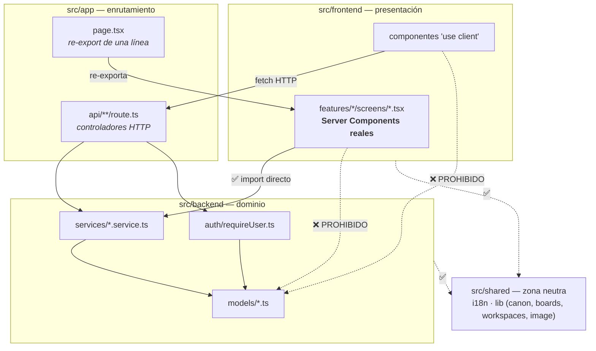

# Reglas de Importación y Fronteras

Reconstruido desde cero el 2026-08-14. La versión anterior prohibía que
`src/frontend` importara de `src/backend` — una regla que **6 archivos violan
legítimamente**, porque son los Server Components de la app.

## El mapa real

## Las fronteras que sí existen

### 1. `@backend/models` no se importa desde `src/frontend` — NUNCA

Es **la** regla dura, y hoy se cumple al 100% (0 violaciones). Importar un
modelo Mongoose en el cliente arrastra `mongoose` al bundle del navegador.
Para tipos en el cliente existe `src/shared/lib/types.ts`, que son las formas
**serializadas**.

### 2. `src/frontend` SÍ puede importar `@backend/services` y `@backend/auth`

Y debe hacerlo: los Server Components viven en
`src/frontend/features/*/screens/`, no en `src/app/`. Los 6 que lo hacen —
`GalleryScreen`, `HomeScreen`, `ProfileScreen`, `ProfileDetailScreen`,
`CollectionDetailScreen`, `SettingsScreen` — llaman al servicio **en memoria**,
evitando un salto HTTP interno.

Ver [`../estructura-optimizada.md`](../estructura-optimizada.md#️-el-malentendido-más-caro-dónde-vive-el-server-component).

### 3. `src/backend/services` no importa nada de `next/server`

Sin `NextRequest`/`NextResponse` ni hooks de React. Se cumple.

**Matiz real:** dos servicios (`explore.service.ts`, `artworks.service.ts`)
importan `unstable_cache` de `next/cache`. No son 100% agnósticos del
framework, aunque sí de HTTP.

### 4. `src/shared` es zona neutra

La importan ambos lados y no importa a ninguno. Es donde va cualquier cosa que
necesiten cliente y servidor (i18n, tipos serializados, lógica pura de dominio).

## Lo que la regla "los controladores son tontos" no cubre

`src/app/api/**/route.ts` no importa modelos (se cumple), pero **sí hay lógica
de negocio en algunos controladores**:

- `settings/account/deactivate/route.ts` muta `user.status` y `user.tokenVersion`
- `settings/account/{password,email,sessions}/route.ts` — lo mismo

Es deuda conocida, no un patrón a imitar: lo correcto es que esa mutación viva
en un servicio.

## Sin lint que lo imponga

Ninguna de estas fronteras está forzada por herramientas — son convención. Un
`eslint-plugin-boundaries` las haría verificables; hoy la única red es
`npm run docs:verify`, que comprueba la documentación, no los imports.

Fuente: verificado con `grep` sobre `@backend/models`, `@backend/services`,
`next/server` y `next/cache` en todo `src/`.
