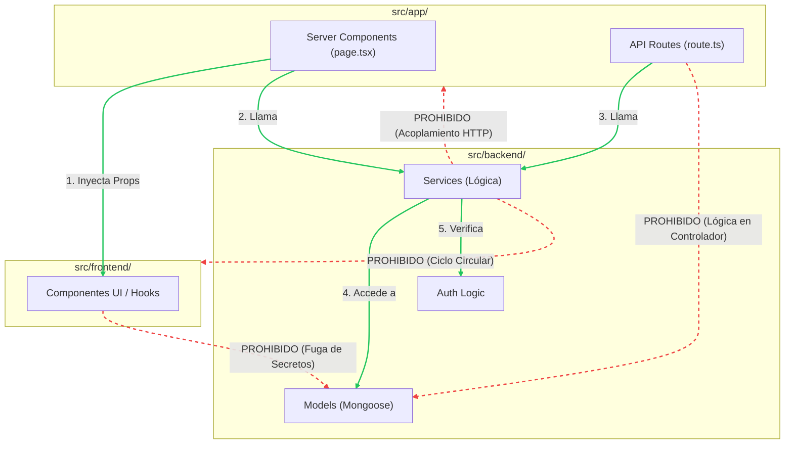

# Reglas de Importación y Fronteras (Límites Arquitectónicos)

Para una IA (o cualquier herramienta de linting), entender el problema a veces es menos importante que **entender lo que NO se debe hacer**. Este diagrama traza las reglas estrictas de acoplamiento de la base de código.

## Restricciones Críticas para la IA
1. **Frontend NUNCA toca el Backend directamente:** El directorio `src/frontend` jamás debe importar nada de `src/backend/models`.
2. **API Routes son "Tontas":** Los archivos `route.ts` de `src/app/api/` tienen estrictamente prohibido importar esquemas Mongoose o interactuar con la base de datos de manera directa; deben cruzar la frontera hacia `src/backend/services`.
3. **Servicios son Agnosticos:** Los servicios en `src/backend/services` nunca deben importar tipos u objetos como `NextRequest` o `NextResponse`. Son funciones puras que retornan objetos de JavaScript.

## Diagrama (Mermaid Flowchart)

