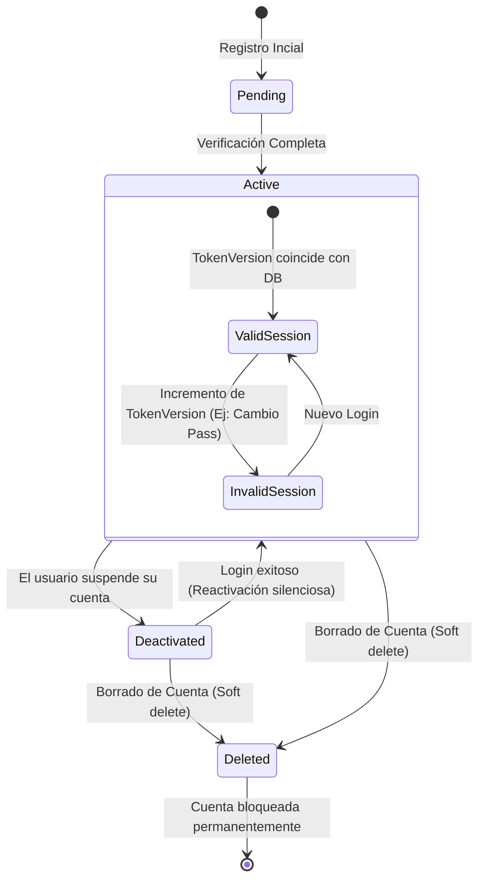

# Máquina de Estados: Ciclo de Vida del Usuario

> 🛑 **DIAGRAMA INCORRECTO — no seguirlo.** Verificado contra el código el
> 2026-08-14. Es peligroso precisamente porque su propósito declarado es
> "restringir" a un agente IA, y las restricciones que impone son falsas:
>
> | Dice el diagrama | Realidad |
> |---|---|
> | Existe un estado `Pending` con "verificación completa" | **No existe.** El enum es `active\|deactivated\|deleted` y `registerUser` crea el usuario ya `active`. No hay verificación de email. |
> | El borrado es *soft delete* → `status = 'deleted'` | **Es hard delete.** `deleteAccountCascade` hace `User.deleteOne()`. **Ningún punto del código asigna `status='deleted'`** — ese valor del enum solo se lee, nunca se escribe. |
> | Un usuario `deleted` queda bloqueado permanentemente | El registro ya no existe: `authorize()` falla antes por `if (!user)`. El username/email **quedan libres** para re-registro. |
> | Las sesiones pasan a inválidas al rotar `tokenVersion` | Con **hasta 5 min de retraso** (`TV_RECHECK_MS`), no de inmediato. |
>
> Además omite que también rotan `tokenVersion` la desactivación y el
> "cerrar todas las sesiones", no solo password y email.
>
> Fuente correcta mientras esto no se rehaga:
> [`../auth.md`](../auth.md).

Los Agentes IA a menudo cometen errores al implementar la lógica de autenticación o borrado de usuarios si no entienden las transiciones de estado. Este diagrama sirve como una restricción lógica y temporal.

## Restricciones Lógicas (Condiciones de Borde)
1. **Reactivación Automática:** Si un usuario tiene estado `deactivated` (cuenta pausada) e introduce credenciales correctas en el login, el sistema DEBE transicionar automáticamente a `active` sin requerir un flujo especial.
2. **Borrado Irreversible:** Un usuario con estado `deleted` tiene acceso revocado permanentemente en el nivel de `authorize()`. Un Agente no debe intentar enviar emails de recuperación a estos usuarios.
3. **Invalidación Global (Token Version):** La sesión activa depende de la comparación entre la cookie JWT y `User.tokenVersion`. Cualquier cambio de seguridad (password, email) DEBE incrementar el `tokenVersion` en la base de datos para transicionar todas las sesiones existentes a `InvalidSession`.

## Diagrama (Mermaid State)

