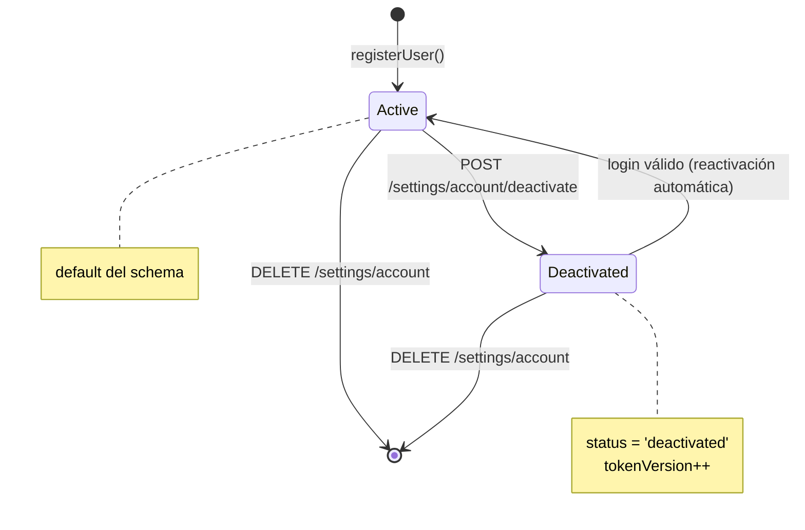
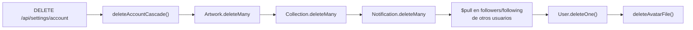
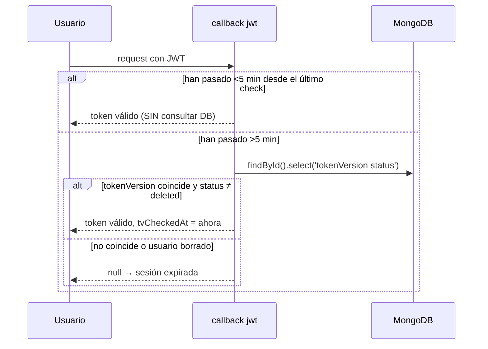

# Máquina de Estados: Ciclo de Vida del Usuario

Reconstruido desde cero el 2026-08-14. La versión anterior inventaba un estado
`Pending` y describía el borrado como *soft delete* siendo un hard delete —
peligroso, porque su propósito es restringir a quien implemente auth.

## Estados reales

`User.status` es un enum de 3 valores, pero **solo 2 se usan**:

**`'deleted'` es un valor muerto del enum.** Existe en el schema y se *lee* en
`auth/index.ts` y `requireUser.ts`, pero **ningún punto del código lo asigna**.
El borrado real es destructivo:

Consecuencias de que sea hard delete y no soft:

- El registro desaparece: `authorize()` falla por `if (!user)`, no por
  `status === 'deleted'`.
- **El username y el email quedan libres** para re-registro. No hay bloqueo.
- Sin transacción (Mongo standalone, ver
  [ADR-0004](../../adr/0004-hard-delete-sin-tx.md)). `User.deleteOne` es el
  **penúltimo** paso: si el `$pull` masivo falla antes, el usuario queda
  parcialmente destruido pero aún logueable.

## Invalidación de sesión — no es inmediata

Rotar `tokenVersion` **no corta la sesión al instante**. El callback `jwt`
revalida contra DB como máximo cada `TV_RECHECK_MS = 5 min`:

**Una sesión revocada sigue siendo válida hasta 5 minutos.** Es un trade-off
deliberado de rendimiento (antes era 1 consulta por request). Si un cambio
requiere corte inmediato, este throttle es el obstáculo.

## Qué rota `tokenVersion`

Los 4 endpoints, no solo 2 como decía la versión anterior:

| Endpoint | Motivo |
|---|---|
| `PATCH /api/settings/account/email` | Cambio de email → sesión sospechosa |
| `PATCH /api/settings/account/password` | Estándar de seguridad |
| `DELETE /api/settings/account/sessions` | Logout-all explícito |
| `POST /api/settings/account/deactivate` | Cuenta inactiva |

## Restricciones para quien implemente

1. **No asumir que `status = 'deleted'` sirve para nada.** Si se quiere soft
   delete de verdad, hay que implementarlo: hoy el valor no se escribe nunca.
2. **No asumir corte inmediato de sesión** al rotar `tokenVersion`.
3. **No hay verificación de email.** `emailPendingChange` existe en el modelo
   pero el cambio de email aplica directo.
4. La reactivación desde `deactivated` es **automática** en el siguiente login
   válido, no requiere acción del usuario.

Fuente: `src/backend/auth/index.ts`, `src/backend/auth/requireUser.ts`,
`src/backend/services/users.service.ts`, `src/backend/models/User.ts`.
Detalle en [`../auth.md`](../auth.md).
