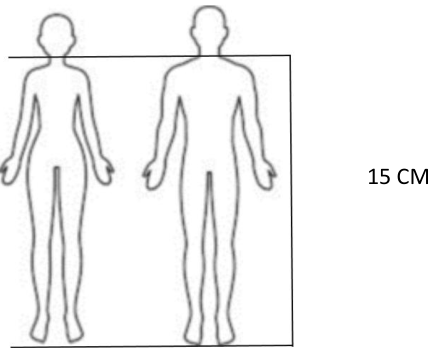
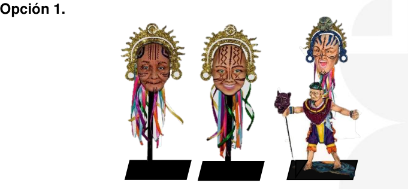

# Comunicado 003-12-05-2026

## Página 1

```text
San Juan de Pasto, 12 de mayo de 2026 
 
 
 
Artistas  
Interesados Acreditación 2027 
La ciudad 
 
 
Asunto: Comunicado Informativo medidas Bocetos Volumétricos. 
 
Cordial saludo, 
 
Por medio de la presente el área de cultura de corpocarnaval informa las medidas 
de los bocetos volumétricos según cada modalidad, para el proceso de acreditación 
del Carnaval de Negros y Blancos de Pasto, versión 2027, la información también 
se verá reflejada en la socialización y publicación del reglamento de acreditación y 
concurso 2027, a continuación, la información detallada por modalidad: 
 
 
DISFRAZ INDIVIDUAL: 
 
QUE SE DEBE PRESENTAR  
1. Presentar boceto volumétrico a escala 1:10 de la obra, la estructura básica 
del cuerpo humano debe ser de 15 cm hasta los hombros. Si la propuesta 
lleva zancos, zancos saltarines u otros elementos deben ir insertos en el 
boceto volumétrico y explícitos en el texto. Las medidas del boceto 
volumétrico son: 
 
DISFRAZ INDIVIDUAL 
BASE 
CUADRADA  
  
MÍNIMO  
Centímetros  
MÁXIMO  
Centímetros  
Centímetros  
ALTO 
12 
15 
 
ANCHO 
15 
25 
20 
LARGO / 
PROFUNDIDAD 
10 
20 
20 
ESPESOR 
 
 
2
```
## Página 2
Ejemplo del tamaño máximo del cuerpo humano hasta los hombros. 
 
 
Notas:  
 
• La medida del boceto volumétrico se toma de los hombros del jugador hacia 
arriba. 
 
COMPARSA: 
 
 
QUE SE DEBE PRESENTAR:  
1. Tres (3) bocetos volumétricos a escala, (1:10) una de ellas teniendo en 
cuenta como estructura básica el cuerpo humano.  
Ejemplo del tamaño del cuerpo humano hasta los hombros.
 
```

## Página 3
```text
Nota: La medida del Boceto volumétrico se toma de los hombros del jugador hacia 
arriba. La medida de la figura humana hasta los hombros es de quince centímetros 
(15 cm). No se puede utilizar el maniquí de madera como soporte. 
 
Medida figura de comparsa: 
 
MEDIDA  
MINIMO (cm)  
MAXIMO (cm)  
ANCHO  
  
35  
ALTO  
20  
25  
 
A continuación, presentamos los dos ejemplos validos de presentación:
```  
Opción 1.

 


Opción 2.

 
```

## Página 4


```text
BASE CUADRADA 
 
Centímetros 
Ancho  
20 cm 
Largo   
20 cm 
Espesor  
2 cm 
 
    Nota: La medida de la base debe ser exacta  
 
NO SE HARÁ LA RECEPCIÓN DE BOCETOS VOLUMÉTRICOS EN LA 
MODALIDAD DE COMPARSA QUE NO CUMPLA CON LAS MEDIDAS DE 
PRESENTACIÓN. 
 
 
 
CARRO ALEGÓRICO: 
 
QUE SE DEBE PRESENTAR  
1. Boceto volumétrico de la obra, en material resistente al tacto, para su 
respectivo traslado y montaje; dentro del Boceto volumétrico se deberá 
delimitar las zonas donde se ubicarán los jugadores, el Boceto volumétrico 
debe cumplir con las siguientes medidas:  
 
CARRO ALEGÓRICO  
  
MÍNIMO 
Centímetros  
MÁXIMO  
Centímetros  
Base de 
Madera  
ALTO  
23.3 
33.3 
  
ANCHO  
20  
26.6 
32 
LARGO  
53.3 
66.6 
70  
ESPESOR  
  
  
4 
         
Nota: La medida de la base debe ser exacta, de color negro. 
 
NO SE HARÁ LA RECEPCIÓN DE BOCETO VOLUMÉTRICOS EN LA 
MODALIDAD DE CARRO ALEGÓRICO QUE NO CUMPLA CON LAS MEDIDAS 
DE PRESENTACIÓN.
```

## Página 5


```text
CARROZA: 
 
QUE SE DEBE PRESENTAR  
1. Boceto Volumétrico de la obra a escala 1:15, en material resistente al tacto, 
para su respectivo traslado y montaje; dentro del Boceto volumétrico se 
deberá delimitar las zonas donde se ubicarán los jugadores, el Boceto 
volumétrico debe cumplir con las siguientes medidas: 
  
CARROZA 
  
MÍNIMO 
Centímetros  
MÁXIMO  
Centímetros  
Base de 
Madera 
LARGO  
86.6 
106.6 
110 
ANCHO  
24 
28.6 
32 
ALTO  
  
41.3 
  
ESPESOR  
  
  
2   
 
Nota: La medida de la base debe ser exacta y de color negro. 
 
NO SE HARÁ LA RECEPCIÓN DE BOCETOS VOLUMÉTRICOS EN LA 
MODALIDAD DE CARROZA QUE NO CUMPLA CON LAS MEDIDAS DE 
PRESENTACIÓN. 
 
Atentamente: 
 
 
 
ANDRES BARRERA 
Director de Cultura
```
